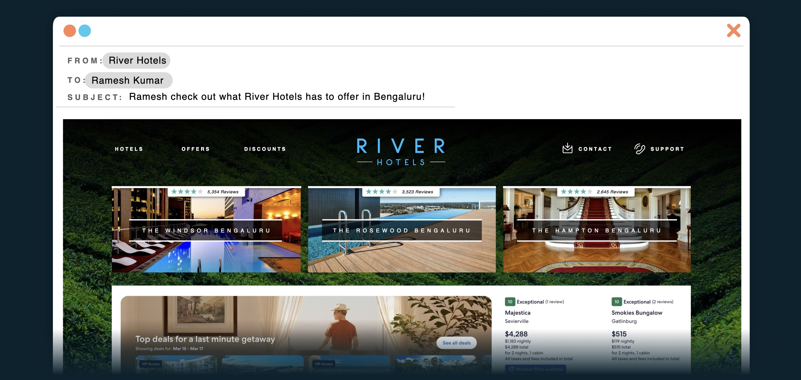
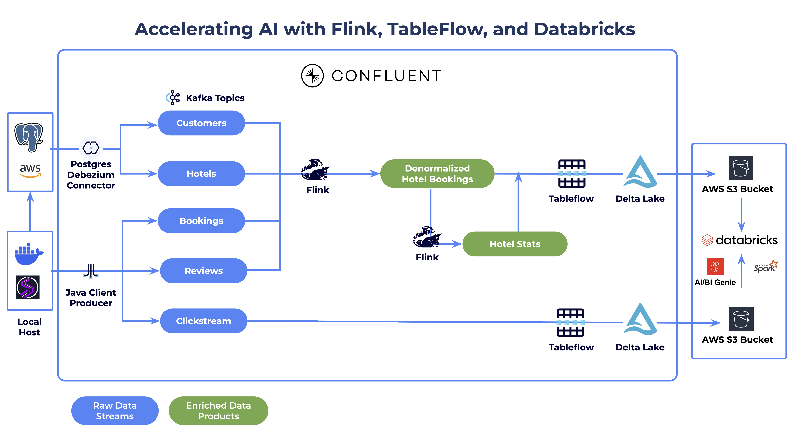
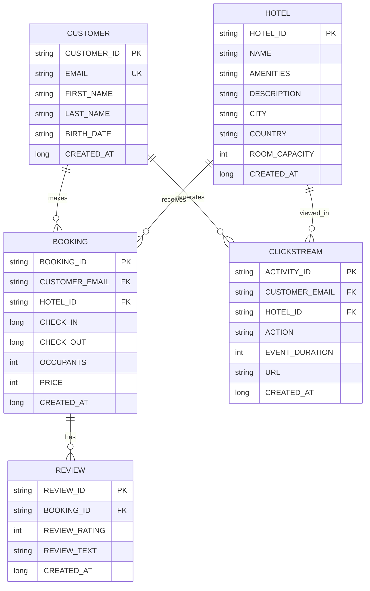
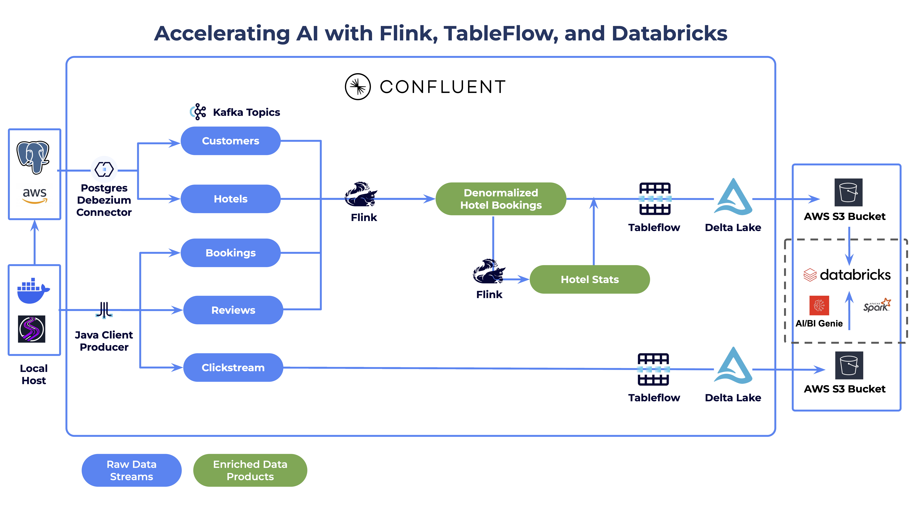

# Workshop: Streamlining Agentic AI with Confluent and Databricks

**Duration**: ~1.5 hours

**Difficulty**: Intermediate

**Technical Requirements**: Working knowledge of cloud platforms (AWS), SQL, and basic command-line operations

**Workshop Type**: This workshop is designed to work for both *self-service* and *instructor-led* scenarios.

## 📖 Overview

This hands-on workshop demonstrates how to build a complete **real-time AI-powered marketing pipeline** for the hospitality industry. You will play the role of a data engineer at *River Hotels*, a fictitious hospitality company, to create an end-to-end data architecture proof-of-concept that transforms raw customer interactions into personalized marketing campaigns using cutting-edge streaming technologies.



Watch this ~13 minute [demo video](https://youtu.be/yVLfYe39SKg) to see the solution to a similar use case.

If you have any issues with or feedback for this workshop, Please let us know in this [quick 2-minute survey](https://docs.google.com/forms/d/e/1FAIpQLSfoVUqUFTAxHKJop7t8TvfZ4gItQxJ1RaM4oy72DjtK-HWoJg/viewform?usp=pp_url&entry.179681974=Tableflow+and+Databricks)!

## ✅ Prerequisites

> [!IMPORTANT]
> **Cloud and Region Compatibility**
>
> This workshop is currently only compatible with **AWS** and requires the following services to be available in your chosen region:
>
> - Amazon EC2 (for database hosting)
> - Amazon S3 (for Delta Lake storage)
> - Amazon VPC (for networking)
>
> **Recommended AWS regions**:
>
> 1. `us-west-2` or `us-east-2`
> 2. `us-east-1`
>
> If you are going through this workshop with a presenter from Confluent, they may provide additional guidance/limitations for cloud regions as needed.

You must complete each of these in order to successfully go through this workshop:

### Required Accounts

- **Confluent Cloud account** with admin privileges - [sign up for a free trial](https://www.confluent.io/confluent-cloud/tryfree?utm_campaign=tm.fm-ams_cd.Build-an-A[…]ne_id.701Uz00000fEQeEIAW&utm_source=zoom&utm_medium=workshop)
- **Databricks account** and existing workspace - paid or [free edition account](https://login.databricks.com/?intent=SIGN_UP&provider=DB_FREE_TIER) are strongly recommended. [Free trial account](https://docs.databricks.com/aws/en/getting-started/express-setup) sometimes experience data syncing issues with this workshop, so we recommend that you use **paid** or **free edition** accounts instead.
- **AWS account** with permissions to create cloud resources (EC2, S3, VPC, IAM)

> [!IMPORTANT]
> **Payment Method or Promo Code Required for Confluent Cloud**
>
> You must either add a [payment method](https://docs.confluent.io/cloud/current/billing/overview.html#manage-your-payment-method) or [redeem a coupon code](https://docs.confluent.io/cloud/current/billing/overview.html#redeem-a-promo-code-or-view-balance) to be able to run this workshop.

### Required Tools

You only need to have these two tools installed on your local machine:

1. **[Git](https://git-scm.com/downloads)**
2. **[Docker Desktop](https://docs.docker.com/get-started/get-docker/)** installed and running

<details>
<summary>Install on macOS</summary>

Using [Homebrew](https://brew.sh/):

```sh
# Install Git
brew install git

# Install Docker Desktop
brew install --cask docker
```

After installation, launch Docker Desktop from Applications and ensure it's running (look for the whale icon in the menu bar).

</details>

<details>
<summary>Install on Windows</summary>

Using [winget](https://learn.microsoft.com/en-us/windows/package-manager/winget/) (Windows Package Manager):

```powershell
# Install Git
winget install --id Git.Git -e --source winget

# Install Docker Desktop
winget install --id Docker.DockerDesktop -e --source winget
```

After installation:

1. Restart your terminal
2. Launch Docker Desktop from the Start menu
3. Ensure Docker is running (look for the whale icon in the system tray)

</details>

<details>
<summary>Install on Linux (Ubuntu/Debian)</summary>

```sh
# Install Git
sudo apt update && sudo apt install -y git

# Install Docker Engine
sudo apt install -y ca-certificates curl gnupg
sudo install -m 0755 -d /etc/apt/keyrings
curl -fsSL https://download.docker.com/linux/ubuntu/gpg | sudo gpg --dearmor -o /etc/apt/keyrings/docker.gpg
sudo chmod a+r /etc/apt/keyrings/docker.gpg

echo \
  "deb [arch=$(dpkg --print-architecture) signed-by=/etc/apt/keyrings/docker.gpg] https://download.docker.com/linux/ubuntu \
  $(. /etc/os-release && echo "$VERSION_CODENAME") stable" | \
  sudo tee /etc/apt/sources.list.d/docker.list > /dev/null

sudo apt update
sudo apt install -y docker-ce docker-ce-cli containerd.io docker-buildx-plugin docker-compose-plugin

# Add your user to the docker group (logout/login required)
sudo usermod -aG docker $USER
```

> **Note**: Log out and back in for the group change to take effect.

</details>

<details>
<summary>Install on Linux (Fedora/RHEL)</summary>

```sh
# Install Git
sudo dnf install -y git

# Install Docker Engine
sudo dnf -y install dnf-plugins-core
sudo dnf config-manager --add-repo https://download.docker.com/linux/fedora/docker-ce.repo
sudo dnf install -y docker-ce docker-ce-cli containerd.io docker-buildx-plugin docker-compose-plugin

# Start Docker
sudo systemctl start docker
sudo systemctl enable docker

# Add your user to the docker group (logout/login required)
sudo usermod -aG docker $USER
```

> **Note**: Log out and back in for the group change to take effect.

</details>

## Initial Setup Steps

Once you have the required tools installed and configured, then perform these steps:

### Step 1: Clone this Repository

Get started by cloning the workshop repository

1. Open your preferred command-line interface, like *zsh* or *Powershell*
2. Clone this repository with git:

   ```sh
   git clone https://github.com/confluentinc/workshop-tableflow-databricks.git
   ```

### Step 2: Pull and Build Docker Images

You will use a Docker container to run Terraform, ensuring consistent behavior across all operating systems (macOS, Linux, Windows). This container includes Terraform, AWS CLI, and SSH tools needed for infrastructure provisioning.

First, open your terminal and navigate into the workshop directory:

```sh
cd workshop-tableflow-databricks
```

Next, navigate into the *terraform* directory

```sh
cd terraform
```

Build the Terraform container (this is a one-time setup):

```sh
docker-compose build
```

You should see output showing the container being built:

```sh
[+] Building 45.2s (7/7) FINISHED
 => [terraform internal] load build definition from Dockerfile
 => ...
 => => naming to docker.io/library/workshop-terraform:latest
```

Next, you need to pull down the data generator (ShadowTraffic) docker image by following these steps:

1. Open a new shell window/tab in the workshop root directory
2. Pull down the ShadowTraffic docker image

   ```sh
   docker pull shadowtraffic/shadowtraffic:1.11.13
   ```

> [!NOTE]
> **First-Time Build**
>
> The initial pull and build may take a few minutes. Subsequent uses leverage cached layers and should complete in seconds.

**You can continue on with the workshop while the docker images are pulled down.**

## 🏨 Use Case

*River Hotels* is at a critical juncture. Despite being a successful hospitality company with properties across multiple continents, they're slowly losing ground to more agile competitors who can respond to market opportunities in real-time. The executive leadership team has identified a fundamental problem: **their data infrastructure is holding back their ability to compete effectively in today's fast-paced hospitality market.**

## 🏛️ Architecture Overview

At a high level, the solution you will build is represented by this diagram:



### 🗄 Datasets

There are five normalized interrelated datasets that you will be streaming to Confluent Cloud:

1. **Customers**: Master customer profiles containing contact information and demographics. These records serve as the foundation for customer behavior analysis across all other data streams.

2. **Hotels**: Comprehensive hotel property data including amenities, descriptions, locations, and capacity details.

3. **Clickstream**: Real-time website interaction events capturing customer browsing behavior, page views, and hotel searches.

4. **Hotel Reviews**: Customer feedback with ratings (1-5 stars) and detailed review text, linked to specific bookings.

5. **Bookings**: Reservation transaction data linking customers to hotels with check-in/check-out dates, pricing, and guest counts.

Expand the accordion below for more background details about this use case. Otherwise, continue on to the next section of this workshop.

<details>
<summary>Use Case Details</summary>

### ⚠️ The Challenge

River Hotels' current batch-processing approach means that by the time sales and marketing teams get insights about customer behavior, booking patterns, and market opportunities, those insights are already stale. Competitors could be capturing customers who browse River Hotels' website but don't book immediately, while River Hotels' marketing team is still waiting for last week's data to become available.

As the lead data engineer, you've been called into an urgent cross-departmental meeting where each team has laid out their critical business needs:

---

### 💰 The Sales Dilemma

>*"We're flying blind,"* says the Sales Director. *"When a potential corporate client asks about our occupancy rates or customer satisfaction trends, I have to tell them I'll get back to them next week. By then, they've already signed with our competitor who had those numbers instantly available."*

---

### 🚀 The Marketing Predicament

> The Marketing Manager shares a similarly frustrating story: *"Every week, we try to run a 'discount deal' campaign for an underperforming but highly-rated property. But our current process takes 2-3 days just to identify which hotel needs promotion and another 2 days to analyze, create, review, and publish messaging that resonates with potential guests. By the time we launch the campaign, it's been over a week and the opportunity is lost."*

---

### ⚙️ The Engineering Conundrum

> The Engineering Director is supportive but realistic: *"Whatever solution we build needs to integrate with our existing Oracle database infrastructure and can't require a massive operational overhead. We're already stretched thin, and we need something built on proven, enterprise-grade technology that our small team can actually maintain."*

---

### 💼 The Business Imperative

> The CEO has made it clear: *"We're losing deals because we can't act on opportunities fast enough. Our competitors are using AI and real-time data to personalize customer experiences and optimize their operations. We need to catch up, and we need to do it quickly."*

---

### 🎖️ Your Mission

Your task is to design and implement a proof-of-concept that transforms River Hotels from a data-lagging organization into a real-time, AI-powered competitor.

#### Solution Requirements

1. 📡 **Capture** customer behavior as it happens
2. ✨ **Enrich** data with meaningful insights
3. 🤖 **Process** intelligently with AI
4. 🔓 **Unlock** teams to act on insights immediately

#### 🎯 Success Metrics

1. **💫 Data Freshness** - Moving from week-old batch data to insights that are less than one hour old
2. **⏱️ Operational Efficiency** - Reducing manual data analysis from days to minutes through enriched datasets and automation
3. **🏆 Competitive Advantage** - Responding to market opportunities in real-time rather than after the fact

---

### 🛠️ What You'll Build

By the end of this workshop, you will have constructed a sophisticated data pipeline that:

1. **Captures Real-Time Customer Behavior**: Set up Oracle XStream CDC to capture customer and hotel data changes, plus generate realistic clickstream, booking, and review data using ShadowTraffic
2. **Processes Streaming Data with AI**: Use Apache Flink SQL to identify high-value prospects (customers who clicked but didn't book) and enrich their profiles with hotel reviews summarized by Large Language Models
3. **Streams to Delta Lake**: Leverage Confluent Tableflow to automatically sync processed data streams as Delta tables in AWS S3
4. **Generates AI-Driven Insights**: Use Databricks Genie to analyze booking patterns, customer preferences, and hotel performance metrics
5. **Creates Personalized Campaigns**: Deploy AI agents in Databricks that identify underperforming hotels with good customer satisfaction, generate targeted social media content based on customer review analysis, and create lists of potential customers for marketing outreach

### 🎓 Key Learning Outcomes

- **Infrastructure as Code**: Deploy complex multi-cloud resources (AWS, Confluent Cloud, Databricks) using Terraform
- **Change Data Capture**: Implement Oracle XStream for real-time database change streaming
- **Stream Processing**: Build sophisticated Flink SQL queries for real-time data enrichment and AI model integration
- **Data Lake Integration**: Use Tableflow to seamlessly bridge streaming data and analytics platforms
- **AI-Powered Analytics**: Apply generative AI for both data summarization and marketing content creation
- **Event-Driven Architecture**: Design systems that react to customer behavior in real-time

### 🔗 Data Entity Relationship

This diagram depicts how these datasets relate to each other:



### 🧩 Key Components

1. **Data Sources**
   - **ShadowTraffic**: Realistic synthetic data generation of:
     - Customer and Hotel data, which is sent to an Oracle database
     - Bookings, Reviews, and Clickstream events, which are all produced to Kafka topics

2. **Ingestion Layer**
   - **Oracle XStream CDC Connector**: Real-time change data capture from Oracle
   - **Kafka Producers**: Stream synthetic data directly from ShadowTraffic to Confluent Cloud topics

3. **Processing Layer**
   - **Apache Flink SQL**: Real-time stream processing and data enrichment
   - **(Optional) AWS Bedrock Integration**: AI-powered review summarization using Claude models
   - **Stream Analytics**: Identification of high-value prospects and customer behavior analysis

4. **Integration Layer**
   - **Confluent Tableflow**: Automated streaming data to Delta Lake format
   - **AWS S3**: Delta Lake storage for processed data streams

5. **Analytics Layer**
   - **Databricks SQL**: Advanced analytics and querying capabilities
   - **Databricks Genie**: Natural language interface for business intelligence
   - **AI Agents**: Intelligent hotel selection, review analysis, and customer targeting for automated marketing campaigns

## 🛠️ Technical Stack

### Core Technologies

- **[Terraform](https://terraform.io/)**: Infrastructure as Code for multi-cloud deployment
<!-- - **[Oracle XStream](https://docs.oracle.com/en/database/oracle/oracle-database/21/xstrm/)**: Change data capture for real-time data streaming -->
- **[Apache Kafka](https://kafka.apache.org/)**: Distributed streaming platform via Confluent Cloud
- **[Apache Flink](https://flink.apache.org/)**: Stream processing and real-time analytics
- **[Delta Lake](https://delta.io/)**: Open-source storage framework for data lakes

### Cloud Platforms

- **[Confluent Cloud](https://confluent.io/)**: Fully managed Apache Kafka service
- **[AWS](https://aws.amazon.com/)**: Primary cloud provider (EC2, S3, VPC, Bedrock)
- **[Databricks](https://databricks.com/)**: Unified analytics platform for big data and ML

### AI/ML Services

<!-- - **[AWS Bedrock](https://aws.amazon.com/bedrock/)**: Managed AI service for Claude model access -->
- **[Databricks Genie](https://docs.databricks.com/en/genie/index.html)**: Natural language interface for analytics
- **[Databricks Mosaic AI Models](https://docs.databricks.com/aws/en/machine-learning/model-serving/foundation-model-overview)**: Large, powerful LLMs that can be utilized in custom agents

### Tools

- **[Docker](https://docker.com/)**: Containerization for Oracle database and ShadowTraffic
- **[Git](https://git-scm.com/)**: Version control
- **[AWS CLI](https://aws.amazon.com/cli/)**: AWS command-line interface
- **[ShadowTraffic](https://shadowtraffic.io/)**: Realistic synthetic data generation

</details>

## 🔬 Workshop Labs

This workshop is organized into seven sequential labs listed below.

Each lab builds upon the previous one, so start with LAB 1 and continue sequentially until completion.

| Lab | Duration | Details |
|-----|----------|-------------|
| [LAB 1: Account Setup](./labs/LAB1_account_setup/LAB1.md) | ~15 min | **Configure cloud platform accounts**: clone repo, set up Confluent Cloud API keys, configure Databricks service principal, establish AWS credentials. |
| [LAB 2: Cloud Infrastructure](./labs/LAB2_cloud_deployment/LAB2.md) | ~10 min | **Deploy infrastructure with Terraform**: provision AWS, Confluent Cloud, and Databricks resources. |
| [LAB 3: Data Generation](./labs/LAB3_data_generation/LAB3.md) | ~10 min | **Generate data**: deploy ShadowTraffic for realistic hospitality data, validate Kafka topics, enable Delta Lake sync. |
| [LAB 4: Tableflow & Unity Catalog](./labs/LAB4_tableflow/LAB4.md) | ~15 min | **Configure Tableflow**: Connect Tableflow with Unity Catalog, enable Tableflow on Clickstream topic. |
| [LAB 5: Stream Processing](./labs/LAB5_stream_processing/LAB5.md) | ~15 min | **Transform streams**: build Flink SQL queries, create snapshot tables with interval joins, configure Tableflow sync.  |
| [LAB 6: Analytics & AI](./labs/LAB6_databricks/LAB6.md) | ~25 min | **Generate insights**: use Databricks Genie for analytics, deploy AI agent for personalized marketing automation.  |
| [LAB 7: Cleanup](./labs/LAB7_clean_up/LAB7.md) | ~5 min | **Clean up resources**: remove UI-created resources and terraform destroy the remainder. |

### Additional Resources

- **[Recap](./labs/recap.md)**: Summary of accomplishments and business value delivered
- **[Troubleshooting](./labs/troubleshooting.md)**: Common issues and solutions
- **[Advanced Flink SQL Patterns](./labs/flink-joins.md)**: Detailed guide for streaming join patterns and schema management
<!-- - **[Optional: Bedrock LLM Integration](./labs/optional_bedrock_llm/optional_bedrock_llm.md)**: AWS Bedrock integration for AI-powered review summarization -->

## 🏁 Conclusion

Congratulations, you have completed this hands-on workshop on creating a streaming AI agent on AWS with Confluent and Databricks!

> [!IMPORTANT]
> **Your Feedback Helps!**
>
> Please help us improve this workshop by leaving your feedback in this [quick 2-minute survey](https://docs.google.com/forms/d/e/1FAIpQLSfoVUqUFTAxHKJop7t8TvfZ4gItQxJ1RaM4oy72DjtK-HWoJg/viewform?usp=pp_url&entry.179681974=Tableflow+and+Databricks)!
>
> Thanks!
