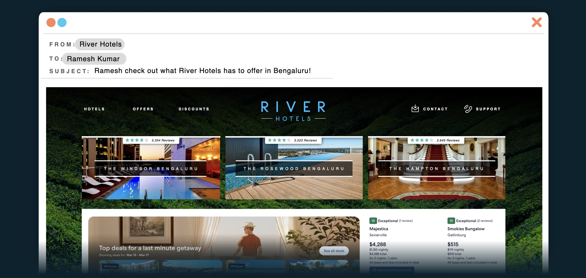
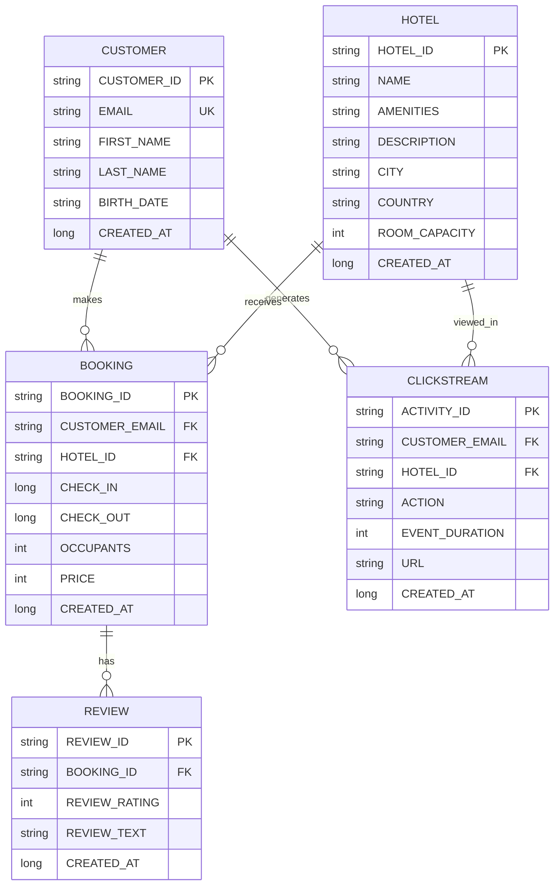
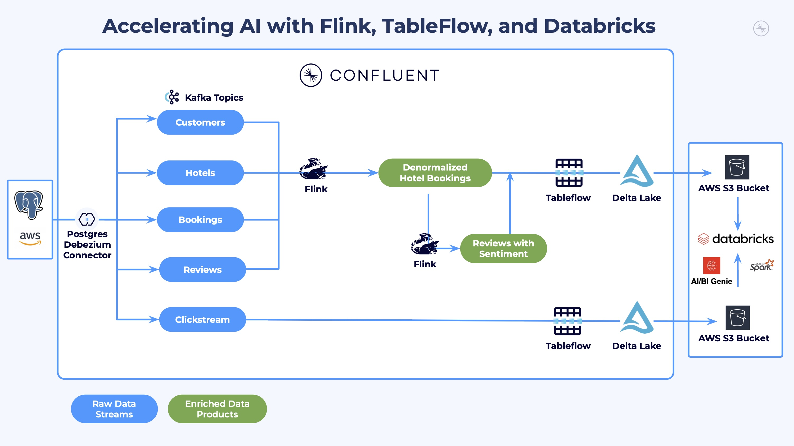
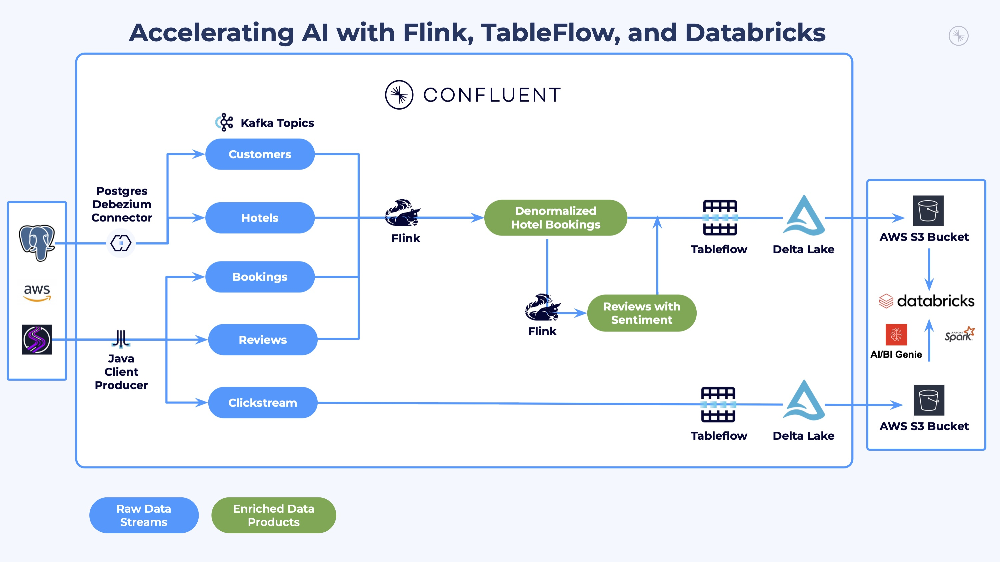

# Workshop: Streamlining Agentic AI with Confluent and Databricks

**Duration**: ~1.5 hours

**Difficulty**: Intermediate

**Technical Requirements**: Working knowledge of cloud platforms (AWS or Azure), SQL, and basic command-line operations

**Workshop Type**: This workshop is designed to work for both *self-service* and *instructor-led* scenarios.

## 📖 Overview

This hands-on workshop demonstrates how to build a complete **real-time AI-powered marketing pipeline** for the hospitality industry. You will play the role of a data engineer at *River Hotels*, a fictitious hospitality company, to create an end-to-end data architecture proof-of-concept that transforms raw customer interactions into personalized marketing campaigns using cutting-edge streaming technologies.

Watch this ~13 minute [demo video](https://youtu.be/yVLfYe39SKg) to see the solution to a similar use case.

If you have any issues with or feedback for this workshop, Please let us know in this [quick 2-minute survey](https://docs.google.com/forms/d/e/1FAIpQLSfoVUqUFTAxHKJop7t8TvfZ4gItQxJ1RaM4oy72DjtK-HWoJg/viewform?usp=pp_url&entry.179681974=Tableflow+and+Databricks)!

## 🏨 Use Case

*River Hotels* is at a critical juncture. Despite being a successful hospitality company with properties across multiple continents, they're slowly losing ground to more agile competitors who can respond to market opportunities in real-time. The executive leadership team has identified a fundamental problem: **their data infrastructure is holding back their ability to compete effectively in today's fast-paced hospitality market.**

## 🗄 Datasets

There are five normalized interrelated datasets that you will be streaming to Confluent Cloud:

1. **Customers**: Master customer profiles containing contact information and demographics. These records serve as the foundation for customer behavior analysis across all other data streams.

2. **Hotels**: Comprehensive hotel property data including amenities, descriptions, locations, and capacity details.

3. **Clickstream**: Real-time website interaction events capturing customer browsing behavior, page views, and hotel searches.

4. **Hotel Reviews**: Customer feedback with ratings (1-5 stars) and detailed review text, linked to specific bookings.

5. **Bookings**: Reservation transaction data linking customers to hotels with check-in/check-out dates, pricing, and guest counts.

Expand the accordion below for more background details about this use case. Otherwise, continue on to the next section of this workshop.

Use Case Details

### ⚠️ The Challenge

River Hotels' current batch-processing approach means that by the time sales and marketing teams get insights about customer behavior, booking patterns, and market opportunities, those insights are already stale. Competitors could be capturing customers who browse River Hotels' website but don't book immediately, while River Hotels' marketing team is still waiting for last week's data to become available.

As the lead data engineer, you've been called into an urgent cross-departmental meeting where each team has laid out their critical business needs:

---

### 💰 The Sales Dilemma

>*"We're flying blind,"* says the Sales Director. *"When a potential corporate client asks about our occupancy rates or customer satisfaction trends, I have to tell them I'll get back to them next week. By then, they've already signed with our competitor who had those numbers instantly available."*

---

### 🚀 The Marketing Predicament

> The Marketing Manager shares a similarly frustrating story: *"Every week, we try to run a 'discount deal' campaign for an underperforming but highly-rated property. But our current process takes 2-3 days just to identify which hotel needs promotion and another 2 days to analyze, create, review, and publish messaging that resonates with potential guests. By the time we launch the campaign, it's been over a week and the opportunity is lost."*

---

### ⚙️ The Engineering Conundrum

> The Engineering Director is supportive but realistic: *"Whatever solution we build needs to integrate with our existing PostgreSQL database infrastructure and can't require a massive operational overhead. We're already stretched thin, and we need something built on proven, enterprise-grade technology that our small team can actually maintain."*

---

### 💼 The Business Imperative

> The CEO has made it clear: *"We're losing deals because we can't act on opportunities fast enough. Our competitors are using AI and real-time data to personalize customer experiences and optimize their operations. We need to catch up, and we need to do it quickly."*

---

### 🎖️ Your Mission

Your task is to design and implement a proof-of-concept that transforms River Hotels from a data-lagging organization into a real-time, AI-powered competitor.

#### Solution Requirements

1. 📡 **Capture** customer behavior as it happens
2. ✨ **Enrich** data with meaningful insights
3. 🤖 **Process** intelligently with AI
4. 🔓 **Unlock** teams to act on insights immediately

#### 🎯 Success Metrics

1. **💫 Data Freshness** - Moving from week-old batch data to insights that are less than one hour old
2. **⏱️ Operational Efficiency** - Reducing manual data analysis from days to minutes through enriched datasets and automation
3. **🏆 Competitive Advantage** - Responding to market opportunities in real-time rather than after the fact

---

### 🛠️ What You'll Build

By the end of this workshop, you will have constructed a sophisticated data pipeline that:

1. **Captures Real-Time Customer Behavior**: Set up PostgreSQL CDC to capture customer and hotel data changes, plus generate realistic clickstream, booking, and review data using ShadowTraffic
2. **Processes Streaming Data with AI**: Use Confluent Cloud for Apache Flink SQL to identify high-value prospects (customers who clicked but didn't book) and enrich their profiles with hotel reviews summarized by Large Language Models
3. **Streams to Delta Lake**: Leverage Confluent Tableflow to automatically sync processed data streams as Delta tables in AWS S3
4. **Generates AI-Driven Insights**: Use Databricks Genie to analyze booking patterns, customer preferences, and hotel performance metrics
5. **Creates Personalized Campaigns**: Deploy AI agents in Databricks that identify underperforming hotels with good customer satisfaction, generate targeted social media content based on customer review analysis, and create lists of potential customers for marketing outreach

### 🎓 Key Learning Outcomes

- **Infrastructure as Code**: Deploy complex multi-cloud resources (AWS, Confluent Cloud, Databricks) using Terraform
- **Change Data Capture**: Implement PostgreSQL CDC Connector for real-time database change streaming
- **Stream Processing**: Build sophisticated Flink SQL queries for real-time data enrichment and AI model integration
- **Data Lake Integration**: Use Tableflow to seamlessly bridge streaming data and analytics platforms
- **AI-Powered Analytics**: Apply generative AI for both data summarization and marketing content creation
- **Event-Driven Architecture**: Design systems that react to customer behavior in real-time

### 🔗 Data Entity Relationship

This diagram depicts how these datasets relate to each other:

```mermaid
erDiagram
    CUSTOMER {
        string CUSTOMER_ID PK
        string EMAIL UK
        string FIRST_NAME
        string LAST_NAME
        string BIRTH_DATE
        long CREATED_AT
    }

    HOTEL {
        string HOTEL_ID PK
        string NAME
        string AMENITIES
        string DESCRIPTION
        string CITY
        string COUNTRY
        int ROOM_CAPACITY
        long CREATED_AT
    }

    BOOKING {
        string BOOKING_ID PK
        string CUSTOMER_EMAIL FK
        string HOTEL_ID FK
        long CHECK_IN
        long CHECK_OUT
        int OCCUPANTS
        int PRICE
        long CREATED_AT
    }

    CLICKSTREAM {
        string ACTIVITY_ID PK
        string CUSTOMER_EMAIL FK
        string HOTEL_ID FK
        string ACTION
        int EVENT_DURATION
        string URL
        long CREATED_AT
    }

    REVIEW {
        string REVIEW_ID PK
        string BOOKING_ID FK
        int REVIEW_RATING
        string REVIEW_TEXT
        long CREATED_AT
    }

    %% Relationships
    CUSTOMER ||--o{ BOOKING : "makes"
    CUSTOMER ||--o{ CLICKSTREAM : "generates"
    HOTEL ||--o{ BOOKING : "receives"
    HOTEL ||--o{ CLICKSTREAM : "viewed_in"
    BOOKING ||--o{ REVIEW : "has"
```

### 🧩 Key Components

1. **Data Sources**
   - **ShadowTraffic**: Realistic synthetic data generation of:
     - Customer and Hotel data, which is sent to an PostgreSQL database
     - Bookings, Reviews, and Clickstream events, which are all produced to Kafka topics

2. **Ingestion Layer**
   - **PostgreSQL CDC Connector**: Real-time change data capture from PostgreSQL
   - **Kafka Producers**: Stream synthetic data directly from ShadowTraffic to Confluent Cloud topics

3. **Processing Layer**
   - **Apache Flink SQL**: Real-time stream processing and data enrichment
   - **(Optional) AWS Bedrock Integration**: AI-powered review summarization using Claude models
   - **Stream Analytics**: Identification of high-value prospects and customer behavior analysis

4. **Integration Layer**
   - **Confluent Tableflow**: Automated streaming data to Delta Lake format
   - **AWS S3**: Delta Lake storage for processed data streams

5. **Analytics Layer**
   - **Databricks SQL**: Advanced analytics and querying capabilities
   - **Databricks Genie**: Natural language interface for business intelligence
   - **AI Agents**: Intelligent hotel selection, review analysis, and customer targeting for automated marketing campaigns

## 🛠️ Technical Stack

### Core Technologies

- **[Terraform](https://terraform.io/)**: Infrastructure as Code for multi-cloud deployment
- **[Apache Kafka](https://www.confluent.io/apache-kafka/)**: Distributed streaming platform via Confluent Cloud
- **[Apache Flink](https://www.confluent.io/product/flink/)**: Stream processing and real-time analytics
- **[Delta Lake](https://delta.io/)**: Open-source storage framework for data lakes

### Cloud Platforms

- **[Confluent Cloud](https://confluent.io/)**: Fully managed Apache Kafka service
- **[AWS](https://aws.amazon.com/)**: Primary cloud provider (EC2, S3, VPC, Bedrock)
- **[Databricks](https://databricks.com/)**: Unified analytics platform for big data and ML

### AI/ML Services

<!-- - **[AWS Bedrock](https://aws.amazon.com/bedrock/)**: Managed AI service for Claude model access -->
- **[Databricks Genie](https://docs.databricks.com/en/genie/index.html)**: Natural language interface for analytics
- **[Databricks Mosaic AI Models](https://docs.databricks.com/aws/en/machine-learning/model-serving/foundation-model-overview)**: Large, powerful LLMs that can be utilized in custom agents

### Tools

- **[Docker](https://docker.com/)**: Containerization for PostgreSQL database and ShadowTraffic
- **[Git](https://git-scm.com/)**: Version control
- **[AWS CLI](https://aws.amazon.com/cli/)**: AWS command-line interface
- **[ShadowTraffic](https://shadowtraffic.io/)**: Realistic synthetic data generation

## 🔬 Workshop Labs

This workshop supports two modes. Choose the path that matches your situation:

### 🎓 Instructor-Led

> Your instructor has pre-provisioned all cloud infrastructure and accounts. You will claim a dedicated environment and focus on the hands-on Confluent and Databricks labs.

| Lab | Duration | Details |
|-----|----------|-------------|
| [LAB 1: Claim Your Account](./labs/instructor-led/LAB1_claim_account/LAB1.md) | ~5 min | **Claim your workshop account**: complete the Google Form, receive credentials, verify access to Confluent Cloud and Databricks. |
| [LAB 2: Explore Your Environment](./labs/instructor-led/LAB2_explore_environment/LAB2.md) | ~10 min | **Tour your environment**: explore your Kafka cluster, CDC topics, connectors, Flink compute pool, and Databricks workspace. |
| [LAB 3: Stream Processing](./labs/instructor-led/LAB3_stream_processing/LAB3.md) | ~15 min | **Transform streams**: build Flink SQL queries with temporal joins, denormalize CDC data, enrich reviews with AI sentiment. |
| [LAB 4: Tableflow](./labs/instructor-led/LAB4_tableflow/LAB4.md) | ~10 min | **Configure catalog and enable Tableflow**: connect Confluent Cloud Tableflow with Databricks Unity Catalog, stream clickstream, denormalized bookings, and sentiment-enriched reviews as Delta Lake tables. |
| [LAB 5: Analytics & AI](./labs/instructor-led/LAB5_analytics_ai/LAB5.md) | ~25 min | **Generate insights**: use Databricks Genie for analytics, deploy AI agent for personalized marketing automation. |
| [LAB 6: Wrap Up](./labs/instructor-led/LAB6_wrap_up/LAB6.md) | ~5 min | **Clean up and recap**: Review accomplishments, provide feedback. |

### 🛠️ Self-Service

> You will set up your own cloud accounts, deploy infrastructure with Terraform, and run the full workshop independently.

| Lab | Duration | Details |
|-----|----------|-------------|
| [LAB 0: Prerequisites](./labs/self-service/LAB0_prerequisites/LAB0.md) | ~10 min | **Set up prerequisites**: create cloud accounts, install Git and Docker, clone the repo, build Docker images. |
| [LAB 1: Account Setup](./labs/self-service/LAB1_account_setup/LAB1.md) | ~15 min | **Configure cloud platform accounts**: set up Confluent Cloud API keys, configure Databricks service principal, establish AWS credentials. |
| [LAB 2: Cloud Infrastructure](./labs/self-service/LAB2_cloud_deployment/LAB2.md) | ~15 min | **Deploy infrastructure with Terraform**: provision AWS, Confluent Cloud, and Databricks resources. Verify data generation and CDC connector. |
| [LAB 3: Tableflow & Unity Catalog](./labs/self-service/LAB3_tableflow/LAB3.md) | ~15 min | **Configure Tableflow**: connect Tableflow with Unity Catalog, enable Tableflow on clickstream topic. |
| [LAB 4: Stream Processing](./labs/self-service/LAB4_stream_processing/LAB4.md) | ~15 min | **Transform streams**: build Flink SQL queries with temporal joins on pre-configured CDC topics, configure Tableflow sync. |
| [LAB 5: Analytics & AI](./labs/self-service/LAB5_databricks/LAB5.md) | ~25 min | **Generate insights**: use Databricks Genie for analytics, deploy AI agent for personalized marketing automation. |
| [LAB 6: Cleanup](./labs/self-service/LAB6_clean_up/LAB6.md) | ~5 min | **Clean up resources**: remove UI-created resources and terraform destroy the remainder. |

### Additional Resources

- **[Recap](./labs/shared/recap.md)**: Summary of accomplishments and business value delivered
- **[Troubleshooting](./labs/shared/troubleshooting.md)**: Common issues and solutions
- **[Stream Processing Insights](./labs/shared/stream-processing-insights.md)**: Detailed guide for streaming join patterns and schema management

## 🏁 Conclusion

Congratulations, you have completed this hands-on workshop on creating a streaming AI agent on AWS with Confluent and Databricks!

> [!IMPORTANT]
> **Your Feedback Helps!**
>
> Please help us improve this workshop by leaving your feedback in this [quick 2-minute survey](https://docs.google.com/forms/d/e/1FAIpQLSfoVUqUFTAxHKJop7t8TvfZ4gItQxJ1RaM4oy72DjtK-HWoJg/viewform?usp=pp_url&entry.179681974=Tableflow+and+Databricks)!
>
> Thanks!
