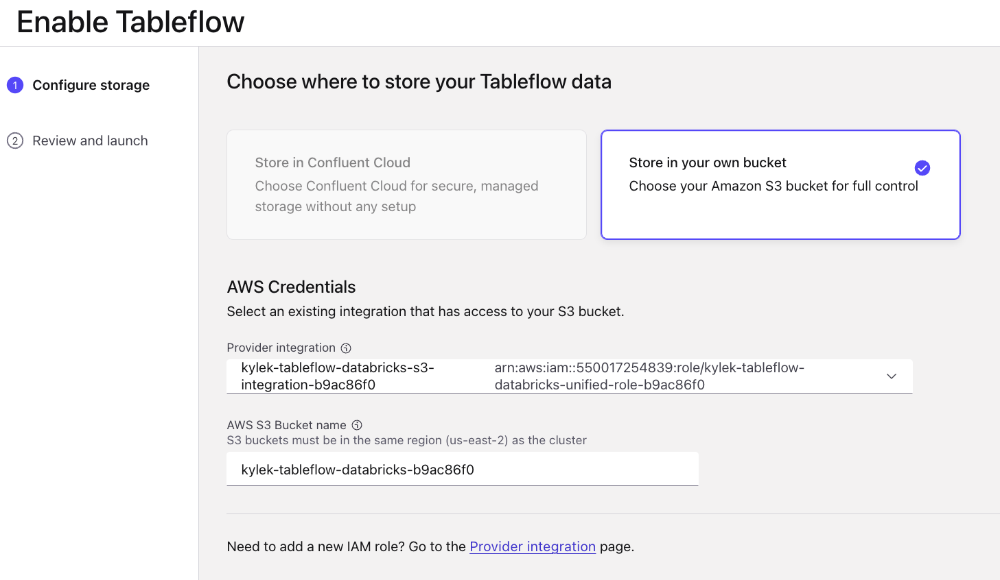

# Workshop: Streamlining Agentic AI with Confluent and Databricks

**Duration**: ~1.5 hours
**Difficulty**: Intermediate
**Technical Requirements**: Working knowledge of cloud platforms (AWS) and SQL

This workshop will guide you through setting up an end-to-end data pipeline that integrates Oracle, Confluent Cloud, and Databricks to power AI-driven hotel marketing campaigns for a fictitious hospitality company called *River Hotels*.

## Overview

In this workshop you will create:

1. An Oracle database with `XStream` enabled
2. A Confluent Cloud environment with Kafka and Flink
3. Locally-running data pipelines that stream hotel, customer, clickstream, booking, and review data
4. Real-time data processing using Flink SQL
5. Streamlined data integration from Confluent Tableflow to Databricks
6. AI-powered social marketing campaigns using Databricks

## Prerequisites

You must fulfill these prerequisites to successfully complete this workshop:

- Confluent Cloud account with admin privileges
- Databricks account and existing workspace (can be a [trial account](https://docs.databricks.com/aws/en/getting-started/express-setup) with the default workspace)
- [AWS CLI](https://docs.aws.amazon.com/cli/latest/userguide/getting-started-install.html) installed and authenticated with an AWS account that has permissions to create resources
- [Terraform](https://developer.hashicorp.com/terraform/install) installed
- [Docker Desktop](https://docs.docker.com/get-started/get-docker/) installed
- [Git](https://git-scm.com/downloads) installed

## Architecture Overview

The diagram below illustrates the end-to-end data pipeline we'll build in this workshop:


### Key Components

1. **Data Layer**: Data sourced from Oracle database (Customer & Hotel data) and ShadowTraffic generators (Bookings, Reviews, Clickstream)
2. **Ingestion Layer**: Oracle XStream CDC connector and Kafka producers
3. **Processing Layer**: Flink SQL for real-time data enrichment and LLM-based review summarization
4. **Integration Layer**: Tableflow creating Delta tables in S3
5. **Analytics Layer**: Databricks for AI-driven analytics and recommendations

This architecture enables real-time personalization and AI-powered marketing based on customer behavior and preferences.

## Workshop Steps

### Step 1: Clone this Repository

The first major step is to open your preferred command-line interface, clone this repository and then change directory into the `terraform` directory within the repository:

```sh
git clone https://github.com/your-org/workshop-tableflow-databricks.git
cd workshop-tableflow-databricks/terraform
```

### Step 2: Fill out Terraform Variables

Terraform enables you to automate and streamline both the creation and some of the initial set up of many cloud resources in this workshop, which allows you to focus on configuring the interesting parts.

The steps below will guide you through setting up your Terraform

#### tfvars

You can supply and override defaults with values from a `.tfvars` file. Follow these steps to get yours set up:

1. Copy or rename the `sample-tfvars` file to `terraform.tfvars` :

```sh
cp sample-tfvars terraform.tfvars
```

2. Edit the `terraform.tfvars` to replace the placeholder values with actual ones:

```hcl
email        = ""
cloud_region = ""

confluent_cloud_api_key    = ""
confluent_cloud_api_secret = ""
oracle_db_username         = ""
oracle_db_password         = ""

databricks_account_id                      = ""
databricks_service_principal_client_id     = ""
databricks_service_principal_client_secret = ""
databricks_host                            = ""
databricks_metastore_id                    = ""
databricks_user_email                      = ""
```

3. Replace the `cloud_region` value placeholder with the AWS region you would like to run this. **Note:** if you are using a trial databricks account, then it will default you to `us-east-2`.
<!-- TODO is email even needed? -->
4. Replace the `email` value placeholder with your email address.

#### Confluent account

Follow this next section of steps to create a Confluent *Cloud resource management* API key and token:

<!-- TODO add free trial link -->
1. In the web browser of your choice, login to your Confluent cloud account. If you don't have one, sign up for a trial [here]()
2. Click on the menu icon in the top right of the screen
3. Click on *API keys*
4. Click on the *+ Add API key* button
5. Select *My account*
6. Click *Next*
7. Select *Cloud resource management*
8. Click *Next*
9. Enter a name like *Tableflow Databricks Workshop*
10. Add a useful description
11. Click the *Create API Key* button
12. In your code editor open your *terraform.tfvars* file and replace the `confluent_cloud_api_key` and `confluent_cloud_api_secret` placeholder values with your newly-created **Key** and **Secret**. Save the file.
13. Back in Confluent Cloud, Click the *Download API key* button to prompt your browser to download a text file with your API key, secret, and other useful Confluent information and values
14. Click the *Complete* button

#### Databricks account

1. Login to your databricks account. Ensure it is a workplace admin.
   1. If you don't have one, you can create a trial one [here](https://docs.databricks.com/aws/en/getting-started/express-setup). Your trial user account will be a workspace admin.
2. Click on your username in the top right bar and select Settings.
Go to Identity and Access: Click on the Identity and access tab.
Manage Service Principals: Next to Service principals, click Manage.
Add a service principal: Click Add service principal and then Add new.
Enter a name: Provide a descriptive name for the service principal.
Click Add: Click Add to finalize the creation.

### Step 3: Deploy Infrastructure with Terraform

Run these `terraform` commands to create the solution resources:

```sh
terraform init
terraform validate
terraform apply -auto-approve
```

These resources will be generated:

- An AWS VPC with necessary networking components
- An EC2 instance running Oracle XE with XStream enabled
- A Confluent Cloud environment with:
  - Kafka *Standard* cluster
  - Schema Registry
  - Flink compute pool
  - Provider integration with AWS for Tableflow
  - Requisite API keys
- These Databricks resources in an existing account and workspace:
  - External storage location
  - ??

When the deployment completes, you can view essential resource output values by running this command:

```sh
terraform output resource-ids
```

<!--
## Step 6: Generate Sample Data in Oracle

1. Connect to Oracle using SQL*Plus:

```sh
docker exec -it oracle-xe sqlplus system/Welcome1@localhost:1521/XE
```

2. Create and populate the Hotels table:

```sql
ALTER SESSION SET CONTAINER=XEPDB1;
CONNECT sample/password@//localhost:1521/XEPDB1;

CREATE TABLE hotels (
  HOTEL_ID CHAR(10) PRIMARY KEY,
  name VARCHAR2(100),
  description VARCHAR2(500),
  country VARCHAR2(50),
  city VARCHAR2(50),
  room_capacity NUMBER,
  amenities VARCHAR2(500),
  created_at TIMESTAMP DEFAULT CURRENT_TIMESTAMP
);

-- Insert sample data (repeat for multiple hotels)
INSERT INTO hotels VALUES(
  'H123456789',
  'Vista Chateau',
  'Built in 1994 and fully renovated in 2016, this luxurious hotel boasts fine dining, breathtaking views, and activities for all.',
  'India',
  'Mumbai',
  500,
  'WiFi, Pool, Spa, Restaurant, Gym',
  CURRENT_TIMESTAMP
);

-- Add more hotels with identical amenities and city for the similar hotels feature
INSERT INTO hotels VALUES(
  'H223456789',
  'Royal Oasis',
  'A modern oasis of luxury in the heart of the city with breathtaking views and world-class amenities.',
  'India',
  'Mumbai',
  350,
  'WiFi, Pool, Spa, Restaurant, Gym',
  CURRENT_TIMESTAMP
);

COMMIT;
``` -->

### Step 5: Configure ShadowTraffic for data generation

We will use [Shadow Traffic](https://shadowtraffic.io/) to generate these five *River Hotel* data streams:

1. **Customer Generator (Oracle)**
2. **Hotel Generator (Oracle)**
3. **Clickstream Generator (Kafka)**
   - Produces 1 message every 10 seconds to the `clickstream` topic
   - Reference customer emails and hotel IDs from the Oracle data
4. **Bookings Generator (Kafka)**
   - Produces 1 message every 60 seconds to the `bookings` topic
   - Ensures that 20% of customers never appear in bookings
   - References customer emails and hotel IDs from the Oracle data
5. **Reviews Generator (Kafka)**
   - Produces 1 message every 120 seconds to the `hotel_reviews` topic
   - Ensures all reviews have ratings between 3-5
   - References customer emails, hotel IDs and booking IDs

Follow these steps to configure Shadow Traffic:

1. Acquire a Shadow Traffic license by signing up for a [free trial](https://shadowtraffic.io/pricing.html)
2. Copy the contents of your Shadow Traffic license to the `sample-shadow-traffic-license.env`
3. Rename the file by removing the `sample-` prefix so it reads `shadow-traffic-license.env`:
4. Run the Shadow Traffic docker container from the workshop's root directory with this command:

<!-- TODO check this works on both *nix and windows -->

**Linux/Mac**

```sh
docker run --env-file ./data/shadow-traffic-license.env -v "$(pwd)/data/:/home/data" shadowtraffic/shadowtraffic:latest --config /home/data/shadow-traffic-configuration.json --watch
```

**Windows cmd**

```sh
docker run --env-file ./data/shadow-traffic-license.env -v "%cd%/data/:/home/data" shadowtraffic/shadowtraffic:latest --config /home/data/shadow-traffic-configuration.json --watch
```

**Windows Powershell**

```sh
docker run --env-file ./data/shadow-traffic-license.env -v "${PWD}/data/:/home/data" shadowtraffic/shadowtraffic:latest --config /home/data/shadow-traffic-configuration.json --watch
```

This will run the data generator in the foreground with .  and you should see something similar to this output:


### Step 5: Set Up Confluent Cloud Oracle XStream Connector

Now it's time to pull in our data from Oracle into Confluent Cloud by following these steps to set up the Oracle XStream Connector!

1. Log into [Confluent Cloud](https://confluent.cloud/login)
2. Click on your workshop environment
3. Click on your workshop cluster
4. Click on *Connectors* in the left sidebar menu

### Create Oracle XStream Fully Managed Connector


1. Type `XStream` in the *search* text field
2. Select the `Oracle XStream CDC Source Premium` tile (it has the Oracle logo on it)
3. Generate Connector API Key
   1. Select the `My account` tile
   2. Click the `Generate API key and download` button **Note:** If you too many existing API keys this will fail; remove any unused keys if this occurs
   3. Click the `Continue` button **Note:** These API keys dont need to be recorded & will automatically be assigned to the cluster
4. Fill out these fields with their corresponding output values from the command:

   ```sh
   terraform output oracle_xstream_connector
   ```

   1. Enter the `database_hostname` Terraform output into the `Database hostname` textbox
   2. Enter the `database_port` Terraform output into the `Database port` textbox
   3. Enter the `database_username` Terraform output into the `Database username` textbox
   4. Enter the `database_password` Terraform output into the `Database password` textbox
   5. Enter the `database_name` Terraform output into the `Database name` textbox
   6. Enter the `database_service_name` Terraform output into the `Database service name` textbox
   7. Enter the `pluggable_database_name` Terraform ouput into the `Pluggable database (PDB) name` textbox
   8. Enter the `xstream_outbound_server` Terraform ouput into the `Xstream outbound server name` textbox
   9. Enter the `1` into the `Total number of Oracle processors to license` textbox

   Your screen should look similar to this:
   

   10. Click the `Continue` button on the bottom right

5. Configure message formatting and tables
   1. Select `AVRO` on the *Output Kafka record key format* dropdown
   2. Select `AVRO` from the *Output Kafka record value format* options
   3. Enter `riverhotel` into the *Topic prefix* textbox

   Your screen should look like this:
   

   4. Click the `Continue` button

6. Configure Connector sizing
   1. Enter `1` into the *Max tasks* textbox
   2. Click the `Continue` button
7. Configure Connector Name
   1. Enter any name you like in the *Connector name* textbox
   2. Click the `Continue` button
8. Wait for the connector to initialize; this could take ~5 minutes; The connector tile will show **Running** status when it is ready


Nice job! You have successfully configured change data capture for all events on the database tables `CUSTOMER` & `HOTEL`, which will automatically be recorded to the corresponding Kafka topics `riverhotel.CUSTOMER` & `riverhotel.HOTEL`

Now that we have data generating to our Oracle database and Kafka topics, let's move on to the next step!

<!--
TODO - include this?
### Step ?: Data Portal
We could do something with Data Portal here, but should we??
-->

### Step 8: Create Flink SQL Queries for Data Processing

Let's process and enrich the River Hotel data with Flink within Confluent Cloud.

1. Login to your Confluent Cloud account and click on your workshop environment
2. Click on the `Flink` menu item in the left-side navigation
3. Click on the `Open SQL workspace` button in your workshop Flink compute pool
   
4. Ensure your workspace environment and cluster are both selected in the `Catalog` and `Database` dropdowns at the top of your compute pool screen
5. Drill down in the left navigation to see the tables in your environment and cluster
   
6. Check out some of the data you've ingested into Confluent Cloud by executing these queries:

   ```sql
   -- View bookings data
   SELECT * FROM `bookings` LIMIT 10;
   ```

   ```sql
   -- View clickstream data
   SELECT * FROM `clickstream` LIMIT 10;
   ```

   ```sql
   -- View hotel_reviews data
   SELECT * FROM `hotel_reviews` LIMIT 10;
   ```

7. Now, create a table that identifies target customers who clicked on a hotel but didn't book within 20 minutes:

```sql
SET 'client.statement-name' = 'target-customers-materializer';

CREATE TABLE TARGET_CUSTOMERS_WITH_SIMILAR_HOTELS
AS (
SELECT
TARGET_CUSTOMERS.CUSTOMER_EMAIL AS CUSTOMER_EMAIL,
TARGET_CUSTOMERS.HOTEL_ID AS HOTEL_ID,
TARGET_CUSTOMERS.ACTIVITY_TIME AS ACTIVITY_TIME,
COALESCE(HOTELS.`NAME`, 'Unknown') AS HOTEL_NAME,
HOTELS.`CITY` AS HOTEL_CITY,
HOTELS.`AMENITIES` AS HOTEL_AMENITIES,
ARRAY_AGG(OTHER_HOTELS.`NAME`) AS SIMILAR_HOTELS
FROM
(
SELECT
    CLICKSTREAM.CUSTOMER_EMAIL,
    CLICKSTREAM.HOTEL_ID,
    CLICKSTREAM.`$rowtime` as ACTIVITY_TIME
FROM `clickstream` CLICKSTREAM
LEFT JOIN `bookings` BOOKINGS
    ON CLICKSTREAM.`CUSTOMER_EMAIL` = BOOKINGS.`CUSTOMER_EMAIL`
    AND BOOKINGS.`$rowtime` BETWEEN CLICKSTREAM.`$rowtime` AND CLICKSTREAM.`$rowtime` + INTERVAL '20' MINUTE
WHERE CLICKSTREAM.`ACTION` = 'booking-click'
GROUP BY CLICKSTREAM.CUSTOMER_EMAIL, CLICKSTREAM.HOTEL_ID, CLICKSTREAM.`$rowtime`
HAVING COUNT(BOOKINGS.CUSTOMER_EMAIL) = 0
) TARGET_CUSTOMERS
JOIN `riverhotel.SAMPLE.HOTEL` as HOTELS
ON TARGET_CUSTOMERS.HOTEL_ID = HOTELS.`HOTEL_ID`
LEFT JOIN `riverhotel.SAMPLE.HOTEL` as OTHER_HOTELS
ON HOTELS.`CITY` = OTHER_HOTELS.`CITY`
AND HOTELS.`AMENITIES` = OTHER_HOTELS.`AMENITIES`
AND HOTELS.`HOTEL_ID` <> OTHER_HOTELS.`HOTEL_ID`
GROUP BY
TARGET_CUSTOMERS.CUSTOMER_EMAIL,
TARGET_CUSTOMERS.HOTEL_ID,
TARGET_CUSTOMERS.ACTIVITY_TIME,
HOTELS.`NAME`,
HOTELS.`CITY`,
HOTELS.`AMENITIES`
);
```

4. Query the results to verify:

```sql
SELECT * FROM `TARGET_CUSTOMERS_WITH_SIMILAR_HOTELS` LIMIT 10;
```

5. Create a table that joins target customers with hotel reviews:

```sql
SET 'client.statement-name' = 'target-customers-with-reviews-materializer';

CREATE TABLE TARGET_CUSTOMERS_WITH_REVIEWS_AND_HOTELS
AS (
SELECT
    TARGET_CUSTOMERS.CUSTOMER_EMAIL,
    TARGET_CUSTOMERS.HOTEL_ID,
    TARGET_CUSTOMERS.ACTIVITY_TIME,
    COALESCE(TARGET_CUSTOMERS.HOTEL_NAME, 'Unknown') AS HOTEL_NAME,
    COALESCE(TARGET_CUSTOMERS.HOTEL_CITY, 'Unknown') AS HOTEL_CITY,
    TARGET_CUSTOMERS.SIMILAR_HOTELS,
    TARGET_CUSTOMERS.HOTEL_AMENITIES,
    ARRAY_JOIN(ARRAY_AGG(HOTEL_REVIEWS.REVIEW_TEXT), '||| ') AS HOTEL_REVIEWS
FROM `TARGET_CUSTOMERS_WITH_SIMILAR_HOTELS` TARGET_CUSTOMERS
LEFT JOIN `hotel_reviews` HOTEL_REVIEWS
    ON TARGET_CUSTOMERS.HOTEL_ID = HOTEL_REVIEWS.HOTEL_ID
    AND HOTEL_REVIEWS.CREATED_AT BETWEEN TARGET_CUSTOMERS.ACTIVITY_TIME - INTERVAL '1' MONTH AND TARGET_CUSTOMERS.ACTIVITY_TIME
GROUP BY
    TARGET_CUSTOMERS.CUSTOMER_EMAIL,
    TARGET_CUSTOMERS.HOTEL_ID,
    TARGET_CUSTOMERS.ACTIVITY_TIME,
    TARGET_CUSTOMERS.HOTEL_NAME,
    TARGET_CUSTOMERS.HOTEL_CITY,
    TARGET_CUSTOMERS.HOTEL_AMENITIES,
    TARGET_CUSTOMERS.SIMILAR_HOTELS
);
```

<!--
TODO: Clarify this step with Zamzam on what should be done

Change changelog.mode from Upsert to append to prevent doing the summarization again for the impacted rows. Execute right after query #2
-- THIS WILL BE HIDDEN FROM THE RECORDING. WE ADDED so that the rows do not get updated when a new review is added. Once the concatentation and summarisation run, they should not run again.
-->

<!-- TODO: Add details here as to what and why -->
Now we need to alter the changelog mode from `upsert` to `append`:

```sql
ALTER TABLE `TARGET_CUSTOMERS_WITH_REVIEWS_AND_HOTELS` SET ('changelog.mode' = 'append');
```

1. Set up the LLM model for review summarization:

```sql
CREATE MODEL REVIEW_SUMMARIZER
INPUT(prompt STRING)
OUTPUT(REVIEW_SUMMARY STRING)
WITH (
'provider' = 'confluent',
'confluent.model' = 'meta-llama/Llama-3.1-8B-Instruct',
'task' = 'text_generation',
'confluent.system_prompt' = 'You will receive hotel reviews as input. The input may be:
1. An empty string.
2. A single review.
3. Multiple reviews, delimited by `|||`.

Your task is to summarize the reviews into a single sentence highlighting what customers liked most about the hotel. This summary will be used in an email to customers.

- If the input is an empty string, return: **"NO REVIEWS FOUND."**
- If there is a single review, condense it into a few words capturing the key aspect the customer appreciated.
- If multiple reviews are provided, merge their main points into a concise sentence that reflects what different customers liked most about the hotel.

Ensure clarity and natural flow in the summary.'
)
```

7. Create a table with summarized reviews:

```sql
SET 'client.statement-name' = 'target-customers-with-reviews-summarizer';

CREATE TABLE TARGET_CUSTOMERS_WITH_REVIEW_SUMMARY AS(
SELECT
CUSTOMER_EMAIL,
HOTEL_ID,
ACTIVITY_TIME,
HOTEL_NAME,
HOTEL_CITY,
SIMILAR_HOTELS,
HOTEL_REVIEWS,
REVIEW_SUMMARY
  FROM `TARGET_CUSTOMERS_WITH_REVIEWS_AND_HOTELS`,LATERAL TABLE(ML_PREDICT('REVIEW_SUMMARIZER', HOTEL_REVIEWS))
);
```

8. Query the results with appropriate filtering:

```sql
SELECT * FROM `TARGET_CUSTOMERS_WITH_REVIEW_SUMMARY` LIMIT 20;
```

9. Create a hotel bookings table for Tableflow:

```sql
CREATE TABLE HOTEL_BOOKINGS AS (
SELECT
  b.BOOKING_ID,
  b.CUSTOMER_EMAIL,
  b.HOTEL_ID,
  h.`NAME` AS hotel_name,
  h.`CITY` AS city,
  h.`COUNTRY` AS country,
  b.CHECK_IN,
  b.CHECK_OUT,
  b.PRICE
FROM `bookings` b
JOIN `riverhotel.SAMPLE.HOTEL` h
ON b.HOTEL_ID = h.`HOTEL_ID`
);
```

<!-- TODO: Explain Why -->
10. Update the `changelog.mode` to `append`

    ```sql
    ALTER TABLE `HOTEL_BOOKINGS` SET ('changelog.mode' = 'append');
    ```

## Step 9: Configure Tableflow

1. Click on the Environments icon in the far left sidebar
2. Click on your workshop environment
3. Click on your workshop cluster
4. Click on *Topics*
5. Click on the newly-created *HOTEL_BOOKINGS* topic
6. Click on the *Enable Tableflow* button
7. Select the *Delta* tile
8. Click on the *Configure custom storage* button
9. Select the *Store in your own bucket* option
10. Select the *tableflow-databricks* provider integration from the dropdown
11. In your command-line interface run `terraform output aws_s3`
12. Copy the value from the `name` property and paste it into the *AWS S3 Bucket name* textbox
    Your selections should look like this:
    

13. Click on the *Continue* button
14. Review the configuration details and click the *Launch* button
15. Repeat steps 4-14 for the *TARGET_CUSTOMERS_WITH_REVIEW_SUMMARY* topic

Verify Tableflow is successfully syncing data by checking the status in the UI.

<!-- TODO add image here  -->

> [!NOTE]
> It may take several minutes for Tableflow to connect and begin streaming your topics as tables.

## Step 10: Derive Analytical Insights within Databricks

1. Log in to Databricks with your workspace admin account
2. Follow [this step](https://docs.confluent.io/cloud/current/topics/tableflow/get-started/quick-start-delta-lake.html#create-and-query-an-external-delta-lake-table) in querying the external delta lake table in S3 from within Databricks.
3. Use Databricks Genie to prompt the data for high-level insights into which hotels are top and bottom performing, as well as suggestions on how to address highly-rated but less popular hotels.
4. Set up a workbook to leverage AI to generate the social media posts.

<!-- TODO add more details and images here-->

## Conclusion

## Clean Up

Cleaning up the workshop is a two-part process:

### Manual Resource Removal

All of the resources we created through the UI we also need to remove via the UI by following these steps:

#### Confluent

1. Disable and then delete Tableflow from the *HOTEL_BOOKINGS* and *TARGET_CUSTOMERS_WITH_REVIEWS* tables
2. Delete the Oracle XStream connector

### Automagic Resource Removal

1. Open your preferred command-line interface
2. Navigate to the workshop's *terraform* directory
3. Run this command

   ```sh
   terraform destroy -auto-approve
   ```

<!-- TODO add confirmation screenshot -->

## Troubleshooting

### Terraform


<!-- TODO add an unordered list of potentially common terraform errors a user might encounter with the scripts in our terraform directory

Instructions for common errors when running terraform commands.
-->

### Oracle Database

If you are experiencing issues with the Oracle database, then you can follow these steps to get into the running container.

1. Connect to the Oracle instance using the SSH command from Terraform outputs:

```sh
ssh -i sshkey-[YOUR_KEY_NAME].pem ec2-user@[YOUR_INSTANCE_DNS]
```

If prompted to add the key fingerprint to your known hosts enter `yes`.

2. Verify Oracle XStream is correctly configured:

```sh
sudo docker exec -it oracle-xe sqlplus system/Welcome1@localhost:1521/XE
```

3. Inside SQL*Plus, verify the XStream outbound server exists:

```sql
SELECT SERVER_NAME, CAPTURE_NAME, SOURCE_DATABASE, QUEUE_OWNER, QUEUE_NAME FROM ALL_XSTREAM_OUTBOUND;
```

You should see an entry for the "xout" server that is `XEPDB1`
