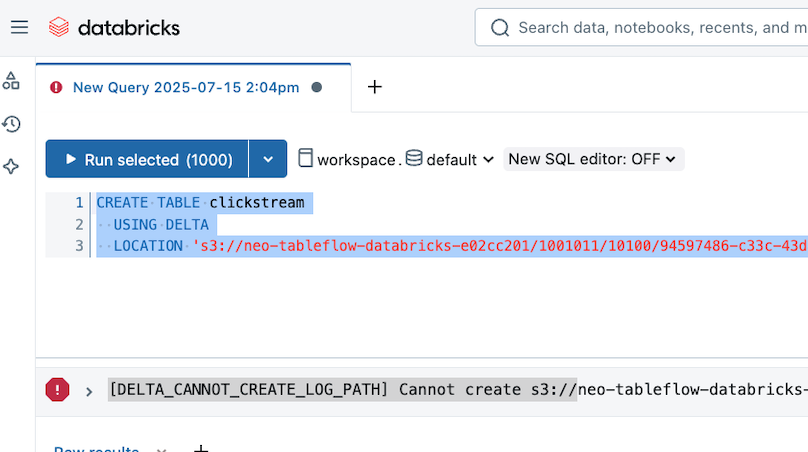

# Troubleshooting

Review the resources below if you run into issues while going through instructions in this workshop.

## 🏗️ Terraform

### Handling Provider Integration Deletion Conflicts

If you encounter a `409 Conflict` error when running `terraform destroy -auto-update` to destroy the workshop cloud resources then follow these additional steps:

1. Remove the problematic resource from Terraform state:

   ```sh
   terraform state rm confluent_provider_integration.s3_tableflow_integration
   ```

> [!NOTE]
> **Terraform State Removal**
>
> This command removes the resource from Terraform's state file but does **not** delete the actual resource from Confluent Cloud. The resource will be force-removed when the Confluent Environment gets deleted in the next step.

2. Rerun the terraform destroy command

   ```sh
   terraform destroy -auto-update
   ```

## 🗄️ Oracle Database

### Cannot Connect to Database

You may run into this error:

```sh
Caused by: oracle.net.ns.NetException: ORA-12514: Cannot connect to database. Service XEPDB1 is not registered with the listener at host 18.221.129.77 port 1521. (CONNECTION_ID=iRbDfISmRYSBvxFTxgCb8Q==)
https://docs.oracle.com/error-help/db/ora-12514/
        at oracle.net.ns.NSProtocolNIO.createRefusePacketException(NSProtocolNIO.java:916)
        at oracle.net.ns.NSProtocolNIO.handleConnectPacketResponse(NSProtocolNIO.java:462)
```

This means that the Oracle database service has not yet fully initialized. Wait a few minutes and try running the command again.

### Other Oracle Issues

If you are experiencing other issues with the Oracle database, then you can follow these steps to get into the running container.

1. Find the right commands to run from this terraform output:

   ```sh
   terraform output oracle_vm
   ```

2. Connect to the Oracle instance using the SSH command from the Terraform output in the above step:

   ```sh
   ssh -i sshkey-[YOUR_KEY_NAME].pem ec2-user@[YOUR_INSTANCE_DNS]
   ```

> [!NOTE]
> **Key Fingerprint**
>
> If prompted to add the key fingerprint to your known hosts, enter `yes`.

3. Verify that Oracle XStream is correctly configured:

   ```sh
   sudo docker exec -it oracle-xe sqlplus system/Welcome1@localhost:1521/XE
   ```

4. Verify the XStream outbound server exists inside of SQL\*Plus:

   ```sql
   SELECT SERVER_NAME, CAPTURE_NAME, SOURCE_DATABASE, QUEUE_OWNER, QUEUE_NAME FROM ALL_XSTREAM_OUTBOUND;
   ```

   You should see an entry for the "xout" server that is `XEPDB1`

## Databricks

[Overview](https://docs.confluent.io/cloud/current/topics/tableflow/get-started/quick-start-delta-lake.html#create-and-query-an-external-delta-lake-table) of the manual External Location setup approach.

### Cannot Create External Location Table

**Issue:**

If you run this statement to source the topic data from S3:

```sql
CREATE TABLE <<table_name>>
  USING DELTA
LOCATION '<<S3 URI>>';
```

And you get an error like this:

```sh
[DELTA_CANNOT_CREATE_LOG_PATH] Cannot create s3://<full_path>
```



**Why This Happens:**

We don't yet fully know why this happens, however it seems to happen more frequently with the Databricks free trial accounts.

**Resolution:**

Here are your options:

1. Clean up and restart the workshop with a Databricks paid or free edition account
2. Clean up and restart the workshop with a new Databricks Service Principal
