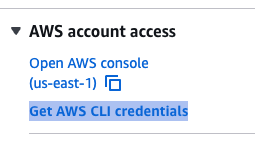

# LAB 1: Account Setup

## 🗺️ Overview

Welcome to the first step of building your real-time AI marketing pipeline! In this lab, you'll configure all the cloud platform accounts and credentials needed to deploy River Hotels' intelligent customer engagement system.

### What You'll Accomplish

By the end of this lab, you will have:

1. **Configured Confluent Cloud**: Create API keys and set up cloud resource management access
2. **Setup Databricks Account**: Configure account access, create service principals, and enable external data access
3. **Authenticated with AWS**: Set up AWS credentials for Terraform to deploy infrastructure


### Prerequisites

Review the [README](../../README.md) and complete its [prerequisites](../../README.md#-prerequisites)

## 👣 Steps

### Step 1: Create Terraform Variables File

1. Navigate to the `terraform` directory
2. Rename the `sample-tfvars` file to `terraform.tfvars`
3. Open `terraform.tfvars` in your preferred editor

Now you can configure each cloud platform's credentials and settings. It should look like this

```hcl
# ===============================
# General Overrides
# ===============================
prefix       = ""
email        = ""
cloud_region = ""


# ===============================
# Confluent Cloud Overrides
# ===============================
confluent_cloud_api_key    = ""
confluent_cloud_api_secret = ""

# ===============================
# Databricks Overrides
# ===============================
databricks_host                            = ""  # e.g., https://your-workspace.cloud.databricks.com
databricks_account_id                      = ""  # Required for IAM trust policy (external ID)
databricks_user_email                      = ""  # Your Databricks user email for granting permissions
databricks_service_principal_client_id     = ""  # Service Principal Application ID
databricks_service_principal_client_secret = ""  # Service Principal OAuth Secret

# ===============================
# AWS Overrides
# ===============================
# Uncomment the lines below if you are using an AWS free tier account:
# oracle_instance_type   = "m7i-flex.large"
# postgres_instance_type = "m7i-flex.large"

# AWS Free Tier now allows for c7i-flex.large and m7i-flex.large for accounts created after July 15, 2025
# https://docs.aws.amazon.com/AWSEC2/latest/UserGuide/LaunchingAndUsingInstances.html

# ===============================
# Optional: Connector Automation
# ===============================
# Set to false if you want to manually create the PostgreSQL CDC connector as a learning exercise
# create_postgres_cdc_connector = false
```

Terraform requires API keys and configuration values to create resources across multiple cloud platforms. You'll configure these values in a `terraform.tfvars` file in the following steps.

### Step 2: Cloud Resource Prefix

The `prefix` terraform variable helps identify the cloud resources you create for this workshop. Because every resource will have it, pick something memorable, short, and fun - like your initials or a nickname.

Here is an example:

```hcl
# ===============================
# General Overrides
# ===============================
prefix       = "neo"
```

### Step 3: Configure Confluent Cloud Account

Follow this next section of steps to create a Confluent *Cloud resource management* API key and token.

#### Login and Create API Key and Secret

1. Open a web browser tab and login to your Confluent cloud account
   - If you don't yet have one, [sign up for a free trial](https://www.confluent.io/confluent-cloud/tryfree?utm_campaign=tm.fm-ams_cd.Build-an-A[…]ne_id.701Uz00000fEQeEIAW&utm_source=zoom&utm_medium=workshop)
2. Click on the menu icon in the top right of the screen
3. Click on *API keys*

   

4. Click on the *+ Add API key* button
5. Select *My account*
6. Click *Next*
7. Select *Cloud resource management*

   

8. Click *Next*
9. Enter a name like *Tableflow Databricks Workshop*
10. Add a useful description
11. Click the *Create API Key* button

#### Add API Key and Secret to Terraform

1. In your code editor of choice, open your `terraform.tfvars` file and enter in the `confluent_cloud_api_key` and `confluent_cloud_api_secret` values from your newly-created **Key** and **Secret**. Save the `terraform.tfvars` file.
2. Back in Confluent Cloud, click the *Complete* button

### Step 4: Configure Databricks Account

There are many values to add from Databricks, and these steps will guide you through it:

#### Sign up/Login

Navigate to [Databricks](https://login.databricks.com/) and login with your account.

> [!NOTE]
> **Create Databricks Account**
>
> If you don't have an existing databricks account, you can create a *recommended* [free edition account](https://login.databricks.com/?intent=SIGN_UP&provider=DB_FREE_TIER).

#### Databricks Account ID

<details>
<summary>Get Account ID For <b>Free Edition</b> Accounts</summary>

1. Open a separate browser tab to the [Databricks Admin Console](https://accounts.cloud.databricks.com/)
2. Find the `account_id=` in the browser tab url and copy the value

   

3. Paste it into your `terraform.tfvars` file for the `databricks_account_id` key

</details>

<details>
<summary>Get Account ID For <b>Paid</b> or <b>Free Trial</b> Accounts</summary>

1. Open a separate browser tab to the [Databricks Admin Console](https://accounts.cloud.databricks.com/)
2. Click on the user icon in the top right

   

3. Copy the **Account ID** value and paste it into your `terraform.tfvars` file for the `databricks_account_id` key

</details>

#### Additional Databricks IDs

1. Click on the workspace dropdown in the top right of the top menu bar

   

2. Take note of the *cloud region* value (e.g. `us-west-2`, `us-east-2`, etc.) and enter it into your `terraform.tfvars` for the `cloud_region` variable override.
3. Click on the user profile circle in the top right of the databricks screen

   

4. Copy your account's email address and paste it into your `terraform.tfvars` for the `databricks_user_email` variable override
5. You can paste the same email address in the `email` variable override in `terraform.tfvars`, or you can paste a different one
6. Copy the *URL* from your browser address bar and paste it into your `terraform.tfvars` for the `databricks_host` variable override. Erase everything after the *databricks.com*. It should look similar to this: `https://dbc-12f34e56-123e.cloud.databricks.com`

#### Create Service Principal

In this step you will create a [Service Principal](https://docs.databricks.com/aws/en/admin/users-groups/service-principals) to authenticate automated tasks, like Terraform, in your Databricks account.

1. Click on your username in the top right bar and select *Settings*
2. Click on *Identity and access*
3. Click the *Manage* button next to *Service principals*

   

4. Click on the *Add service principal* button
5. Click on the *Add new* button
6. Enter a descriptive name in the textbox, something like *workshop-tableflow-databricks*

   

7. Click on the *Add* button

##### Create OAuth Secret for Service Principal

1. Click on your newly-created Service Principal
2. Click on the *Secrets* tab
3. Click on the *Generate secret* button
4. Enter a reasonable duration lifetime, something like `30` or above

   

5. Click the *Generate* button
6. Copy and paste the `Secret` and `Client ID` into the corresponding databricks Terraform variables in your `terraform.tfvars` file

   

7. Click on the *Done* button

##### Add Service Principal to Admin Group

Next, you want to grant the Service Principal admin privileges:

1. Click on the *Identity and access* link under the *Settings* heading
2. Click on the *Manage* button next to the *Groups* section
3. Click on the *admins* link

   

4. Click on the *Add members* button
5. Search for the name of the Service Principal you just created and select it from the dropdown

   

6. Click on the *Add* button

Now your Service Principal should be part of the **admins** group and have the proper permissions for this workshop.

#### Enable External Data Access

The last Databricks setup step is to enable external data access:

1. Click on *Catalog* in the left menu
2. Click on the gear icon to expand a dropdown
3. Click on the *Metastore* dropdown

   

4. Toggle the *External data access* so that is enabled

   

#### Databricks Setup Complete

You have completed the Databricks setup! At this point, your `terraform.tfvars` file should have the following Databricks values populated:

- `databricks_host` - Your workspace URL (e.g. *https://dbc-12f34e56-123e.cloud.databricks.com*)
- `databricks_account_id` - Your Databricks account ID
- `databricks_user_email` - Your Databricks user email
- `databricks_service_principal_client_id` - Service Principal Application ID
- `databricks_service_principal_client_secret` - Service Principal OAuth Secret

You are now ready to configure your AWS account!

### Step 4: Configure AWS Account

The Terraform Docker container automatically detects AWS credentials from multiple sources. Choose the option that matches your setup:

<details>
<summary>Option A: AWS Workshop Studio Accounts</summary>

If you are using an AWS Workshop Studio account:

1. Click on the **Get AWS CLI credentials** link on your event home screen
2. Copy the environment variable export commands for your operating system
3. **Run the export commands in the same terminal** where you will run Terraform Docker commands

   

> [!IMPORTANT]
> **Same Terminal Window Required**
>
> The environment variables must be exported in the same terminal window where you will run `docker-compose` commands. The Docker container will automatically inherit these exported credentials.

</details>

<details>
<summary>Option B: Personal AWS Accounts</summary>

If you are using your personal AWS account, configure credentials on your **host machine**:

```sh
aws configure
```

The Docker container automatically mounts your `~/.aws` directory and will use these credentials.

</details>

#### Verify AWS Configuration

To verify AWS credentials are working inside the Docker container, switch to your shell that is in the *workshop-tableflow-databricks/terraform* directory and run:

```sh
docker-compose run --rm terraform -c "aws configure list"
```

You should an output similar to this:

```sh
✓ Using AWS credentials from environment variables
      Name                    Value             Type    Location
      ----                    -----             ----    --------
   profile                <not set>             None    None
access_key     ****************XXXX              env
secret_key     ****************XXXX              env
    region                us-east-2              env    AWS_DEFAULT_REGION
```

> [!WARNING]
> **Windows Users: Permission Errors**
>
> If you encounter "Access is Denied" or "Permission denied" errors on Windows, you should run this workshop from **WSL 2** instead of PowerShell. See the [Windows setup instructions in the README](../../README.md#step-2-pull-and-build-docker-images) for details.
>

## 🏁 Conclusion

🎉 **Congratulations!** You've successfully configured all the cloud platform accounts and credentials needed for River Hotels' AI-powered marketing pipeline!

## ➡️ What's Next

Your journey continues in **[LAB 2: Cloud Infrastructure Deployment](../LAB2_cloud_deployment/LAB2.md)**

## 🔧 Troubleshooting

You can find potentially common issues and solutions or workarounds in the [Troubleshooting](../troubleshooting.md) guide.
