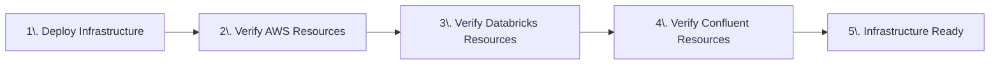

# LAB 2: Cloud Infrastructure Deployment

## 🗺️ Overview

Now that you've configured your cloud platform accounts, it's time to deploy the infrastructure foundation for River Hotels' real-time AI marketing pipeline! In this lab, you'll use Terraform to automatically provision and validate resources across multiple cloud platforms.

### What You'll Accomplish



By the end of this lab, you will have:

1. **Multi-Cloud Infrastructure Deployment**: Use Terraform to automatically provision 40+ cloud resources across AWS, Confluent Cloud, and Databricks with proper security, networking, and integration
2. **Infrastructure Validation**: Verify that all deployed resources are running correctly and accessible
3. **Platform Integration**: Confirm that AWS, Confluent Cloud, and Databricks are properly connected and ready for data streaming

### Key Technologies You'll Deploy

- **Docker**: Containerized Terraform environment for cross-platform consistency
- **Terraform**: Infrastructure as Code for automated multi-cloud resource provisioning and management
- **AWS Services**: EC2 for PostgreSQL hosting, S3 for Delta Lake storage, VPC for networking, IAM for security
- **Confluent Cloud**: Environment, Kafka cluster, Flink compute pool, and AWS provider integration
- **Databricks**: External locations, storage credentials, and Unity Catalog integration
- **Multi-Cloud Networking**: Secure connections and access policies between all platforms

### Prerequisites

- **Docker Desktop** installed and running on your machine
  - [Download Docker Desktop](https://www.docker.com/products/docker-desktop/) for macOS, Windows, or Linux
- Built [Terraform Docker container](../../README.md#step-2-pull-and-build-docker-images)
- Complete **[LAB 1: Account Setup](../LAB1_account_setup/LAB1.md)** with all cloud platform credentials configured in your `terraform.tfvars` file

## 👣 Steps

### Step 1: Deploy Cloud Infrastructure with Terraform

Now it's time for you to perform some deployment magic! 🪄🎩

The following commands will initialize, validate, and apply the Terraform configuration to create your cloud resources.

#### Initialize Terraform

Run Terraform init inside the container:

```sh
docker-compose run --rm terraform -c "terraform init"
```

You should see this success message:

```sh
Terraform has been successfully initialized!
```

#### Validate Configuration

Verify that your Terraform configuration is valid:

```sh
docker-compose run --rm terraform -c "terraform validate"
```

You should see this success message:

```sh
Success! The configuration is valid.
```

#### Deploy Infrastructure

Initiate cloud resource creation:

```sh
docker-compose run --rm terraform -c "terraform apply -auto-approve"
```

> [!NOTE]
> **Duration: 7-10 Minutes**
>
> It should take between 7-10 minutes for Terraform to completely generate all of the needed cloud resources, so hang tight!
>
> While you wait, you should see an extensive log output in your shell showing the progress of generating the cloud resources. When finished, you should see a message like this:
>
> *Apply complete! Resources: XX added, 0 changed, 0 destroyed.*

> [!TIP]
> **If Terraform Fails with a Transient Error**
>
> If you encounter a `500 Internal Server Error` when creating the Databricks external location, this is a transient error due to IAM propagation delays. Simply re-run the apply command - Terraform will only create the remaining resources:
>
> ```sh
> docker-compose run --rm terraform -c "terraform apply -auto-approve"
> ```
>
> Alternatively, use the retry wrapper script that automatically handles retries:
>
> ```sh
> docker-compose run --rm terraform -c "./terraform-apply-wrapper-with-retry.sh"
> ```
>
> See the [Troubleshooting Guide](../troubleshooting.md#transient-500-error-during-external-location-creation) for more details.

Here is a summary of the main cloud resources you created through Terraform:

**AWS Resources:**

- VPC with proper networking components
- Security groups with minimal required access
- EC2 instance running PostgreSQL database with logical replication enabled
- S3 general-purpose bucket to store Delta table data
- IAM roles and policies for secure access

**Confluent Cloud Resources:**

- Environment for workshop isolation
- *Standard* Kafka cluster for data streaming
- Flink compute pool
- Provider Integration with AWS for Tableflow

**Databricks Resources:**

- External Location to access S3 bucket
- Storage Credential for secure access

**Terraform Output:**

When the deployment completes, Terraform outputs helpful cloud resource values. You can view these values at any time by running:

```sh
docker-compose run --rm terraform -c "terraform output"
```

> [!TIP]
> **Interactive Shell**
>
> If you prefer to work in an interactive shell inside the container, run `docker-compose run --rm terraform` to drop into a bash shell where you can run `terraform` commands directly without the `-c` wrapper.

> [!IMPORTANT]
> **Troubleshoot Terraform Issues**
>
> If your terraform execution fails, you can [review these common issues](../troubleshooting.md#terraform).

### Step 3: Verify Infrastructure Deployment

Now is a good time to verify that the cloud resources we created via Terraform are accessible to us and working as expected.

#### Verify AWS Resources

1. If logged out, log into the AWS console with the same account you used in Terraform
2. Select the same *cloud region* as you have in Terraform
3. **Ensure EC2 Instance is running**
   1. Navigate to the EC2 home page
   2. Click on *Instances* in the left navigation
   3. Search for the name of your instance (it should contain your call sign)
   4. Click on the link for it
   5. Check that it is running

   

4. **Ensure S3 Bucket is available**
   1. Navigate to the S3 home page
   2. Search for your bucket under the *General purpose buckets* section
   3. Verify that the bucket exists and is empty

   

#### Verify Databricks Resources

Follow these steps in a separate browser tab to verify that your Databricks cloud resources work:

##### Test External Location

1. Click on the *Catalog* link in the left navigation panel
2. Click on the gear icon in the top right of the Catalog panel

   

3. Click on *External Locations*
4. Click on the *Name* link of the External Location created by Terraform
5. Click on the *Test connection* button in the top right of the screen
6. You should see a message like this

   

##### Validate Storage Credential

1. Click on the *Credential* link
2. Click on the *Validate Configuration* button
3. You should see a success message like this:

   

> [!NOTE]
> **Databricks Browser Tab**
>
> Keep this browser tab open as you will be returning to Databricks towards the end of this workshop.

#### Verify Confluent Resources

1. Navigate to your Confluent Cloud account
2. Find and Click on your workshop environment
3. Click on the *Integrations* link in the left menu
4. Notice there is a row under the *Provider* tab that contains the name **tableflow-databricks**. This is the AWS integration that will enable Tableflow to push streams as Delta Lake tables to S3

   

5. Click on *Overview* in the left sidebar menu
6. Click on your workshop Cluster
7. Click on the *Topics* link in the left sidebar menu
8. Notice that there no Topics being produced yet

   

## 🏁 Conclusion

🎉 **Congratulations!** You've successfully deployed the complete infrastructure foundation for River Hotels' AI-powered marketing pipeline!

### What You've Achieved

In this lab, you have:

- ✅ **Deployed Production-Scale Infrastructure**: Provisioned 40+ cloud resources across AWS, Confluent Cloud, and Databricks using Terraform
- ✅ **Validated Multi-Cloud Integration**: Confirmed that all platforms are properly connected, secured, and ready for data streaming
- ✅ **Established Resource Foundation**: Created the networking, storage, and compute resources needed for the data pipeline

### Your Infrastructure Foundation

You now have a robust multi-cloud platform consisting of:

**AWS Resources:**

- **EC2 instance** running PostgreSQL database with logical replication enabled
- **S3 bucket** for Delta Lake table storage
- **VPC and security groups** for secure networking
- **IAM roles and policies** for cross-platform access

**Confluent Cloud Resources:**

- **Kafka cluster** ready for data streaming
- **Flink compute pool** for stream processing
- **AWS provider integration** for Tableflow Delta Lake sync

**Databricks Resources:**

- **External location** configured to access S3 storage
- **Storage credentials** for secure Unity Catalog integration
- **Catalog permissions** ready for data governance

## ➡️ What's Next

Your journey continues in **[LAB 3: Tableflow and Connector Setup](../LAB3_tableflow_and_connector/LAB3.md)** where you will:

1. **Configure PostgreSQL CDC Connector**: Set up real-time change data capture from PostgreSQL to Confluent Cloud
2. **Enable Tableflow Integration**: Connect Confluent Cloud with Databricks Unity Catalog for automated Delta Lake sync
3. **Generate Realistic Data**: Deploy Shadow Traffic to create authentic customer behavior patterns

## 🔧 Troubleshooting

You can find potentially common issues and solutions or workarounds in the [Troubleshooting](../troubleshooting.md) guide.
