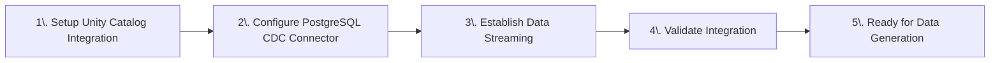
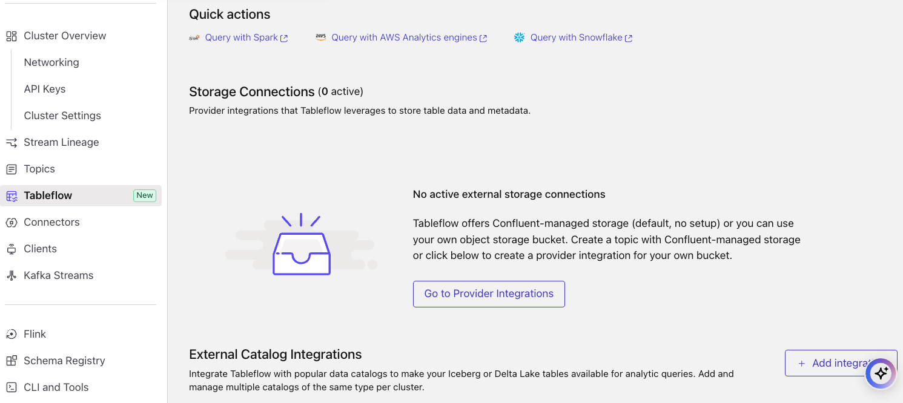
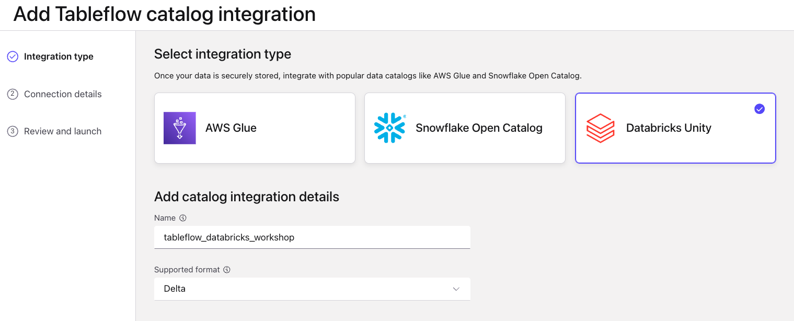
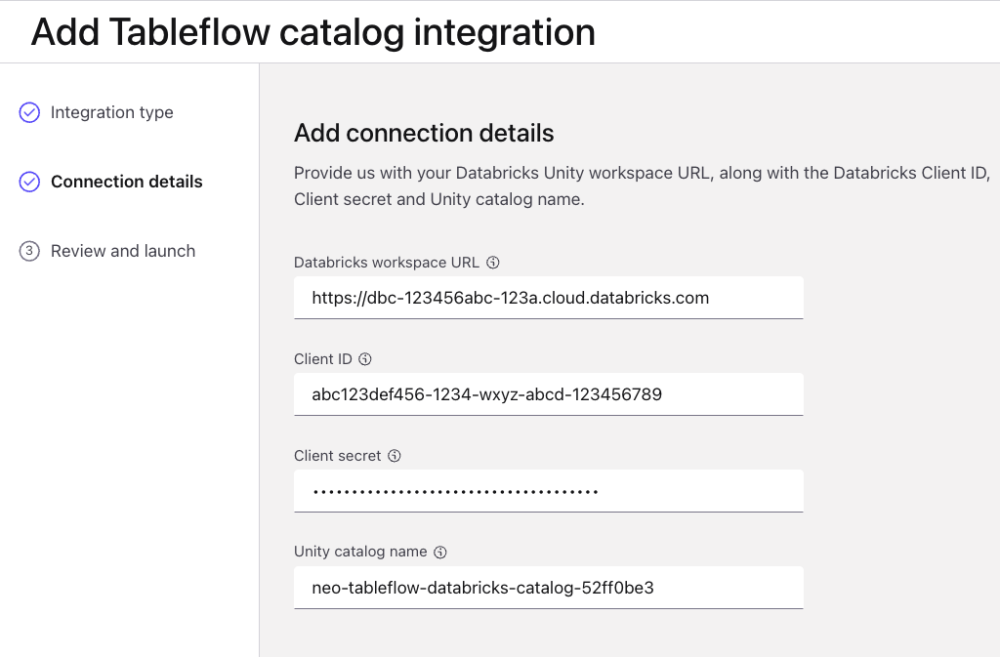
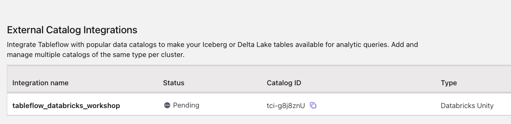
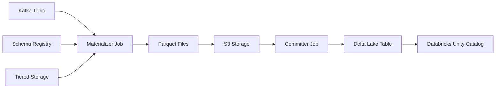

# LAB 3: Tableflow and Connector Setup

## 🗺️ Overview

Now that your infrastructure is deployed, it's time to connect your systems and enable data streaming! In this lab, you'll configure the PostgreSQL CDC connector to capture real-time database changes and set up Tableflow integration with Databricks Unity Catalog.

### What You'll Accomplish



By the end of this lab, you will have:

1. **Unity Catalog Integration**: Connect Confluent Cloud with Databricks Unity Catalog through Tableflow for automated Delta Lake synchronization
2. **PostgreSQL Data Streaming**: Configure PostgreSQL CDC connector to capture real-time changes from customer and hotel tables
3. **Service Account Authentication**: Use Terraform-managed service accounts for secure, automated credential management

### Key Technologies You'll Configure

- **Confluent Tableflow**: Automated streaming pipeline for synchronizing Kafka topics to Delta Lake tables
- **PostgreSQL CDC Source Connector**: Real-time change data capture from PostgreSQL database to Kafka topics using Debezium
- **Databricks Unity Catalog**: Data governance platform for managing Delta Lake metadata and permissions
- **Service Accounts**: Terraform-managed authentication for secure, automated access control
- **AVRO Schema**: Message serialization format for structured data streaming

### Prerequisites

Complete **[LAB 2: Cloud Infrastructure Deployment](../LAB2_cloud_deployment/LAB2.md)** with all infrastructure successfully deployed and validated

## 👣 Steps

### Step 1: Tableflow Unity Catalog Integration

#### Establish Unity Catalog Integration

Follow these steps to setup the Tableflow-to-Unity Catalog integration:

1. Navigate to your cluster in Confluent Cloud
2. Click on **Tableflow** in the left menu
3. Click on the **+ Add integration** button next to the *External Catalog Integrations* section

   

4. Select **Databricks Unity**
5. Enter a relevant and memorable title in the *Name* field, something like `tableflow-databricks-workshop`

   

6. Click **Continue**
7. Copy and paste the value from the `databricks_host` variable in your *terraform.tfvars* file into the *Databricks workspace URL* field
8. Copy and paste the value from the `databricks_service_principal_client_id` variable in your *terraform.tfvars* file into the *Client ID* field
9.  Copy and paste the value from the `databricks_service_principal_client_secret` variable in your *terraform.tfvars* file into the *Client secret* field
10. Copy and paste the name of your databricks catalog into the *Unity catalog name* - look for the *name* attribute from the result of running this terraform command:

   ```sh
   docker-compose run --rm terraform -c "terraform output databricks_tableflow_catalog"
   ```

   

11. Click **Continue**
12. Launch your Unity Catalog integration, you should see something like this on your screen:

   


> [!IMPORTANT]
> **Pending Status**
>
> The status of your Tableflow integration with Unity Catalog will remain in *Pending* until you enable Tableflow for Delta Lake on your first topic, which you will do in a future step. Do not be concerned about its status at this point.

#### Verify Catalog in Databricks

The Unity Catalog integration will be validated later when we enable Tableflow for a specific topic. For now, the integration remains in pending status until we begin streaming data.

#### How Tableflow Works

When you enable Tableflow on a topic, Confluent starts two critical jobs that work together to provide reliable, exactly-once data processing:



**🔧 Materializer Job:**

- **Data Ingestion**: Connects to your Kafka topic and fetches table metadata
- **Schema Integration**: Retrieves associated schema from Schema Registry to define table structure
- **Optimized Reading**: Fetches data segments directly from tiered object storage (bypassing Kafka consumer APIs for better performance)
- **Format Conversion**: Converts streaming data to Parquet format for efficient analytical queries
- **Storage Writing**: Writes converted data to your specified S3 location

**🔧 Committer Job:**

- **Transactional Commits**: Commits snapshots to catalogs with exactly-once semantics guaranteed
- **Catalog Sync**: Propagates changes to external catalogs like Unity Catalog and AWS Glue
- **Metadata Management**: Maintains table metadata and ensures data consistency

#### Schema Evolution and Versioning

**🔄 Dynamic Schema Handling:**

- **Automatic Detection**: When schema changes are detected in your Kafka topic, Tableflow automatically creates new snapshots
- **Version Tracking**: Iceberg tracks schema evolution in metadata files, with each snapshot pointing to its schema version
- **Backward Compatibility**: Ensures existing queries continue to work while supporting new schema versions

#### Performance Optimization: The 15-Minute Threshold

**⏱️ Tiered Storage Integration:**

- **Primary Path**: Tableflow reads from tiered object storage for optimal performance
- **Fallback Mechanism**: If data hasn't been tiered within 15 minutes, automatically falls back to Kafka consumer APIs
- **Low-Throughput Handling**: This fallback may introduce delays for low-throughput topics but ensures data availability

> [!NOTE]
> **Performance Consideration**
>
> The 15-minute threshold is designed to balance performance with data availability. For high-throughput topics like `clickstream`, data is typically tiered quickly and benefits from the optimized storage path. For lower-throughput topics, the fallback ensures no data is lost while maintaining exactly-once processing guarantees.

#### Exactly-Once Processing Guarantees

**🛡️ Data Integrity:**

- **Transactional Semantics**: All commits are transactional, preventing data duplication or loss
- **Idempotent Operations**: Retries and failures don't create duplicate records
- **Consistency Guarantees**: Delta Lake's ACID properties ensure consistent reads across all consumers

#### Monitoring Your Tableflow Pipeline

After enabling Tableflow, you can monitor the pipeline through:

1. **Confluent Cloud UI**: Check sync status and processing metrics
2. **S3 Storage**: Verify Parquet files are being created in your bucket
3. **Databricks Unity Catalog**: Confirm tables are appearing and updating

> [!TIP]
> **Tableflow Best Practices**
>
> - **Topic Naming**: Use descriptive topic names as they become your Delta Lake table names
> - **Schema Design**: Design schemas for evolution - add fields rather than changing existing ones when possible
> - **Monitoring**: Regularly check sync status, especially for critical business data
> - **Partitioning**: Consider your query patterns when designing topic key strategies

### Step 2: Configure PostgreSQL CDC Connector

In this section you will configure the PostgreSQL CDC connector to capture real-time changes from your PostgreSQL database and stream them to Confluent Cloud.

> [!NOTE]
> **5-10 minute PostgreSQL Spin-up Time**
>
> It takes about 5-10 minutes for the PostgreSQL database instance to fully spin up after Terraform completes.
>
> If the connector creation was automated via Terraform (`create_postgres_cdc_connector = true`), you can skip this step and proceed to verify the connector is running.
>
> **While you wait, we recommend you try out this optional [Data Governance ~7-minute lab](../LAB_data_governance/LAB_data_governance.md) to get hands on with Confluent features that can help you organize and ensure high quality data.**

#### Navigate to the PostgreSQL CDC Connector

1. Click on *Connectors* in the left sidebar menu
2. Type `PostgreSQL` in the *search* text field
3. Select the `PostgreSQL CDC Source` tile (it has the PostgreSQL elephant logo on it)


#### Use Service Account API Key

Instead of creating new API keys manually, you'll use the service account credentials that Terraform automatically created for you.

1. Select the **Service account** tile
2. Select **Existing account** under the *Choose service account* section
3. Search for your workshop service account, it should start with the `prefix` value from your *terraform.tfvars* file

   

4. Check the *Add all required ACLs* checkbox
5. Click the `Continue` button

> [!NOTE]
> **Automated Service Account**
>
> These credentials belong to the `app-manager` service account that Terraform created with `EnvironmentAdmin` permissions. This provides secure, automated credential management without manual API key creation.

#### Configure Connection and Authentication

Run this Terraform command in your shell (from the `terraform/` directory) to show the values needed to connect and authenticate the PostgreSQL CDC Connector.

```sh
docker-compose run --rm terraform -c "terraform output postgres_cdc_connector"
```

Now copy and paste the corresponding values into the text boxes:

1. Enter the `database_hostname` Terraform output into the `Database hostname` textbox
2. Enter the `database_port` Terraform output into the `Database port` textbox (default: 5432)
3. Enter the `database_username` Terraform output into the `Database username` textbox
4. Enter the `database_password` Terraform output into the `Database password` textbox
5. Enter the `database_name` Terraform output into the `Database name` textbox
6. Select `pgoutput` from the `Output plugin name` dropdown

   Your screen should look similar to this:
   

7. Click the `Continue` button on the bottom right

#### Configure Message Formatting and Tables

1. Select `AVRO` on the *Output Kafka record key format* dropdown
2. Select `AVRO` from the *Output Kafka record value format* options
3. Enter `riverhotel` into the *Topic prefix* textbox
4. Enter `public.hotel, public.customer` into the *Table include list* textbox

    Your screen should look like this:

    

5. Click the `Continue` button

#### Complete the Connector Configuration

1. Enter `1` into the *Max tasks* textbox
2. Click the `Continue` button
3. Configure Connector Name - enter any name you like in the *Connector name* textbox
4. Click the `Continue` button
5. Now this connector could take ~2-3 minutes to initialize; The connector tile will show **Running** status when it is ready


Well done! You have successfully configured change data capture for all events on the database tables `customer` & `hotel`, which will automatically be recorded to the corresponding Kafka topics `riverhotel.CDC.customer` & `riverhotel.CDC.hotel`

#### ✅ Solution Requirements Fulfilled

- **🔌 Seamless Integration** - PostgreSQL CDC now streams database changes in real-time to Confluent Cloud
- **📡 Capture** - Customer and hotel data changes are now captured in real-time from PostgreSQL database

Now that we have data generating to our PostgreSQL database and Kafka topics, let's move on to the next step!

## 🏁 Conclusion

🎉 **Congratulations!** You've successfully configured the data integration layer for River Hotels' AI-powered marketing pipeline!

### What You've Achieved

In this lab, you have:

- ✅ **Established Unity Catalog Integration**: Connected Confluent Cloud with Databricks Unity Catalog through Tableflow for automated Delta Lake synchronization
- ✅ **Learned Tableflow Architecture**: Gained a deeper understanding of materializer jobs, committer jobs, schema evolution, and exactly-once processing guarantees
- ✅ **Configured Real-Time Data Capture**: Set up PostgreSQL CDC connector to stream database changes from customer and hotel tables
- ✅ **Implemented Automated Authentication**: Used Terraform-managed service accounts for secure, credential-less integration

### Your Data Integration Foundation

You now have a robust streaming data pipeline consisting of:

**PostgreSQL CDC Streaming:**

- **Real-time customer data** streaming from PostgreSQL database to Kafka topics
- **Real-time hotel data** streaming with AVRO schema serialization
- **Automated change capture** for INSERT, UPDATE, and DELETE operations

**Tableflow Integration:**

- **Unity Catalog connection** ready for automated Delta Lake synchronization
- **Service account authentication** providing secure, automated access
- **Schema management** through Confluent Schema Registry

## ➡️ What's Next

Your journey continues in **[LAB 4: Data Generation](../LAB4_data_generation/LAB4.md)** where you will:

1. **Deploy Shadow Traffic**: Generate realistic customer behavior data including clickstreams, bookings, and reviews
2. **Validate Data Streaming**: Confirm that PostgreSQL CDC is capturing and streaming database changes
3. **Monitor Topic Creation**: Watch as Kafka topics populate with structured data streams

## 🔧 Troubleshooting

You can find potentially common issues and solutions or workarounds in the [Troubleshooting](../troubleshooting.md) guide.
