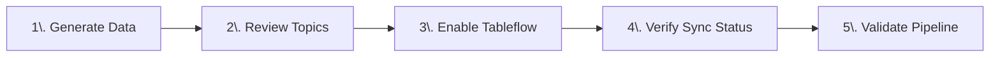
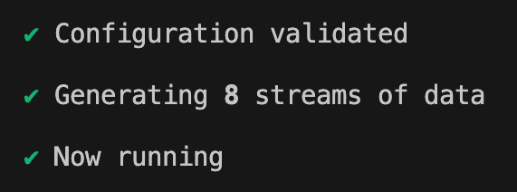
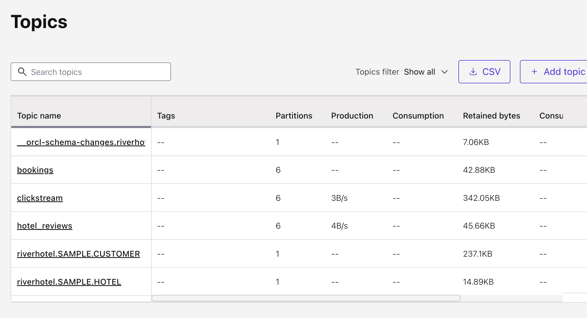
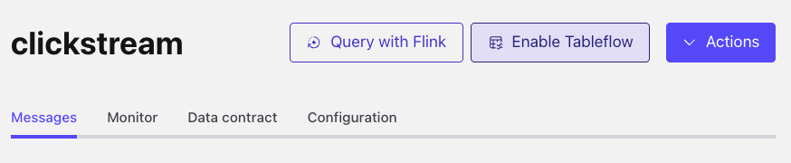
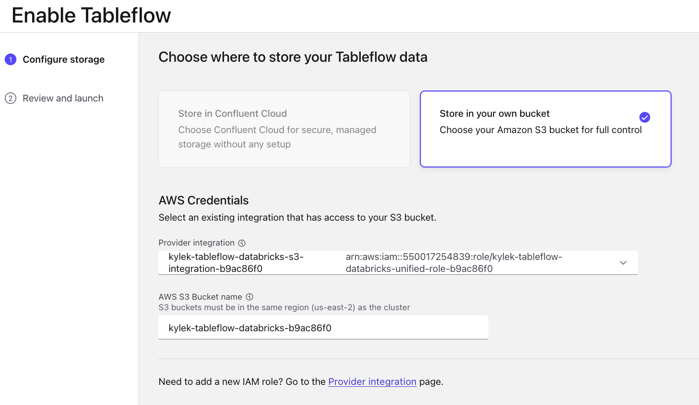
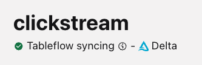

# LAB 4: Data Generation

## 🗺️ Overview

Time to bring your data pipeline to life! With your infrastructure deployed and connectors configured, you'll now generate realistic customer behavior data that will flow through your entire pipeline. This lab focuses on creating authentic hospitality industry data patterns using Shadow Traffic and enabling Tableflow to automatically sync streams to Delta Lake.

### What You'll Accomplish



By the end of this lab, you will have:

1. **Realistic Data Generation**: Deploy Shadow Traffic to create authentic customer behavior data including clickstreams, bookings, reviews, and customer profiles
2. **Topic Validation**: Verify that PostgreSQL CDC and Shadow Traffic are successfully streaming data to Kafka topics
3. **Tableflow Integration**: Enable automated Delta Lake synchronization for the clickstream topic and verify sync status

### Key Technologies You'll Deploy

- **Shadow Traffic**: Advanced data generation tool for creating realistic, interconnected synthetic datasets that mirror real hospitality industry patterns
- **Confluent Tableflow**: Automated streaming pipeline that converts Kafka topics to Delta Lake tables with exactly-once processing guarantees. *Tiered Storage* is Confluent's optimization feature that moves older data to cost-effective object storage while maintaining performance
- **Delta Lake**: Open-source storage framework that provides reliability, performance, and lifecycle management for data lakes

### Prerequisites

Complete **[LAB 3: Tableflow and Connector Setup](../LAB3_tableflow_and_connector/LAB3.md)** with PostgreSQL CDC connector configured and Unity Catalog integration established

## 👣 Steps

### Step 1: Generate Data

You will use a flexible data-generator tool called [Shadow Traffic](https://shadowtraffic.io/) to create *River Hotel* data streams using a three-stage approach that creates both historical and streaming data.

#### Data Generation Overview

As depicted in [this ERD diagram](../../README.md#-data-entity-relationship) from the README, There are 5 streams of data that will be produced to Confluent Cloud. These data streams have these key features:

- **Sequential execution**: Seed data → Historical data → Streaming data
- **Historical timestamps**: Random distribution over past 8 weeks (Kafka) or fixed 10 weeks ago (PostgreSQL)
- **Customer behavior modeling**: 80% of activities/bookings come from repeat customers
- **Data relationships**: Reviews reference bookings, activities reference hotels and customers
- **Realistic throttling**: Variable delays simulate real-world user behavior patterns

> [!TIP]
> **Dive Deeper into Data Generation**
>
> Peruse the details of this workshop's data generation by reviewing [this guide](../../data/data_overview.md)

To generate this data, open a new shell window/tab at the workshop repository root folder and execute this command:

#### Linux/Mac

```sh
docker run --env-file ./data/shadow-traffic-license.env -v "$(pwd)/data/:/home/data" shadowtraffic/shadowtraffic:1.11.13 --config /home/data/shadow-traffic-configuration.json
```

#### Windows cmd

```sh
docker run --env-file ./data/shadow-traffic-license.env -v "%cd%/data/:/home/data" shadowtraffic/shadowtraffic:1.11.13 --config /home/data/shadow-traffic-configuration.json
```

#### Windows Powershell

```sh
docker run --env-file ./data/shadow-traffic-license.env -v "${PWD}/data/:/home/data" shadowtraffic/shadowtraffic:1.11.13 --config /home/data/shadow-traffic-configuration.json
```

> [!NOTE]
> **Run ShadowTraffic Image v1.11.13**
>
> The above commands will run [v1.11.13](https://hub.docker.com/layers/shadowtraffic/shadowtraffic/1.11.13/images/sha256:082fc44c6c7454ec26c961708a585eb2338d39ef5b472bf9111fe302611c1677) of the data generator in the foreground of your shell, which has been tested and validated as compatible with this workshop

You should see this output showing that it was successful in connecting to the data ingestion layer and pushing data to it:



### Step 2: Review Topics

After successfully starting the data generating process, follow these steps to see the data streaming into Confluent Cloud:

1. Navigate your web browser back to your workshop cluster in Confluent Cloud
2. Click on *Topics* in the left sidebar menu
3. Verify that you see these topics:

   

### Step 3: Enable Tableflow on `clickstream` topic

1. Click on the `clickstream` topic
2. Click on the **Enable Tableflow** button in the top right of your screen

   

3. Deselect the **Iceberg** tile
4. Select the **Delta** tile

   

5. Click on the **Configure custom storage** button
6. Ensure the **Store in your own bucket** tile is selected
7. Select the *tableflow-databricks* provider integration from the dropdown
8. Open your command-line interface in the *terraform/* directory
9. Run this command

    ```sh
    docker-compose run --rm terraform -c "terraform output aws_s3"
    ```

10. Copy the value from the `name` property and paste it into the *AWS S3 Bucket name* textbox
   Your selections should look like this:

   

11. Click on the *Continue* button
12. Review the configuration details and click the *Launch* button
13. Verify Tableflow is successfully syncing data by checking the status in the UI.

   

> [!IMPORTANT]
> **Tableflow Sync Startup Time**
>
> It may take a few minutes for Tableflow to connect to S3 and begin streaming your topics as tables.

### Step 4: Verify Tableflow Sync Status

Now that you've enabled Tableflow on the `clickstream` topic, let's verify that data is flowing properly from Confluent Cloud to Delta Lake.

#### Monitor Sync Progress

1. **Monitor Data Flow**: You should see data being processed and committed to your S3 bucket
2. **Verify Unity Catalog**: In your next lab, you'll confirm that tables are appearing in Databricks Unity Catalog

> [!NOTE]
> **Understanding Tableflow Architecture**
>
> For a deep dive into how Tableflow works under the hood—including materializer jobs, committer jobs, schema evolution, and exactly-once processing guarantees, refer to the comprehensive architecture section in **[LAB 3: How Tableflow Works](../LAB3_tableflow_and_connector/LAB3.md#how-tableflow-works)**.

## 🏁 Conclusion

🎉 **Congratulations!** You've successfully generated realistic data and established automated streaming to Delta Lake for River Hotels' AI-powered marketing pipeline!

### What You've Achieved

In this lab, you have:

✅ **Generated Realistic Data**: Deployed Shadow Traffic to create authentic customer behavior data that mirrors real hospitality industry patterns

✅ **Validated Data Streaming**: Confirmed that PostgreSQL CDC and Shadow Traffic are successfully streaming data to Kafka topics

✅ **Enabled Tableflow Integration**: Set up automated Delta Lake synchronization and verified sync status for clickstream data

### Your Data Pipeline Foundation

You now have a live, streaming data pipeline consisting of:

**Generated Data Streams:**

- **1,000 customer profiles** with realistic contact information and preferences
- **30 hotel properties** across 9 countries with detailed amenities and descriptions
- **3,000+ historical clickstream events** showing authentic customer browsing behavior
- **400+ booking transactions** with realistic customer-hotel relationships
- **200+ hotel reviews** with ratings and feedback that reflect actual guest experiences
- **Continuous streaming data** with realistic throttling patterns that simulate real-world usage

**Tableflow Pipeline:**

- **Automated Delta Lake sync** for clickstream data with exactly-once processing guarantees
- **Schema evolution support** allowing for future data structure changes
- **Optimized performance** through tiered storage integration and intelligent fallback mechanisms
- **Unity Catalog integration** providing enterprise-grade data governance and discoverability

## ➡️ What's Next

Your journey continues in **[LAB 5: Stream Processing](../LAB5_stream_processing/LAB5.md)** where you will:

1. **Build Intelligent Stream Processing**: Use Flink SQL to identify high-value prospects and create enriched customer profiles
2. **Create Data Products**: Transform raw streams into business-ready datasets that drive marketing decisions
3. **Implement Real-Time Analytics**: Develop streaming queries that provide immediate insights into customer behavior

## 🔧 Troubleshooting

You can find potentially common issues and solutions or workarounds in the [Troubleshooting](../troubleshooting.md) guide.
