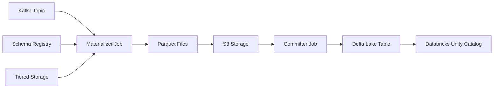

# LAB 4: Tableflow and Unity Catalog

## 🗺️ Overview

Now with your data generated, it's time to integrate with Databricks Unity Catalog and enable Tableflow on a topic!

### What You'll Accomplish

By the end of this lab, you will have:

1. **Unity Catalog Integration**: Connect Confluent Cloud with Databricks Unity Catalog through Tableflow for automated Delta Lake synchronization
2. **Tableflow-enabled Topic**: Stream your `clickstream` topic as a Delta Lake table with Tableflow

### Prerequisites

Make sure to have completed [LAB 3: Data Generation](../LAB3_data_generation/LAB3.md) with data streaming to Kafka topics.

## 👣 Steps

### Step 1: Setup Tableflow Integration with Unity Catalog

#### Establish Unity Catalog Integration

Follow these steps to setup the Tableflow-to-Unity Catalog integration:

1. Navigate to your cluster in Confluent Cloud
2. Click on **Tableflow** in the left menu
3. Click on the **+ Add integration** button next to the *External Catalog Integrations* section

   

4. Select **Databricks Unity**
5. Enter a relevant and memorable title in the *Name* field, something like `tableflow-databricks-workshop`

   

6. Click **Continue**
7. Copy and paste the value from the `databricks_host` variable in your *terraform.tfvars* file into the *Databricks workspace URL* field
8. Copy and paste the value from the `databricks_service_principal_client_id` variable in your *terraform.tfvars* file into the *Client ID* field
9. Copy and paste the value from the `databricks_service_principal_client_secret` variable in your *terraform.tfvars* file into the *Client secret* field
10. Copy and paste the name of your databricks catalog into the *Unity catalog name* - look for the *catalog_name* attribute from the result of running this terraform command:

   ```sh
   docker-compose run --rm terraform -c "terraform output databricks_integration"
   ```

   

11. Click **Continue**
12. Launch your Unity Catalog integration, you should see something like this on your screen:

   

> [!IMPORTANT]
> **Pending Status**
>
> The status of your Tableflow integration with Unity Catalog will remain in *Pending* until you enable Tableflow for Delta Lake on your first topic, which you will do in a future step. Do not be concerned about its status at this point.

#### How Tableflow Works (Optional)

<details>
<summary>Expand to learn more about how Tableflow works</summary>

When you enable Tableflow on a topic, Confluent starts two critical jobs that work together to provide reliable, exactly-once data processing:



**🔧 Materializer Job:**

- **Data Ingestion**: Connects to your Kafka topic and fetches table metadata
- **Schema Integration**: Retrieves associated schema from Schema Registry to define table structure
- **Optimized Reading**: Fetches data segments directly from tiered object storage (bypassing Kafka consumer APIs for better performance)
- **Format Conversion**: Converts streaming data to Parquet format for efficient analytical queries
- **Storage Writing**: Writes converted data to your specified S3 location

**🔧 Committer Job:**

- **Transactional Commits**: Commits snapshots to catalogs with exactly-once semantics guaranteed
- **Catalog Sync**: Propagates changes to external catalogs like Unity Catalog and AWS Glue
- **Metadata Management**: Maintains table metadata and ensures data consistency

#### Schema Evolution and Versioning

**🔄 Dynamic Schema Handling:**

- **Automatic Detection**: When schema changes are detected in your Kafka topic, Tableflow automatically creates new snapshots
- **Version Tracking**: Iceberg tracks schema evolution in metadata files, with each snapshot pointing to its schema version
- **Backward Compatibility**: Ensures existing queries continue to work while supporting new schema versions

#### Performance Optimization: The 15-Minute Threshold

**⏱️ Tiered Storage Integration:**

- **Primary Path**: Tableflow reads from tiered object storage for optimal performance
- **Fallback Mechanism**: If data hasn't been tiered within 15 minutes, automatically falls back to Kafka consumer APIs
- **Low-Throughput Handling**: This fallback may introduce delays for low-throughput topics but ensures data availability

> [!NOTE]
> **Performance Consideration**
>
> The 15-minute threshold is designed to balance performance with data availability. For high-throughput topics like `clickstream`, data is typically tiered quickly and benefits from the optimized storage path. For lower-throughput topics, the fallback ensures no data is lost while maintaining exactly-once processing guarantees.

#### Exactly-Once Processing Guarantees

**🛡️ Data Integrity:**

- **Transactional Semantics**: All commits are transactional, preventing data duplication or loss
- **Idempotent Operations**: Retries and failures don't create duplicate records
- **Consistency Guarantees**: Delta Lake's ACID properties ensure consistent reads across all consumers

#### Monitoring Your Tableflow Pipeline

After enabling Tableflow, you can monitor the pipeline through:

1. **Confluent Cloud UI**: Check sync status and processing metrics
2. **S3 Storage**: Verify Parquet files are being created in your bucket
3. **Databricks Unity Catalog**: Confirm tables are appearing and updating

> [!TIP]
> **Tableflow Best Practices**
>
> - **Topic Naming**: Use descriptive topic names as they become your Delta Lake table names
> - **Schema Design**: Design schemas for evolution - add fields rather than changing existing ones when possible
> - **Monitoring**: Regularly check sync status, especially for critical business data
> - **Partitioning**: Consider your query patterns when designing topic key strategies

</details>

### Step 2: Enable Tableflow on `clickstream` topic

Follow these steps to switch on Tableflow for the `clickstream` topic:

1. Navigate to your cluster topics
2. Click on the `clickstream` topic
3. Click on the **Enable Tableflow** button in the top right of your screen

   

4. Deselect the **Iceberg** tile
5. Select the **Delta** tile

   

6. Click on the **Configure custom storage** button
7. Ensure the **Store in your own bucket** tile is selected
8. Select the *tableflow-databricks* provider integration from the dropdown
9. Open your command-line interface in the *terraform/* directory
10. Run this command

   ```sh
   docker-compose run --rm terraform -c "terraform output aws_s3"
   ```

11. Copy the value from the `bucket_name` property and paste it into the *AWS S3 Bucket name* textbox; your selections should look like this:

   

12. Click on the **Continue** button
13. Review the configuration details and click the **Launch** button
14. Verify Tableflow is successfully syncing data by checking the status in the UI.

   

> [!IMPORTANT]
> **Tableflow Sync Startup Time**
>
> It may take several minutes for Tableflow to connect to S3 and begin streaming your topics as tables.

## 🏁 Conclusion

🎉 **Congratulations!** You've successfully configured the link between Tableflow and Unity Catalog, as well as initiate streaming your `clickstream` topic as a Delta Lake table with Tableflow.

## ➡️ What's Next

Move forward in your journey with **[LAB 5: Stream Processing](../LAB5_stream_processing/LAB5.md)**.

## 🔧 Troubleshooting

You can find potentially common issues and solutions or workarounds in the [Troubleshooting](../troubleshooting.md) guide.
