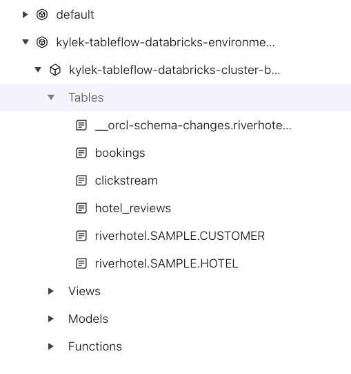
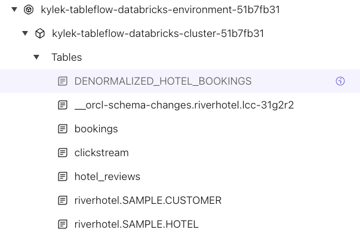

# LAB 5: Stream Processing

## 🗺️ Overview

This lab transforms your raw data streams into intelligent, enriched data products using Confluent Cloud's streaming platform. You'll build sophisticated real-time processing pipelines that establish the foundation for matching high-value customers with relevant hotels.

### What You'll Accomplish


By the end of this lab you will have:

1. **Established Intelligent Stream Processing**: Build Flink SQL queries that identify
   prospects who clicked but didn't book and enrich their profiles
2. **Created Enriched Data Products**: Create denormalized datasets that combine customer,
   booking, and hotel data for analytics
3. **Integrated with Delta Lake**: Use Confluent Tableflow to sync processed data
   streams as Delta tables in S3

### Prerequisites

- Completed **[LAB 4: Tableflow and Unity Catalog](../LAB4_tableflow/LAB4.md)** with Unity Catalog integration established

## 👣 Steps

### Step 1: Explore Streaming Data with Flink SQL

The next step in your journey is to enrich your *data streams* with serverless
Apache Flink on Confluent.

#### Navigate to Flink Compute Pool

Follow these steps to navigate to the *Flink Compute Pool* that you spun up
earlier with Terraform:

1. Click on your workshop environment link in the navigation breadcrumbs
2. Click on the `Flink` menu item in the left-side navigation

   

3. Click on the `Open SQL workspace` button in your workshop Flink compute pool

   

4. Ensure your workspace environment and cluster are both selected in the
   `Catalog` and `Database` dropdowns at the top of your compute pool screen
5. Drill down in the left navigation to see the tables in your environment and
   cluster

   

#### Explore Bookings Data

Now that you are in the Flink SQL workspace, you can start executing queries and
statements to enhance your River Hotels data streams.

Start by reviewing the `booking` topic data with these steps:

1. Copy and paste this query into the cell:

```sql
-- View bookings data
SELECT * FROM `bookings` LIMIT 10;
```

2. Click the *Run* button

3. Look for the cell to expand at the bottom to show you the result set, which
   should look similar to this:

   

   Some observations about this data stream:

   - The date fields of `check_in`, `check_out`, and `created_at` all have
     timestamp values that are not human friendly
   - While you can see the values of `hotel_id`, it would be more informative to have more identifiable fields displayed as well, like its name and location
   - It would be useful to know if a customer completed a review of their hotel stay

4. Click the *Stop* button
5. Click the *+* button in the in the narrow side panel at the top left of the
   cell to create a new one. Create ~10 new cells as you will need them
   throughout the remainder of this workshop
6. Delete the current cell by clicking the trash icon located below the *+*

   

#### Run Streaming Data Queries

Execute these steps to see how the `bookings` data continues to stream in from
the data generator:

1. Copy and paste this query into the next empty cell

```sql
-- See streaming count of bookings data
SELECT COUNT(*) FROM `bookings` AS `TOTAL_BOOKINGS`;
```

2. Click the *Run* button

3. Pay attention to the count - over the next few minutes it should increase
   gradually as new booking data is produced to the `bookings` topic and
   surfaced in this table

### Step 2: Enrich and Denormalize Hotel Bookings

At this time, your data has normalized topics as tables in Flink. Normalization makes sense for maintaining data, but you're interested in processing it into useful datasets for data analysis use cases.

#### Create Snapshot Tables

First, run these statements to create snapshot tables from the CDC sources, then you can execute the main denormalization query:

```sql
-- Create append-only customer snapshot from CDC source
SET 'client.statement-name' = 'customer-snapshot';

CREATE TABLE customer_snapshot AS (
SELECT
  customer_id,
  email,
  first_name,
  last_name,
  birth_date,
  created_at
FROM `riverhotel.cdc.customer`
);
```

```sql
-- Ensure append-only mode for interval join compatibility
ALTER TABLE customer_snapshot SET ('changelog.mode' = 'append');
```

```sql
-- Create append-only hotel snapshot from CDC source
SET 'client.statement-name' = 'hotel-snapshot';

CREATE TABLE hotel_snapshot AS (
SELECT
  hotel_id,
  name,
  category,
  description,
  city,
  country,
  room_capacity,
  created_at
FROM `riverhotel.cdc.hotel`
);
```

```sql
-- Ensure append-only mode for interval join compatibility
ALTER TABLE hotel_snapshot SET ('changelog.mode' = 'append');
```

#### Create Denormalized Table

The query below creates a denormalized topic/table that combines booking data with customer information, hotel details, and any existing hotel reviews.:

```sql
SET 'client.statement-name' = 'denormalized-hotel-bookings';

CREATE TABLE denormalized_hotel_bookings AS (

SELECT
  h.`name` AS `hotel_name`,
  h.`description` AS `hotel_description`,
  h.`category` AS `hotel_category`,
  h.`city` AS `hotel_city`,
  h.`country` AS `hotel_country`,
  b.`price` AS `booking_amount`,
  b.`occupants` AS `guest_count`,
  to_timestamp_ltz(b.`created_at`, 3) AS `booking_date`,
  to_timestamp_ltz(b.`check_in`, 3) AS `check_in`,
  to_timestamp_ltz(b.`check_out`, 3) AS `check_out`,
  c.`email` AS `customer_email`,
  c.`first_name` AS `customer_first_name`,
  hr.`review_rating` AS `review_rating`,
  hr.`review_text` AS `review_text`,
  to_timestamp_ltz(hr.`created_at`, 3) AS `review_date`,
  b.`booking_id` AS `booking_id`,
  h.`hotel_id` AS `hotel_id`
FROM `bookings` b
   JOIN `customer_snapshot` c
     ON c.`email` = b.`customer_email`
     AND c.`$rowtime` BETWEEN b.`$rowtime` - INTERVAL '7' DAY AND b.`$rowtime` + INTERVAL '7' DAY
   JOIN `hotel_snapshot` h
     ON h.`hotel_id` = b.`hotel_id`
     AND h.`$rowtime` BETWEEN b.`$rowtime` - INTERVAL '7' DAY AND b.`$rowtime` + INTERVAL '7' DAY
  LEFT JOIN `hotel_reviews` hr
    ON hr.`booking_id` = b.`booking_id`
    AND to_timestamp_ltz(hr.`created_at`, 3) BETWEEN
        to_timestamp_ltz(b.`created_at`, 3) AND
        to_timestamp_ltz(b.`created_at`, 3) + INTERVAL '90' DAY
);
```

Next, run this SQL statement to change the *changelog* mode from `retract` to `append`:

```sql
-- Set append-only mode for Tableflow compatibility
ALTER TABLE denormalized_hotel_bookings SET ('changelog.mode' = 'append');
```

<details>
<summary>Expand this section for more Flink join details</summary>


This **[CREATE TABLE AS SELECT (CTAS)](https://docs.confluent.io/cloud/current/flink/reference/statements/create-table-as.html)** statement creates a real-time **[denormalized fact table](https://www.kimballgroup.com/data-warehouse-business-intelligence-resources/kimball-techniques/dimensional-modeling-techniques/fact-table-core-concepts/)** by joining streaming tables using [interval joins](https://docs.confluent.io/cloud/current/flink/concepts/joins.html#interval-joins).

##### Understanding the Join Strategy

This query uses a **hybrid timestamp strategy** combining processing-time and business-time semantics:

| Join Type | Timestamp | Window | Purpose |
|-----------|-----------|--------|---------|
| **Dimension joins** (customer/hotel) | `$rowtime` | 7 days | Ensures data was available when booking was processed |
| **Event joins** (reviews) | `created_at` | 90 days | Reflects realistic business timing relationships |

**Why Snapshot Tables?**

PostgreSQL CDC sources produce changelog streams (`INSERT`, `UPDATE`, `DELETE`) that aren't directly compatible with interval joins. The snapshot tables convert these to append-only format for reliable processing.

**Key Query Components:**

- **`JOIN customer_snapshot`** / **`JOIN hotel_snapshot`** — 7-day `$rowtime` windows ensure dimension data availability
- **`LEFT JOIN hotel_reviews`** — 90-day `created_at` window captures reviews within 3 months of booking
- **Timestamp conversions** — `to_timestamp_ltz(b.created_at, 3)` converts epoch milliseconds

> [!TIP]
> **Deep Dive: CDC Join Challenges**
>
> For a comprehensive exploration of why temporal joins fail with CDC sources and how we arrived at this snapshot + interval join solution, see **[Flink Streaming Joins with CDC Sources](../flink-joins.md)**.
>
> Additional resources in that guide:
> - [Schema Definition Approaches](../flink-joins.md#a3-schema-definition-approaches-for-nullable-columns) for handling nullable columns in aggregates
> - [Hybrid Timestamp Strategy Details](../flink-joins.md#a4-hybrid-timestamp-strategy-for-complex-joins) for production tuning

> [!NOTE]
> **Workshop vs Production**
>
> In production, dimension windows can often be smaller (hours) when CDC is properly synchronized, and event windows should match actual business requirements.

</details>

#### Verify Denormalization Results

Now run this query to return 20 records from this newly-created table:

```sql
SELECT *
  FROM `denormalized_hotel_bookings`
LIMIT 20;
```

Some observations from the data:

- Because of the **LEFT JOIN** on `hotel_reviews`, there are some hotels that have bookings but no customer reviews
- The `check_in`, `check_out`, `booking_date`, and `review_date` columns are now human readable and immediately useful!

#### Review Table Schema and Details

Now look into the details of the table by reviewing the table schema in the left side navigation:

1. Find and drill down into your workshop environment and cluster in the resource
   tree in the left menu
2. Click on the *Tables* menu item to expand it
3. Verify that you see a list of your tables, including the recently-created
   `denormalized_hotel_bookings`, show up in the list:

   

> [!TIP]
> **Refresh Tables**
>
> Hover over the *Tables* left menu item to reveal a sync icon. Click it to
> refresh any new tables into the UI.
>
> 

4. Click on `denormalized_hotel_bookings` to reveal *Schema* and *Options* data
   display in the bottom panel

   

#### Hotel Stats Data Product

With your enriched booking data flowing in real-time, you can now build powerful analytical data products that provide immediate business insights.

This next Flink SQL statement creates a **streaming aggregation table** that transforms individual booking records into comprehensive hotel-level performance metrics:

```sql
SET 'client.statement-name' = 'hotel-stats';

CREATE TABLE hotel_stats AS (

SELECT
  COALESCE(hotel_id, 'UNKNOWN_HOTEL') AS hotel_id,
  COALESCE(hotel_name, 'UNKNOWN_HOTEL_NAME') AS hotel_name,
  COALESCE(hotel_city, 'UNKNOWN_HOTEL_CITY') AS hotel_city,
  COALESCE(hotel_country, 'UNKNOWN_HOTEL_COUNTRY') AS hotel_country,
  COALESCE(hotel_description, 'UNKNOWN_HOTEL_DESCRIPTION') AS hotel_description,
  COALESCE(hotel_category, 'UNKNOWN_HOTEL_CATEGORY') AS hotel_category,
  SUM(1) AS total_bookings_count,
  SUM(guest_count) AS total_guest_count,
  SUM(booking_amount) AS total_booking_amount,
  CAST(AVG(review_rating) AS DECIMAL(10, 2)) AS average_review_rating,
  SUM(CASE WHEN review_rating IS NOT NULL THEN 1 ELSE 0 END) AS review_count
FROM `denormalized_hotel_bookings`
WHERE hotel_id IS NOT NULL
GROUP BY
   COALESCE(hotel_id, 'UNKNOWN_HOTEL'),
   COALESCE(hotel_name, 'UNKNOWN_HOTEL_NAME'),
   COALESCE(hotel_city, 'UNKNOWN_HOTEL_CITY'),
   COALESCE(hotel_country, 'UNKNOWN_HOTEL_COUNTRY'),
   COALESCE(hotel_description, 'UNKNOWN_HOTEL_DESCRIPTION'),
   COALESCE(hotel_category, 'UNKNOWN_HOTEL_CATEGORY')
);
```

> [!NOTE]
> **Handling Nullable Columns in GROUP BY**
>
> This query uses `COALESCE()` for all GROUP BY columns to ensure no null values are used in the primary key that Flink auto-infers from the grouping columns. Without this, you may get: `Invalid primary key... Column 'hotel_name' is nullable.`
>
> For alternative approaches that avoid COALESCE in aggregates, see **[Schema Definition Approaches](../flink-joins.md#a3-schema-definition-approaches-for-nullable-columns)**.

Look through the data by invoking this query:

```sql
SELECT *
  FROM `hotel_stats`
LIMIT 20;
```

Some observations from the data:

- Fields like `average_review_rating` and `review_count` provide more context and analytical insight into individual hotels
- `total_bookings_count` and `total_booking_amount` provide a way to easily benchmark hotels performance and determine how an individual hotel, city of hotels, country of hotels, or category of hotels is performing relative to its peers.

**Time for Analytics:**

Now that you have created enriched datasets, you can now more easily derive insights from them with powerful analytical platforms like Databricks!

In this next section you will stream your topics as *Delta Lake* tables with *TableFlow*.

### Step 3: Enable Tableflow on Topics

These steps guide you through enabling Tableflow for the `denormalized_hotel_bookings` and `hotel_stats` topics:

1. Click on the *Environments* icon in the far left sidebar
2. Click on your workshop environment
3. Click on your workshop cluster
4. Click on *Topics*

   Your Topics should looks something like:
   

5. Click on the newly-created `denormalized_hotel_bookings` topic
6. Click on the **Enable Tableflow** button in the top right of the screen
7. Select the **Delta** tile
8. Deselect the **Iceberg** tile

   

9. Click on the *Configure custom storage* button
10. Select the *Store in your own bucket* option
11. Select the *tableflow-databricks* provider integration from the dropdown
12. In your command-line interface in the *terraform* directory run

    ```sh
    docker-compose run --rm terraform -c "terraform output aws_s3"
    ```

13. Copy the value from the `bucket_name` property and paste it into the *AWS S3 Bucket
    name* textbox

    Your selections should look like this:
    

14. Click on the **Continue** button
15. Review the configuration details and click the **Launch** button
16. Verify Tableflow is successfully syncing data by checking the status in the UI

    

17. Repeat steps 4-16 for the `hotel_stats` topic

> [!IMPORTANT]
> **Tableflow Sync Startup Time**
>
> It should take only a few minutes for Tableflow to connect to S3 and begin streaming your topics as tables.
>
> However, in some cases it may take longer, and you will see a *Tableflow sync pending* message.
>
> While this sync is pending, you can move on to the next lab but you will not be able to pull in data until the sync is successful.

#### Review Unity Catalog Integration

Follow these steps to verify that the integration between Tableflow and Unity Catalog is working as expected:

1. Click on **Tableflow** in the left menu
2. Scroll down to the *External Catalog Integrations* section
3. Check for *Connected* status on the integration you set up previously - It should look similar to this:

   

## 🏁 Conclusion

🎉 **Huzzah!** You've successfully built a sophisticated real-time streaming pipeline that transforms raw customer data into enriched insights ready for analytics.

### Your Achievements

- ✅ **Intelligent Stream Processing**: Your Flink SQL queries with snapshot tables and interval joins
process and denormalize customer, booking, and hotel data reliably in real-time
- ✅ **Production-Ready Data Products**: Multiple enriched streaming tables now
flow continuously to Delta Lake, ready for advanced analytics

## ➡️ What's Next

Press forward on your journey with [LAB 6: Analytics and AI-Powered Marketing Automation](../LAB6_databricks/LAB6.md).

## 🔧 Troubleshooting

You can find potentially common issues and solutions or workarounds in the [Troubleshooting](../troubleshooting.md) guide.
