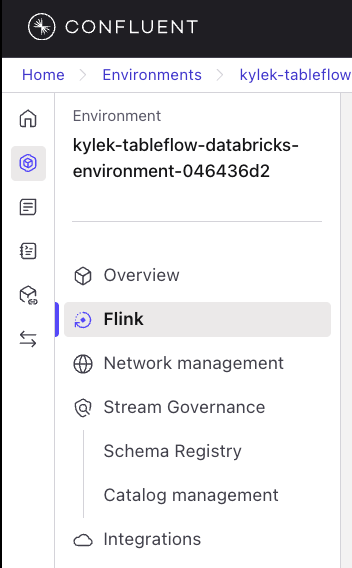
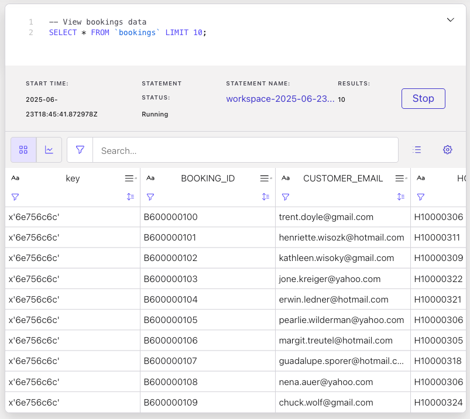
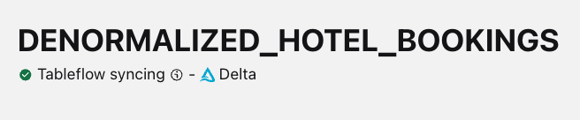

# LAB 5: Stream Processing

## 🗺️ Overview

This lab transforms your raw data streams into intelligent, enriched data products using Confluent Cloud's streaming platform. You'll build sophisticated real-time processing pipelines that establish the foundation for matching high-value customers with relevant hotels.

### What You'll Accomplish


By the end of this lab you will:

1. **Establish Intelligent Stream Processing**: Build Flink SQL queries that identify
   prospects who clicked but didn't book and enrich their profiles
2. **Create Enriched Data Products**: Create denormalized datasets that combine customer,
   booking, and hotel data for analytics
3. **Integrated with Delta Lake**: Use Confluent Tableflow to sync processed data
   streams as Delta tables in S3

### Key Technologies You'll Use

- **Apache Flink SQL**: Stream processing and real-time analytics
- **Confluent Tableflow**: Automatic streaming to Delta Lake format
- **Delta Lake**: Open-source storage layer for reliable data lakes

### Prerequisites

- Completed [LAB 4: Data Generation](../LAB4_data_generation/LAB4.md) with data streaming to Kafka topics

## 👣 Steps

### Step 1: Explore Streaming Data with Flink SQL

The next step in your journey is to enrich your *data streams* with serverless
Apache Flink on Confluent.

#### Navigate to Flink Compute Pool

Follow these steps to navigate to the *Flink Compute Pool* that you spun up
earlier with Terraform:

1. Click on your workshop environment link in the navigation breadcrumbs
2. Click on the `Flink` menu item in the left-side navigation

   

3. Click on the `Open SQL workspace` button in your workshop Flink compute pool

   

4. Ensure your workspace environment and cluster are both selected in the
   `Catalog` and `Database` dropdowns at the top of your compute pool screen
5. Drill down in the left navigation to see the tables in your environment and
   cluster

   

#### Explore Data

Now that you are in the Flink SQL workspace, you can start executing queries and
statements to enhance your River Hotels data streams.

Start by reviewing the `booking` topic data with these steps:

1. Copy and paste this query into the cell:

```sql
-- View bookings data
SELECT * FROM `bookings` LIMIT 10;
```

2. Click the *Run* button

3. Look for the cell to expand at the bottom to show you the result set, which
   should look similar to this:

   

   Some observations about this data stream:

   - The date fields of `CHECK_IN`, `CHECK_OUT`, and `CREATED_AT` all have
     timestamp values that are not human friendly
   - While you can see the Hotel IDs, it would be more informative to have most
     of the other hotel fields displayed as well
   - It would be useful to know if a customer completed a review of their hotel
     stay

4. Click the *Stop* button
5. Click the *+* button in the in the narrow side panel at the top left of the
   cell to create a new one. Create ~10 new cells as you will need them
   throughout the remainder of this workshop
6. Delete the current cell by clicking the trash icon located below the *+*

   

#### Run Streaming Data Queries

Execute these steps to see how the `bookings` data continues to stream in from
the data generator:

1. Copy and paste this query into the next empty cell

```sql
-- See streaming count of bookings data
SELECT COUNT(*) FROM `bookings` AS `TOTAL_BOOKINGS`;
```

2. Click the *Run* button

3. Pay attention to the count - over the next few minutes it should increase
   gradually as new booking data is produced to the `bookings` topic and
   surfaced in this table

### Step 2: Enrich and Denormalize Hotel Bookings

At this time, your data has normalized topics as tables in Flink. Normalization makes sense for maintaining data, but you're interested in processing it into useful datasets for data analysis use cases.

#### Create Snapshot Tables

First, run these statements to create snapshot tables from the CDC sources, then you can execute the main denormalization query:

```sql
-- Create append-only customer snapshot from CDC source
SET 'client.statement-name' = 'customer-snapshot';

CREATE TABLE CUSTOMER_SNAPSHOT AS (
SELECT
  CUSTOMER_ID,
  EMAIL,
  FIRST_NAME,
  LAST_NAME,
  BIRTH_DATE,
  CREATED_AT
FROM `riverhotel.SAMPLE.CUSTOMER`
);
```

```sql
-- Ensure append-only mode for interval join compatibility
ALTER TABLE CUSTOMER_SNAPSHOT SET ('changelog.mode' = 'append');
```

```sql
-- Create append-only hotel snapshot from CDC source
SET 'client.statement-name' = 'hotel-snapshot';

CREATE TABLE HOTEL_SNAPSHOT AS (
SELECT
  HOTEL_ID,
  NAME,
  CLASS,
  DESCRIPTION,
  CITY,
  COUNTRY,
  ROOM_CAPACITY,
  CREATED_AT
FROM `riverhotel.SAMPLE.HOTEL`
);
```

```sql
-- Ensure append-only mode for interval join compatibility
ALTER TABLE HOTEL_SNAPSHOT SET ('changelog.mode' = 'append');
```

#### Create Denormalized Table

The query below creates a denormalized topic/table that combines booking data with customer information, hotel details, and any existing hotel reviews.:

```sql
SET 'client.statement-name' = 'denormalized-hotel-bookings';

CREATE TABLE DENORMALIZED_HOTEL_BOOKINGS AS (

SELECT
  h.`NAME` AS `HOTEL_NAME`,
  h.`DESCRIPTION` AS `HOTEL_DESCRIPTION`,
  h.`CLASS` AS `HOTEL_CLASS`,
  h.`CITY` AS `HOTEL_CITY`,
  h.`COUNTRY` AS `HOTEL_COUNTRY`,
  b.`PRICE` AS `BOOKING_AMOUNT`,
  b.`OCCUPANTS` AS `GUEST_COUNT`,
  to_timestamp_ltz(b.`CREATED_AT`, 3) AS `BOOKING_DATE`,
  to_timestamp_ltz(b.`CHECK_IN`, 3) AS `CHECK_IN`,
  to_timestamp_ltz(b.`CHECK_OUT`, 3) AS `CHECK_OUT`,
  c.`EMAIL` AS `CUSTOMER_EMAIL`,
  c.`FIRST_NAME` AS `CUSTOMER_FIRST_NAME`,
  hr.`REVIEW_RATING`,
  hr.`REVIEW_TEXT`,
  to_timestamp_ltz(hr.`CREATED_AT`, 3) AS `REVIEW_DATE`,
  b.`BOOKING_ID`,
  h.`HOTEL_ID`
FROM `bookings` b
   JOIN `CUSTOMER_SNAPSHOT` c
     ON c.`EMAIL` = b.`CUSTOMER_EMAIL`
     AND c.`$rowtime` BETWEEN b.`$rowtime` - INTERVAL '7' DAY AND b.`$rowtime` + INTERVAL '7' DAY
   JOIN `HOTEL_SNAPSHOT` h
     ON h.`HOTEL_ID` = b.`HOTEL_ID`
     AND h.`$rowtime` BETWEEN b.`$rowtime` - INTERVAL '7' DAY AND b.`$rowtime` + INTERVAL '7' DAY
  LEFT JOIN `hotel_reviews` hr
    ON hr.`BOOKING_ID` = b.`BOOKING_ID`
    AND to_timestamp_ltz(hr.`CREATED_AT`, 3) BETWEEN
        to_timestamp_ltz(b.`CREATED_AT`, 3) AND
        to_timestamp_ltz(b.`CREATED_AT`, 3) + INTERVAL '90' DAY
);
```

Next, run this SQL statement to change the *changelog* mode from `retract` to `append`:

```sql
-- Set append-only mode for Tableflow compatibility
ALTER TABLE DENORMALIZED_HOTEL_BOOKINGS SET ('changelog.mode' = 'append');
```

> [!NOTE]
> **Hybrid Timestamp Approach**
>
> The denormalization query uses a **hybrid timestamp strategy** for optimal join performance:
>
> - **`$rowtime` intervals** for dimension joins (customer/hotel): Uses processing time windows to ensure dimension data availability
> - **`CREATED_AT` intervals** for business logic joins (reviews): Uses business timestamps for realistic review timing (90 days after booking creation)
>
> This approach ensures all 420 bookings are returned with reviews attached where business timing makes sense, avoiding artificial filtering based on processing order.

This **[CREATE TABLE AS SELECT (CTAS)](https://docs.confluent.io/cloud/current/flink/reference/statements/create-table-as.html)**
statement creates a real-time **[denormalized](https://www.confluent.io/blog/data-denormalization-with-apache-kafka-and-confluent/)
[fact table](https://www.kimballgroup.com/data-warehouse-business-intelligence-resources/kimball-techniques/dimensional-modeling-techniques/fact-table-core-concepts/)** by joining multiple streaming tables using [interval joins](https://docs.confluent.io/cloud/current/flink/concepts/joins.html#interval-joins) with snapshot tables.

> [!TIP]
> **Alternative Schema Approaches**
>
> For production environments, you may want to avoid COALESCE in aggregate queries by defining explicit NOT NULL constraints. See **[Advanced Schema Definition Approaches](../flink-joins.md#a3-schema-definition-approaches-for-nullable-columns)** for detailed alternatives including explicit schema definition and source table constraints.

##### Data Sources & Joins

This section walks you through the different parts of the Flink SQL statement and highlights key parts.

**Main Data Source: `bookings` table**

- The primary [fact table](https://www.kimballgroup.com/data-warehouse-business-intelligence-resources/kimball-techniques/dimensional-modeling-techniques/fact-table-core-concepts/)
  containing booking events
- Provides core booking data: `PRICE`, `OCCUPANTS`, timestamps, and `BOOKING_ID`

**Interval Join with CUSTOMER Snapshot:**

```sql
JOIN `CUSTOMER_SNAPSHOT` c
  ON c.`EMAIL` = b.`CUSTOMER_EMAIL`
  AND c.`$rowtime` BETWEEN b.`$rowtime` - INTERVAL '7' DAY AND b.`$rowtime` + INTERVAL '7' DAY
```

- **Snapshot table** contains current customer data converted from CDC changelog to append-only format
- **7-day processing time window** ensures dimension data was available when booking was processed
- **`$rowtime` semantics** provide data availability guarantees for dimension joins
- Compatible with CDC streaming sources

**Interval Join with HOTEL Snapshot:**

```sql
JOIN `HOTEL_SNAPSHOT` h
  ON h.`HOTEL_ID` = b.`HOTEL_ID`
  AND h.`$rowtime` BETWEEN b.`$rowtime` - INTERVAL '7' DAY AND b.`$rowtime` + INTERVAL '7' DAY
```

- **Snapshot table** provides hotel information in append-only format for reliable processing
- **7-day processing time window** ensures dimension data was available when booking was processed
- **`$rowtime` semantics** provide data availability guarantees for dimension joins

**Business Time Join with REVIEWS:**

```sql
LEFT JOIN `hotel_reviews` hr
  ON hr.`BOOKING_ID` = b.`BOOKING_ID`
  AND to_timestamp_ltz(hr.`CREATED_AT`, 3) BETWEEN
      to_timestamp_ltz(b.`CREATED_AT`, 3) AND
      to_timestamp_ltz(b.`CREATED_AT`, 3) + INTERVAL '90' DAY
```

- **Left join** includes bookings even without reviews
- **Business time semantics** using `CREATED_AT` fields for realistic timing relationships
- **90-day window** captures reviews created within 3 months after booking was made
- **Hybrid approach** avoids artificial processing-time filtering that can exclude valid reviews
- Prevents [unbounded state growth](https://docs.confluent.io/cloud/current/flink/concepts/joins.html#interval-joins)
  while ensuring all bookings are returned with appropriate review attachments

##### Key Transformations

- **Timestamp conversions**: `to_timestamp_ltz(b.CREATED_AT, 3)` converts epoch
  milliseconds to timestamps
- **Field renaming**: Creates business-friendly names (`h.NAME` → `HOTEL_NAME`)
- **Real-time denormalization**: All related data combined into one
  analytics-ready table

> [!IMPORTANT]
> **CDC Sources and Streaming Joins**
>
> Oracle CDC sources produce changelog streams (`INSERT`, `UPDATE`, `DELETE`) which have
> compatibility challenges with Flink's streaming joins.
>
> **Snapshot tables + interval joins** provide a reliable approach for
> denormalizing data from CDC sources in real-time streaming scenarios.

##### Denormalization Summary

**Hybrid Timestamp Strategy for Streaming Joins**
This query uses a **sophisticated hybrid timestamp approach** that combines the best of processing-time and business-time semantics:

- **`$rowtime` for dimension joins** - Uses processing time windows (7-day) to ensure customer/hotel data was available when bookings were processed
- **`CREATED_AT` for business logic joins** - Uses business timestamps (90-day) for realistic review timing relationships
- **Snapshot tables** convert CDC changelog streams to append-only format for reliable processing
- **CDC compatibility** - handles Oracle CDC timing variations and state management issues
- **All bookings returned** - Ensures 420 bookings are returned with reviews attached where business timing makes sense
- **Performance optimization** - maintains bounded state through time windows for optimal memory usage

This hybrid approach is considered the most sophisticated and reliable streaming pattern for CDC scenarios as it provides both data availability guarantees and realistic business semantics.

> [!NOTE]
> **Workshop vs Production Time Windows**
>
> This workshop uses a **hybrid timestamp strategy** with different window sizes:
>
> - **7-day processing-time windows** for dimension joins (customer/hotel snapshots)
> - **90-day business-time windows** for event joins (reviews)
>
> In production environments:
>
> - **Dimension windows** can often be smaller (hours or days) when CDC streams are properly synchronized
> - **Event windows** should match actual business requirements (e.g., review submission patterns)
> - **Hybrid approach** should be tuned based on your specific timing characteristics
> - **Monitoring** should track both join success rates and business logic correctness

#### Verify Denormalization Results

Now run this query to return 20 records from this newly-created table:

```sql
SELECT *
  FROM `DENORMALIZED_HOTEL_BOOKINGS`
LIMIT 20;
```

Some observations from the data:

- Because of the `LEFT JOIN` on `hotel_reviews`, there are some hotels that have bookings but no customer reviews
- The `CHECK_IN`, `CHECK_OUT`, and `BOOKING_DATE`, and `REVIEW_DATE` are now human readable and immediately useful

#### Review Table Schema and Details

Now look into the details of the table by reviewing the table schema in the left
side navigation:

1. Find and drill down into your workshop environment and cluster in the resource
   tree in the left menu
2. Click on the *Tables* menu item to expand it
3. Verify that you see a list of your tables, including the recently-created
   `DENORMALIZED_HOTEL_BOOKINGS`, show up in the list:

   

> [!TIP]
> **Refresh Tables**
>
> Hover over the *Tables* left menu item to reveal a sync icon. Click it to
> refresh any new tables into the UI.
>
> 

4. Click on `DENORMALIZED_HOTEL_BOOKINGS` to reveal *Schema* and *Options* data
   display in the bottom panel

   

#### Hotel Stats Data Product

With your enriched booking data flowing in real-time, you can now build powerful analytical data products that provide immediate business insights. This next Flink SQL statement creates a **streaming aggregation table** that transforms individual booking records into comprehensive hotel-level performance metrics.

This data product automatically calculates key business intelligence metrics including revenue totals, booking volumes, guest counts, and review sentiment - all updated in real-time as new bookings and reviews flow through your pipeline. These aggregated insights enable River Hotels' business teams to instantly identify top-performing properties, track customer satisfaction trends, and make data-driven decisions about pricing and marketing strategies.

Execute this statement to create a table that aggregates statistic information at the hotel level:

```sql
SET 'client.statement-name' = 'hotel-stats';

CREATE TABLE HOTEL_STATS AS (

SELECT
  COALESCE(HOTEL_ID, 'UNKNOWN_HOTEL') AS HOTEL_ID,
  COALESCE(HOTEL_NAME, 'UNKNOWN_HOTEL_NAME') AS HOTEL_NAME,
  COALESCE(HOTEL_CITY, 'UNKNOWN_HOTEL_CITY') AS HOTEL_CITY,
  COALESCE(HOTEL_COUNTRY, 'UNKNOWN_HOTEL_COUNTRY') AS HOTEL_COUNTRY,
  COALESCE(HOTEL_DESCRIPTION, 'UNKNOWN_HOTEL_DESCRIPTION') AS HOTEL_DESCRIPTION,
  COALESCE(HOTEL_CLASS, 'UNKNOWN_HOTEL_CLASS') AS HOTEL_CLASS,
  SUM(1) AS TOTAL_BOOKINGS_COUNT,
  SUM(GUEST_COUNT) AS TOTAL_GUEST_COUNT,
  SUM(BOOKING_AMOUNT) AS TOTAL_BOOKING_AMOUNT,
  CAST( AVG(REVIEW_RATING) AS DECIMAL(10, 2)) AS AVERAGE_REVIEW_RATING,
  SUM(CASE WHEN REVIEW_RATING IS NOT NULL THEN 1 ELSE 0 END) AS REVIEW_COUNT
FROM `DENORMALIZED_HOTEL_BOOKINGS`
WHERE HOTEL_ID IS NOT NULL
GROUP BY
   COALESCE(HOTEL_ID, 'UNKNOWN_HOTEL'),
   COALESCE(HOTEL_NAME, 'UNKNOWN_HOTEL_NAME'),
   COALESCE(HOTEL_CITY, 'UNKNOWN_HOTEL_CITY'),
   COALESCE(HOTEL_COUNTRY, 'UNKNOWN_HOTEL_COUNTRY'),
   COALESCE(HOTEL_DESCRIPTION, 'UNKNOWN_HOTEL_DESCRIPTION'),
   COALESCE(HOTEL_CLASS, 'UNKNOWN_HOTEL_CLASS')
);
```

> [!NOTE]
> **Handling Nullable Columns in GROUP BY**
>
> This query uses `COALESCE()` for all GROUP BY columns to ensure no null values are used in the primary key that Flink auto-infers from the grouping columns. Without this, you may get: `Invalid primary key... Column 'HOTEL_NAME' is nullable.`
>
> For alternative approaches that avoid COALESCE in aggregates, see **[Schema Definition Approaches](../flink-joins.md#a3-schema-definition-approaches-for-nullable-columns)**.

Look through the data by invoking this query:

```sql
SELECT *
  FROM `HOTEL_STATS`
LIMIT 20;
```

Some observations from the data:

- Fields like `AVERAGE_REVIEW_RATING` and `REVIEW_COUNT` provide more context and analytical insight into individual hotels
- `TOTAL_BOOKINGS_COUNT` and `TOTAL_BOOKINGS_AMOUNT` provide a way to easily benchmark hotels performance and determine how an individual hotel, city of hotels, country of hotels, or class of hotels is performing relative to its peers.

**Time for Analytics:**

Now that you have created enriched datasets, you can now more easily derive insights from them with powerful analytical platforms like Databricks!

In this next section you will stream your topics as Delta tables with TableFlow.

### Step 3: Enable Tableflow on Topics

These steps guide you through enabling Tableflow for the `DENORMALIZED_HOTEL_BOOKINGS` and `HOTEL_STATS` topics:

1. Click on the *Environments* icon in the far left sidebar
2. Click on your workshop environment
3. Click on your workshop cluster
4. Click on *Topics*

   Your Topics should looks something like:
   

5. Click on the newly-created `DENORMALIZED_HOTEL_BOOKINGS` topic
6. Click on the **Enable Tableflow** button in the top right of the screen
7. Select the **Delta** tile
8. Deselect the **Iceberg** tile

   

9. Click on the *Configure custom storage* button
10. Select the *Store in your own bucket* option
11. Select the *tableflow-databricks* provider integration from the dropdown
12. In your command-line interface in the *terraform* directory run

    ```sh
    terraform output aws_s3
    ```

13. Copy the value from the `name` property and paste it into the *AWS S3 Bucket
    name* textbox

    Your selections should look like this:
    

14. Click on the **Continue** button
15. Review the configuration details and click the **Launch** button
16. Verify Tableflow is successfully syncing data by checking the status in the UI

    

17. Repeat steps 4-16 for the `HOTEL_STATS` topic

> [!IMPORTANT]
> **Tableflow Sync Startup Time**
>
> It should take only a few minutes for Tableflow to connect to S3 and begin streaming your topics as tables.
>
> However, in some cases it may take longer, and you will see a *Tableflow sync pending* message like this:
> 
>
> While this sync is pending, you can move on to the next lab but you will not be able to pull in data until the sync is successful.

#### Review Unity Catalog Integration

Follow these steps to verify that the integration between Tableflow and Unity Catalog is working as expected:

1. Click on **Tableflow** in the left menu
2. Scroll down to the *External Catalog Integrations* section
3. Check for *Connected* status on the integration you set up previously - It should look similar to this:

   

## 🏁 Conclusion

🎉 **Huzzah!** You've successfully built a sophisticated real-time streaming pipeline that transforms raw customer data into enriched insights ready for analytics.

### Your Achievements

✅ **Intelligent Stream Processing**: Your Flink SQL queries with snapshot tables and interval joins
process and denormalize customer, booking, and hotel data reliably in real-time

✅ **Production-Ready Data Products**: Multiple enriched streaming tables now
flow continuously to Delta Lake, ready for advanced analytics

### Business Impact

Your streaming pipeline now enables River Hotels to:

- Capture and process customer interactions in real-time
- Automatically enrich customer profiles with comprehensive booking and hotel data

### ✅ Solution Requirements Fulfilled

- **🔓 Unlock** - Teams can now access real-time enriched data through Delta
  Lake tables for immediate analytics
- **💫 Data Freshness** - Data processing latency reduced from days to minutes
- **⏱️ Operational Efficiency** - Automated data pipelines eliminate manual
  batch processing delays
- **🏆 Competitive Advantage** - Real-time insights enable immediate response to
  customer behavior patterns
- **📊 Data Product Creation** - Hotel bookings and reviews are now denormalized
  and aggregated, providing comprehensive insights for sales and marketing teams

## ➡️ What's Next

Continue your journey with [LAB 6: Analytics and AI-Powered Marketing Automation](../LAB6_databricks/LAB6.md), where you'll transform these streaming data products into actionable business intelligence and AI-generated marketing campaigns using Databricks' advanced analytics platform.

## 🔧 Troubleshooting

You can find potentially common issues and solutions or workarounds in the [Troubleshooting](../troubleshooting.md) guide.
