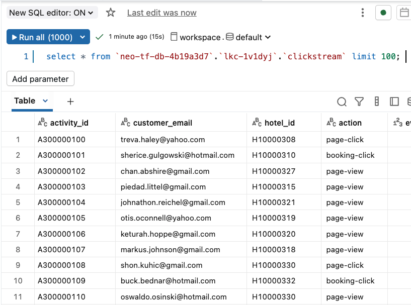

# LAB 6: Analytics and AI-Powered Marketing Automation

## 🗺️ Overview

Welcome to the analytics powerhouse of your real-time AI marketing pipeline! Transform your streaming data products into actionable business insights and AI-generated marketing campaigns using Databricks' advanced analytics and AI capabilities.

### What You'll Accomplish


By the end of this lab, you will have:

1. **AI-Powered Business Intelligence**: Use Databricks Genie to generate natural language insights about customer behavior, booking patterns, and hotel performance metrics
2. **Intelligent Marketing Automation**: Deploy an AI agent that automatically identifies underperforming hotels with good customer satisfaction, generates personalized social media campaigns based on customer reviews, and creates targeted customer lists for marketing outreach

### Prerequisites

Completed [LAB 5: Stream Processing](../LAB5_stream_processing/LAB5.md) with enriched data products flowing to Delta Lake tables

## 👣 Steps

### Step 1: Explore Streaming Data in Unity Catalog

Now that both raw and enriched data is flowing from Confluent via Tableflow to Databricks Unity Catalog, you can do some deep analysis and capture insights from it.

First, follow these steps to verify that the data is flowing in as expected:

1. Login and navigate to your Databricks account in your web browser
2. Click on **Catalog** in the left menu
3. Verify that you see your Tableflow catalog, it will look something like this:

   

4. Click to expand your Tableflow catalog
5. Click to expand your Confluent cluster schema - its name should match the ID of your Confluent Cloud kafka cluster
6. Verify that you see three tables: *clickstream*, *denormalized_hotel_bookings*, and *hotel_stats*

   

7. Select the `clickstream` table
8. Click the **Create** dropdown button in the top right of the screen
9. Select **Query** from the dropdown list
10. Select your *catalog* and *schema* from the dropdowns

   

11. Run the query that appears in the cell - it should look like this:

   ```sql
   select * from `<catalog>`.`<schema>`.`clickstream` limit 100;
   ```

> [!TIP]
> **Compute Resource**
>
> You may see this modal pop up, especially if you are using a free edition or free trial Databricks account:
>
> 
>
> If you do, select the **Automatically launch and attach without prompting** and click the **Start, attach and run** button

12. You should see a result like this:

   

> [!IMPORTANT]
> **10-15 Minute Data Sync**
>
> It may take 5-10 minutes for the `SELECT` queries to return data for the `denormalized_hotel_bookings` and `hotel_stats` tables, as you may have only recently enabled them with TableFlow.

### Step 2: Derive Data Product Insights with Genie

Databricks Genie makes it more accessible and easier to obtain data insights.  It provides a chat interface where you ask questions about your data in natural language, and it leverages generative AI to parse your questions and answer them through SQL queries it generates.

#### Set Up Genie Workspace

Follow these steps to set Genie up:

1. Click on the **Genie** link under the *SQL* section in the left sidebar
2. Click on the **+ New** button in the top right of the screen to create a new Genie space
3. Click on the **All** toggle
4. Navigate to your workshop *catalog* and *database*
5. Select all three of the `clickstream`, `denormalized_hotel_bookings`, and `hotel_stats` tables

   

6. Click on the **Create** button
7. Rename your space to something like *River Hotel BI*
8. Your space should look similar to this:

   

#### Generate Business Insights

Prompt Genie for insights about the data using natural language and following these steps:

> [!NOTE]
> **Example Screenshots**
>
> Throughout these next steps of prompting insights from Genie, the results depicted in the screenshots are **only examples** - the dataset
> you generate for this lab is different each time, and so these example screenshots will never fully match what you see.

Click the **Explain the data set** button to generate an output similar to this:


Now, find out how each country is doing with customer satisfaction with this prompt:
> Show me customer satisfaction metrics by country

You may see a table and chart similar to this:


You can dive into customer-centric analysis with this prompt:
> Show me customers who viewed hotels in the most cities

You should see a result similar to this:


Another prompt to try out is this:
> Which cities had the most interest from customers?

See which cities top your list, it may look similar to this:


You may continue with your own prompts or clicking on Genie-suggested ones to further learn from the data.

Executing this final prompt will provide the *category* of hotel that you will use to fulfill the targeted Marketing campaign:

> Which category of hotel had the lowest interest from customers?


Identify the *Hotel Category* with the lowest customer interest, you will use this in the next section to create an intelligent marketing agent.

### Step 3: Create and Deploy Marketing Campaign Agent

In this section you will use a provided Jupyter Notebook to generate an AI agent that will identify hotels that need promotion and create targeted marketing campaigns for them!

The AI agent combines three intelligent functions:

1. **Hotel Selection**: Identifies the lowest-performing hotel in a given category that has above-average customer satisfaction (3+ reviews) - perfect candidates for promotion
2. **Content Generation**: Leverages AI to analyze customer reviews and extract the top 3 reasons guests enjoyed their stay, then creates positive social media posts highlighting these strengths
3. **Customer Targeting**: Uncovers customers who showed high interest (many page views/clicks) but made few bookings in that hotel category - prime targets for conversion

See the [**optional** Notebook deep dive](notebook_details.md) for more information.

#### Import and Configure Notebook

Follow these steps to import and use a pre-built Notebook to generate your AI Agent:

1. Click on the light-red **+ New** button in the top left of the screen
2. Select **Notebook**
3. Click on **File**
4. Select **Import**

   

5. Select **URL**
6. Paste in this value

   ```link
   https://raw.githubusercontent.com/confluentinc/workshop-tableflow-databricks/refs/heads/main/labs/LAB6_databricks/river_hotel_marketing_agent.ipynb
   ```

7. Click **Import**

   

8. The Notebook should load in a new tab

9. Follow the instructions in the Notebook to create and deploy the marketing campaign agent.

## 🏁 Conclusion

**Congratulations!** Your AI marketing agent is now deployed and accessible through multiple interfaces, and is ready to help River Hotels create data-driven marketing campaigns in real-time!

## ➡️ What's Next

Your journey concludes by cleaning up the resources you created in **[LAB 7: Resource Cleanup](../LAB7_clean_up/LAB7.md)**!

## 🔧 Troubleshooting

You can find potentially common issues and solutions or workarounds in the [Troubleshooting](../troubleshooting.md) guide.
