# LAB 6: Analytics and AI-Powered Marketing Automation

## 🗺️ Overview

Welcome to the analytics powerhouse of your real-time AI marketing pipeline! Transform your streaming data products into actionable business insights and AI-generated marketing campaigns using Databricks' advanced analytics and AI capabilities.

### What You'll Accomplish


By the end of this lab, you will have:

1. **AI-Powered Business Intelligence**: Use Databricks Genie to generate natural language insights about customer behavior, booking patterns, and hotel performance metrics
2. **Intelligent Marketing Automation**: Deploy an AI agent that automatically identifies underperforming hotels with good customer satisfaction, generates personalized social media campaigns based on customer reviews, and creates targeted customer lists for marketing outreach

### Prerequisites

Completed [LAB 5: Stream Processing](../LAB5_stream_processing/LAB5.md) with enriched data products flowing to Delta Lake tables

## 👣 Steps

### Step 1: Explore Streaming Data in Unity Catalog

Now that both raw and enriched data is flowing from Confluent via Tableflow to Databricks Unity Catalog, you can do some deep analysis and capture insights from it.

First, follow these steps to verify that the data is flowing in as expected:

1. Login and navigate to your Databricks account in your web browser
2. Click on **Catalog** in the left menu
3. Verify that you see your Tableflow catalog, it will look something like this:

   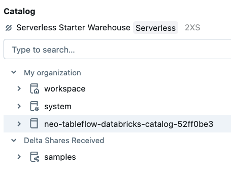

4. Click to expand your Tableflow catalog
5. Click to expand your Confluent cluster schema - its name should match the ID of your Confluent Cloud kafka cluster
6. Verify that you see three tables: *clickstream*, *denormalized_hotel_bookings*, and *hotel_stats*

   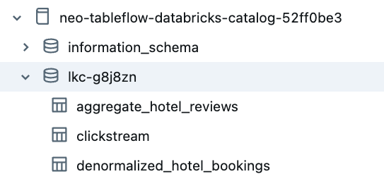

7. Select the `clickstream` table
8. Click the **Create** dropdown button in the top right of the screen
9. Select **Query** from the dropdown list
10. Select your *catalog* and *schema* from the dropdowns

   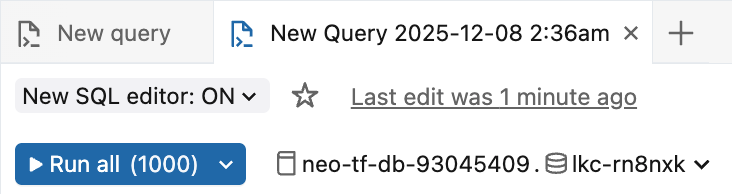

1.  In the SQL editor, run this query to see if data is available

```sql
SELECT * FROM clickstream LIMIT 20;
```

> [!TIP]
> **Compute Resource**
>
> You may see this modal pop up, especially if you are using a free edition or free trial Databricks account:
>
> 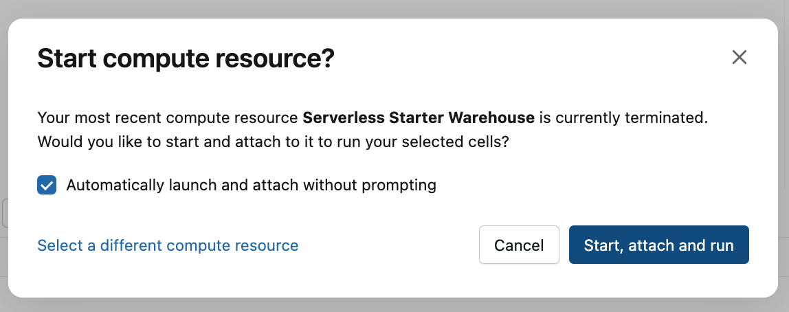
>
> If you do, select the **Automatically launch and attach without prompting** and click the **Start, attach and run** button

You should see 20 records of clickstream data.

<!-- TODO: Add screenshot here of clickstream -->

> [!IMPORTANT]
> **10-15 Minute Data Sync**
>
> It may take 5-10 minutes for the `SELECT` queries to return data for the `denormalized_hotel_bookings` and `hotel_stats` tables, as you may have only recently enabled them with TableFlow.

### Step 2: Derive Data Product Insights with Genie

Databricks Genie makes it more accessible and easier to obtain data insights.  It provides a chat interface where you ask questions about your data in natural language, and it leverages generative AI to parse your questions and answer them through SQL queries it generates.

#### Set Up Genie Workspace

Follow these steps to set Genie up:

1. Click on the **Genie** link under the *SQL* section in the left sidebar
2. Click on the **+ New** button in the top right of the screen to create a new Genie space
3. Click on the **All** toggle
4. Navigate to your workshop *catalog* and *database*
5. Select all three of the `clickstream`, `denormalized_hotel_bookings`, and `hotel_stats` tables

   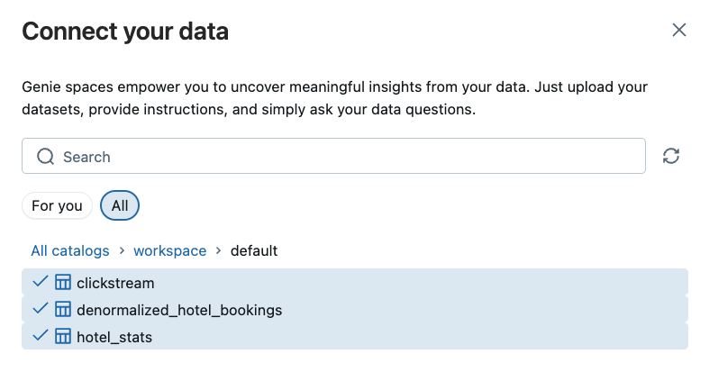

6. Click on the **Create** button
7. Rename your space to something like *River Hotel BI*
8. Your space should look similar to this:

   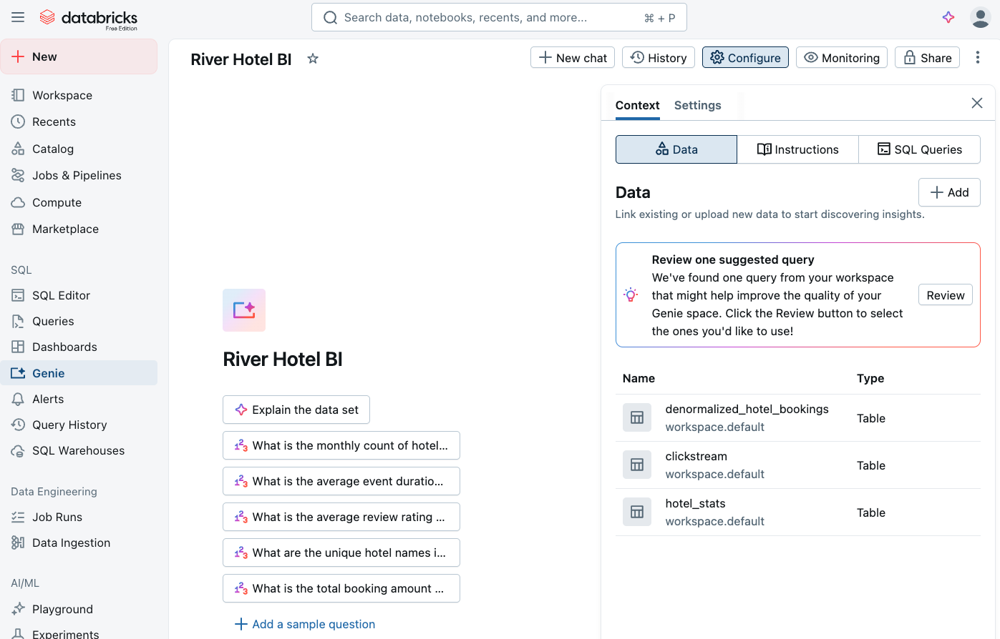

#### Generate Business Insights

Prompt Genie for insights about the data using natural language and following these steps:

> [!NOTE]
> **Example Screenshots**
>
> Throughout these next steps of prompting insights from Genie, the results depicted in the screenshots are **only examples** - the dataset
> you generate for this lab is different each time, and so these example screenshots will never fully match what you see.

Click the **Explain the data set** button to generate an output similar to this:

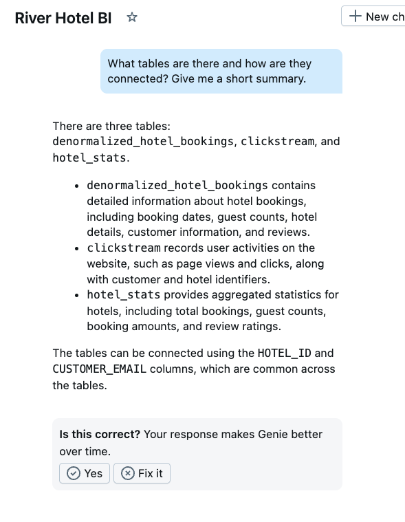

Now, find out how each country is doing with customer satisfaction with this prompt:
> Show me customer satisfaction metrics by country

You may see a table and chart similar to this:
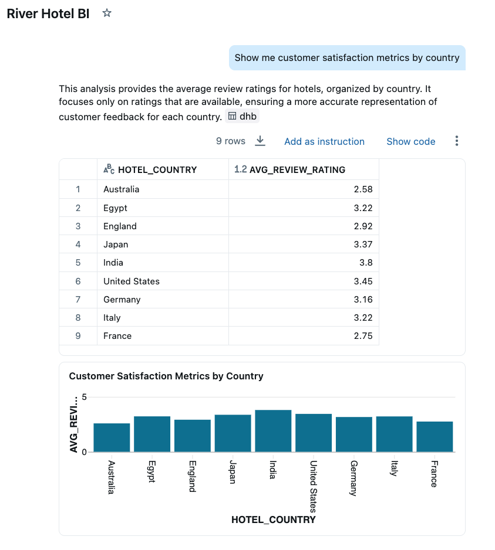

You can dive into customer-centric analysis with this prompt:
> Show me customers who viewed hotels in the most cities

You should see a result similar to this:

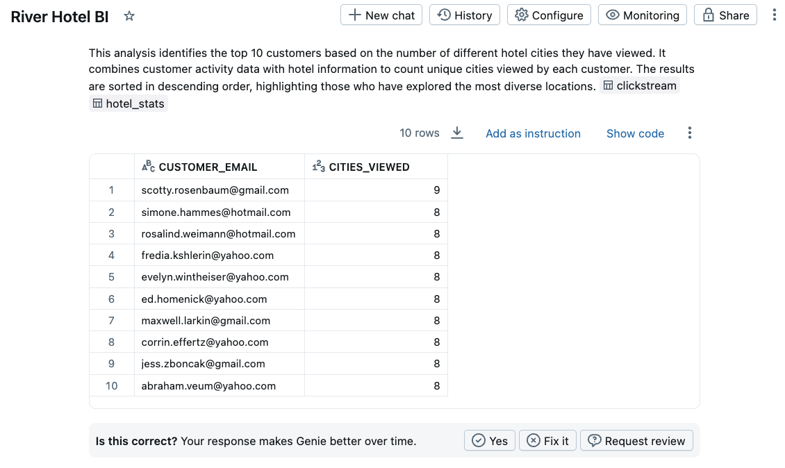

Another prompt to try out is this:
> Which cities had the most interest from customers?

See which cities top your list, it may look similar to this:

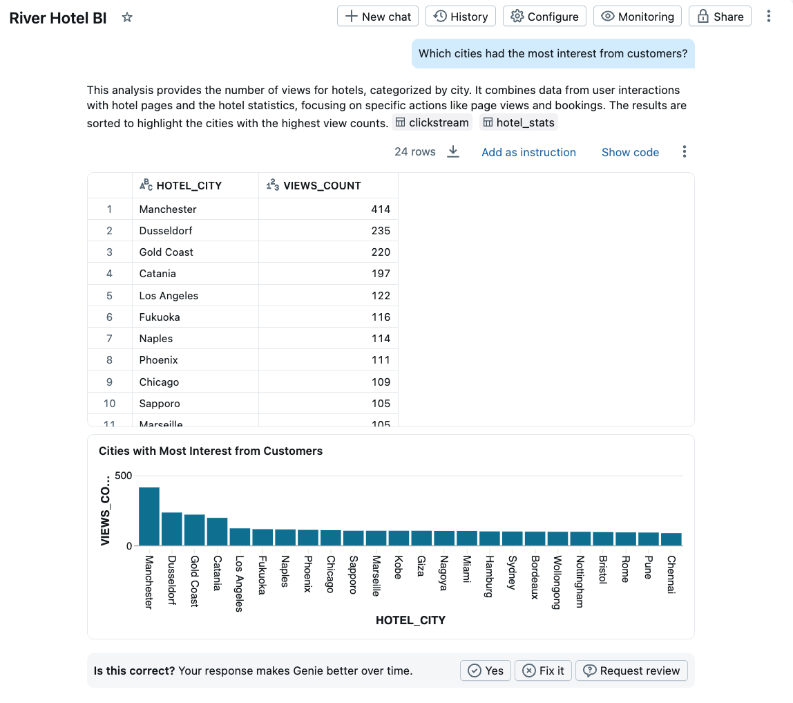

You may continue with your own prompts or clicking on Genie-suggested ones to further learn from the data.

Executing this final prompt will provide the *category* of hotel that you will use to fulfill the targeted Marketing campaign:

> Which category of hotel had the lowest interest from customers?


Identify the *Hotel Category* with the lowest customer interest, you will use this in the next section to create an intelligent marketing agent.

### Step 3: Create and Deploy Marketing Campaign Agent

In this section you will use a provided Jupyter Notebook to generate an AI agent that will identify hotels that need promotion and create targeted marketing campaigns for them!

The AI agent combines three intelligent functions:

1. **Hotel Selection**: Identifies the lowest-performing hotel in a given category that has above-average customer satisfaction (3+ reviews) - perfect candidates for promotion
2. **Content Generation**: Leverages AI to analyze customer reviews and extract the top 3 reasons guests enjoyed their stay, then creates positive social media posts highlighting these strengths
3. **Customer Targeting**: Uncovers customers who showed high interest (many page views/clicks) but made few bookings in that hotel category - prime targets for conversion

See the [**optional** Notebook deep dive](notebook_details.md) for more information.

#### Import and Configure Notebook

Follow these steps to import and use a pre-built Notebook to generate your AI Agent:

1. Click on the light-red **+ New** button in the top left of the screen
2. Select **Notebook**
3. Click on **File**
4. Select **Import**

   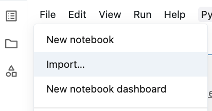

5. Select **URL**
6. Paste in this value

   ```link
   https://raw.githubusercontent.com/confluentinc/workshop-tableflow-databricks/refs/heads/main/labs/LAB6_databricks/river_hotel_marketing_agent.ipynb
   ```

7. Click **Import**

   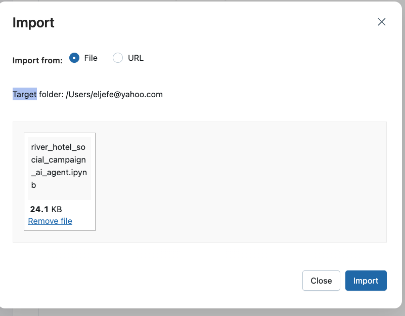

8. The Notebook should load in a new tab

9. Follow the instructions in the Notebook to create and deploy the marketing campaign agent.

#### Use Agent in AI Playground

Once you have completed creating and deploying your marketing agent, you can interact with it through the Databricks AI Playground:

1. Click on **Playground** in the left sidebar (under the *AI* section)
2. In the model dropdown, you should now see your `river-hotel-agent-playground` endpoint
3. Select it and start chatting with your agent!

4. Try these example prompts:
   - "Which hotel should we create a marketing campaign for in the Airport category?"
   - "Find the best hotel to promote in the Luxury category"
   - "Create a targeted campaign for Extended Stay hotels"

5. Your agent will automatically:
   - Identify an underperforming hotel with good reviews
   - Generate a positive marketing post based on customer reviews
   - Provide a list of target customers

**Congratulations!** Your AI marketing agent is now deployed and accessible through multiple interfaces:

- ✅ AI Playground for interactive testin
- ✅ Unity Catalog for governance and versioning

The agent is ready to help River Hotels create data-driven marketing campaigns in real-time!

## 🏁 Conclusion

🎉 **Phenomenal achievement!** You've successfully completed the entire real-time AI-powered marketing pipeline and demonstrated the full potential of modern streaming analytics!

### Your Achievements

✅ **Delta Lake Analytics Integration**: Successfully connected streaming Delta tables from Confluent Tableflow to Databricks for advanced analytics and real-time querying

✅ **AI-Powered Business Intelligence**: Used Databricks Genie to generate natural language insights about customer behavior, booking patterns, and hotel performance metrics

✅ **Intelligent Marketing Automation**: Deployed an AI agent that automatically identifies underperforming hotels with good customer satisfaction, creates personalized social media campaigns based on customer review analysis, and generates targeted customer lists

✅ **End-to-End Pipeline Validation**: Demonstrated a complete real-time journey from customer behavior to AI-generated marketing content

### Your AI-Powered Analytics Foundation

Your complete AI-powered marketing pipeline now provides:

**Real-Time Business Intelligence:**

- **Natural language queries** through Databricks Genie for instant insights
- **Advanced analytics** on streaming Delta Lake tables
- **Customer behavior analysis** with immediate actionable insights

**Intelligent Marketing Automation:**

- **AI-powered hotel selection** identifying promotion candidates automatically
- **Review-based content generation** creating targeted social media campaigns
- **Behavioral customer targeting** reaching high-engagement prospects

### ✅ Solution Requirements Fulfilled

- **💫 Data Freshness** - Reduced from week-old batch data to real-time insights (seconds to minutes)
- **⏱️ Operational Efficiency** - Eliminated manual data analysis through automation and AI-powered processing
- **🏆 Competitive Advantage** - River Hotels can now respond to market opportunities in real-time with AI-generated marketing campaigns
- **🔍 Prospect Intelligence** - Genie enables natural language queries to identify high-value prospects and conversion opportunities from real-time data
- **📈 Real-time Insights** - Natural language business intelligence provides immediate access to booking trends and customer satisfaction metrics
- **🏝️ Smart Hotel Selection** - AI agents automatically identify underperforming hotels with positive reviews for strategic promotion

**🏨 River Hotels is now equipped to compete effectively in the digital hospitality landscape with real-time, AI-powered marketing capabilities!**

## ➡️ What's Next

Your journey concludes by cleaning up the resources you created in **[LAB 7: Resource Cleanup](../LAB7_clean_up/LAB7.md)** where you will:

1. **Destroy Infrastructure**: Use Terraform to safely remove all cloud resources
2. **Validate Cleanup**: Confirm all services and storage have been properly terminated
3. **Cost Management**: Ensure no unexpected charges continue after the workshop

## 🔧 Troubleshooting

You can find potentially common issues and solutions or workarounds in the [Troubleshooting](../troubleshooting.md) guide.
