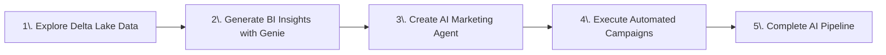
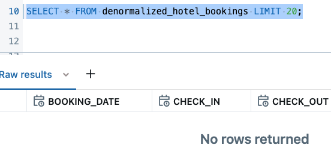
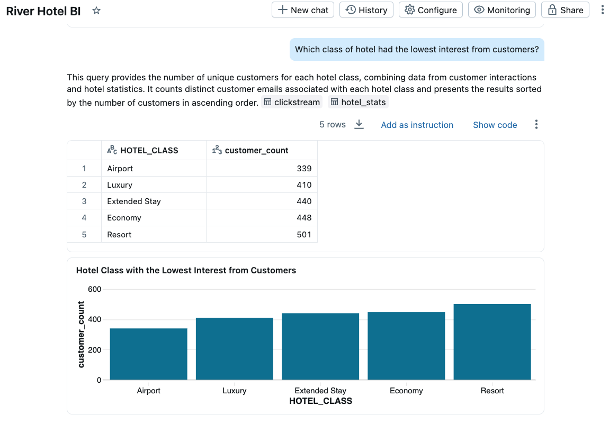
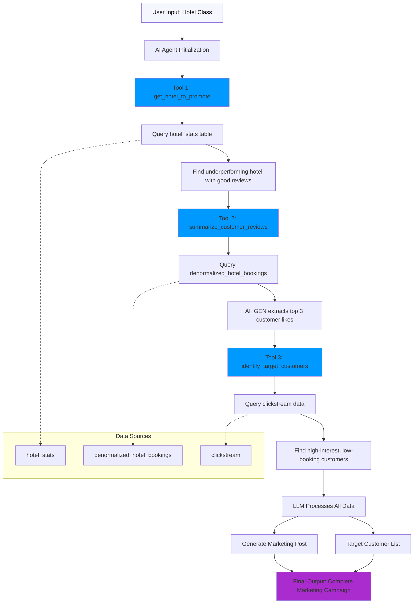
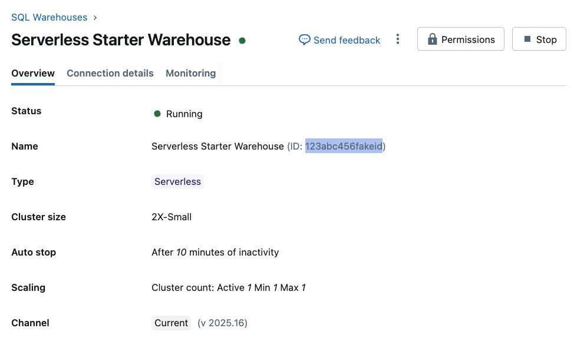
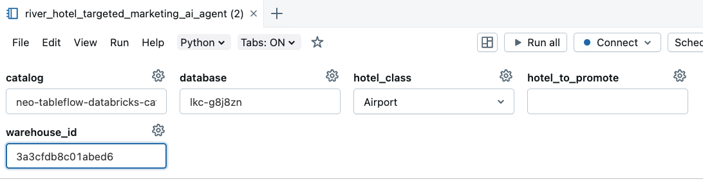
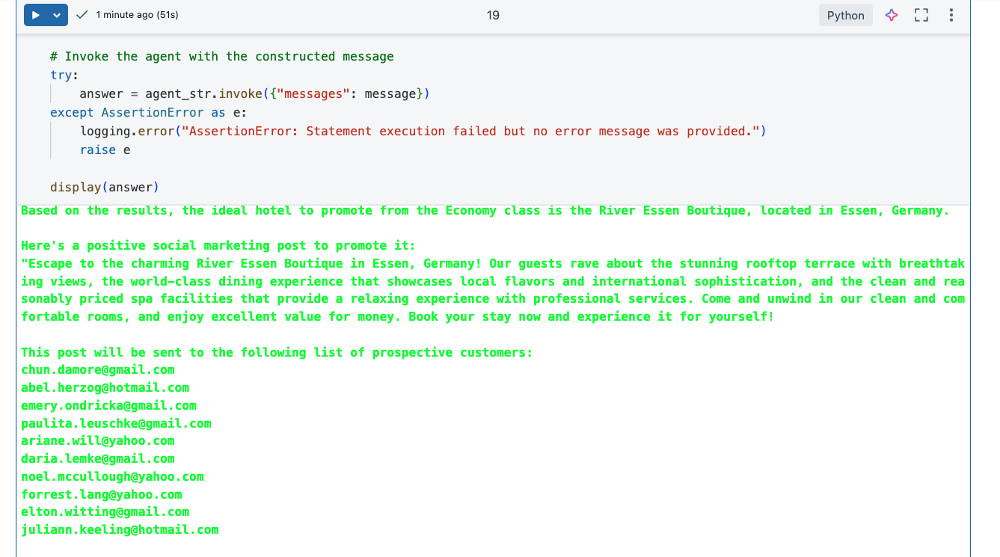

# LAB 6: Analytics and AI-Powered Marketing Automation

## 🗺️ Overview

Welcome to the analytics powerhouse of your real-time AI marketing pipeline! Transform your streaming data products into actionable business insights and AI-generated marketing campaigns using Databricks' advanced analytics and AI capabilities.

### What You'll Accomplish



By the end of this lab, you will have:

1. **Delta Lake Analytics Integration**: Connect your streaming Delta tables from Confluent Tableflow to Databricks for advanced analytics and querying
2. **AI-Powered Business Intelligence**: Use Databricks Genie to generate natural language insights about customer behavior, booking patterns, and hotel performance metrics
3. **Intelligent Marketing Automation**: Deploy an AI agent that automatically identifies underperforming hotels with good customer satisfaction, generates personalized social media campaigns based on customer reviews, and creates targeted customer lists for marketing outreach
4. **End-to-End Pipeline Validation**: Demonstrate a complete real-time journey from customer behavior to AI-generated marketing content

### Key Technologies You'll Use

- **Databricks SQL**: High-performance analytics engine for complex queries and data exploration
- **Databricks Genie**: Natural language interface for business intelligence and data exploration
- **LangChain AI Agents**: Intelligent automation framework that combines multiple data analysis functions to automate hotel promotion and customer targeting
- **Delta Lake**: Open-source storage layer providing reliable, high-performance analytics on your streaming data

### Prerequisites

- Completed [LAB 5: Stream Processing](../LAB5_stream_processing/LAB5.md) with enriched data products flowing to Delta Lake tables

## 👣 Steps

### Step 1: Explore Streaming Data in Unity Catalog

Now that both raw and enriched data is flowing from Confluent via Tableflow to Databricks Unity Catalog, you can do some deep analysis and capture insights from it.

First, follow these steps to verify that the data is flowing in as expected:

1. Navigate to your Databricks account in your web browser
2. Click on **Catalog** in the left menu
3. Verify that you see a catalog with *tableflow-databricks* in it, it should look something like this:

   

4. Click to expand your *tableflow-databricks* catalog
5. Click to expand your Confluent cluster schema - its name should match the ID of your Confluent Cloud kafka cluster
6. Verify that you see three tables: *clickstream*, *denormalized_hotel_bookings*, and *hotel_stats*

   

7. Select the *denormalized_hotel_bookings* table
8. Click the **Create** dropdown button in the top right of the screen
9. Select **Query** from the dropdown list
10. In the SQL editor, run this query to see if data is available

```sql
SELECT * FROM denormalized_hotel_bookings LIMIT 20;
```

> [!IMPORTANT]
> **Data Sync Delay**
>
> It may take 5-10 minutes for the above `SELECT` queries to return data in the results.
>
> 
>
> You can review the [notebook](../../assets/resources/river_hotel_targeted_marketing_ai_agent.ipynb) containing the Agentic workflow you will implement while you wait for the data to arrive.

### Step 2: Derive Data Product Insights with Genie

Databricks Genie makes it more accessible and easier to obtain data insights.  It provides a chat interface where you ask questions about your data in natural language, and it leverages generative AI to parse your questions and answer them through SQL queries it generates.

#### Set Up Genie Workspace

Follow these steps to set Genie up:

1. Click on the **Genie** link under the *SQL* section in the left sidebar
2. Click on the **+ New** button in the top right of the screen to create a new Genie space
3. Click on the **All** toggle
4. Navigate to your workshop *catalog* and *database* (e.g. `****-tableflow-databricks-****` and `lkc-****`)
5. Select all three of the `clickstream`, `denormalized_hotel_bookings`, and `hotel_stats` tables

   

6. Click on the **Create** button
7. Rename your space to something like *River Hotel BI*
8. Your space should look similar to this:

   

#### Generate Business Insights

Prompt Genie for insights about the data using natural language and following these steps:

> [!NOTE]
> **Example Screenshots**
>
> Throughout these next steps of prompting insights from Genie, the results depicted in the screenshots are **only examples** - the dataset
> you generate for this lab is different each time, and so these example screenshots will never fully match what you see.

Click the **Explain the data set** button to generate an output similar to this:


Now, find out how each country is doing with customer satisfaction with this prompt:
> Show me customer satisfaction metrics by country

You may see a table and chart similar to this:


You can dive into customer-centric analysis with this prompt:
> Show me customers who viewed hotels in the most cities

You should see a result similar to this:


Another prompt to try out is this:
> Which cities had the most interest from customers?

See which cities top your list, it may look similar to this:


You may continue with your own prompts or clicking on Genie-suggested ones to further learn from the data.

Executing this final prompt will provide the *class* of hotel that you will use to fulfill the targeted Marketing campaign:

> Which class of hotel had the lowest interest from customers?



Identify the *Hotel Class* with the lowest customer interest, you will use this in the next section to create an intelligent marketing agent.

### Step 4: Create Marketing Campaign Agent

In this section you will use a provided Jupyter Notebook to generate an AI agent that will identify hotels that need promotion and create targeted marketing campaigns for them!

The AI agent combines three intelligent functions:

1. **Hotel Selection**: Identifies the lowest-performing hotel in a given class that has above-average customer satisfaction (3+ reviews) - perfect candidates for promotion
2. **Content Generation**: Leverages AI to analyze customer reviews and extract the top 3 reasons guests enjoyed their stay, then creates positive social media posts highlighting these strengths
3. **Customer Targeting**: Uncovers customers who showed high interest (many page views/clicks) but made few bookings in that hotel class - prime targets for conversion

This diagram shows a detailed flow of the notebook:



#### Get SQL Warehouse ID

Your *SQL Warehouse ID* is needed for the Notebook. Follow these steps to retrieve it:

1. Click on **SQL Warehouses** in the left panel
2. Click on the warehouse where you want to execute this Notebook. If you are on a *trial* or *free edition* account, then click on the default *Serverless Starter Warehouse*
3. Copy the ID next to the *Name* field

    

#### Import and Configure Notebook

Follow these steps to import and use a pre-built Notebook to generate your AI Agent:

1. Click on the light-red **+ New** button in the top left of the screen
2. Select **Notebook**
3. Select **File**
4. Browse for [this file](../../assets/resources/river_hotel_targeted_marketing_ai_agent.ipynb)
5. Click **Import**

   

6. Click on the Notebook name in the success modal to navigate to it, or find it using the *Search* bar at the top of the page

#### Execute AI Agent

Now that you have successfully imported the Notebook, Fill out these widget fields at the top of the notebook with appropriate values for your Databricks account.

Here is an example:

- **catalog:** `****-tableflow-databricks-******`
  - You can find this in the *Catalog explorer*
- **database:** `lkc-******`
  - You can find this in the *Catalog explorer*
- **warehouse_id:** `77ad79eadc0d123`
  - You copied this in a previous step
- **hotel_class:** `Extended Stay`
  - You derived this in the previous step with *Genie*
- **hotel_to_promote**: ` `
  - Leave this one blank until later in the notebook

It should look like this:



Start with the first cell and execute each one in succession, reading through the comments and executing the code. The notebook will guide you through:

1. **Creating SQL Functions**: Three user-defined functions that serve as tools for the AI agent
2. **Building the AI Agent**: Using LangChain and Databricks LLM endpoints to create an intelligent agent
3. **Executing the Marketing Campaign**: Running the agent to automatically identify a hotel, create marketing content, and generate a prospective customer list

> [!IMPORTANT]
> **Follow Notebook Comments**
>
> Follow the instructions in the Notebook that appear as commented out text, as they help guide you through it.

At the end you should get an output that includes:

- The name and location of the selected hotel to promote
- A positive social media marketing post highlighting the hotel's best features
- A list of 10 customer email addresses who are prime targets for the campaign

Here is an example output:



The AI agent intelligently combines customer review analysis, booking performance data, and customer behavior patterns to create data-driven marketing campaigns!

## 🏁 Conclusion

🎉 **Phenomenal achievement!** You've successfully completed the entire real-time AI-powered marketing pipeline and demonstrated the full potential of modern streaming analytics!

### Your Achievements

✅ **Delta Lake Analytics Integration**: Successfully connected streaming Delta tables from Confluent Tableflow to Databricks for advanced analytics and real-time querying

✅ **AI-Powered Business Intelligence**: Used Databricks Genie to generate natural language insights about customer behavior, booking patterns, and hotel performance metrics

✅ **Intelligent Marketing Automation**: Deployed an AI agent that automatically identifies underperforming hotels with good customer satisfaction, creates personalized social media campaigns based on customer review analysis, and generates targeted customer lists

✅ **End-to-End Pipeline Validation**: Demonstrated a complete real-time journey from customer behavior to AI-generated marketing content

### Your AI-Powered Analytics Foundation

Your complete AI-powered marketing pipeline now provides:

**Real-Time Business Intelligence:**

- **Natural language queries** through Databricks Genie for instant insights
- **Advanced analytics** on streaming Delta Lake tables
- **Customer behavior analysis** with immediate actionable insights

**Intelligent Marketing Automation:**

- **AI-powered hotel selection** identifying promotion candidates automatically
- **Review-based content generation** creating targeted social media campaigns
- **Behavioral customer targeting** reaching high-engagement prospects

### ✅ Solution Requirements Fulfilled

- **💫 Data Freshness** - Reduced from week-old batch data to real-time insights (seconds to minutes)
- **⏱️ Operational Efficiency** - Eliminated manual data analysis through automation and AI-powered processing
- **🏆 Competitive Advantage** - River Hotels can now respond to market opportunities in real-time with AI-generated marketing campaigns
- **🔍 Prospect Intelligence** - Genie enables natural language queries to identify high-value prospects and conversion opportunities from real-time data
- **📈 Real-time Insights** - Natural language business intelligence provides immediate access to booking trends and customer satisfaction metrics
- **🏝️ Smart Hotel Selection** - AI agents automatically identify underperforming hotels with positive reviews for strategic promotion

**🏨 River Hotels is now equipped to compete effectively in the digital hospitality landscape with real-time, AI-powered marketing capabilities!**

## ➡️ What's Next

Your journey concludes by cleaning up the resources you created in **[LAB 7: Resource Cleanup](../LAB7_clean_up/LAB7.md)** where you will:

1. **Destroy Infrastructure**: Use Terraform to safely remove all cloud resources
2. **Validate Cleanup**: Confirm all services and storage have been properly terminated
3. **Cost Management**: Ensure no unexpected charges continue after the workshop

## 🔧 Troubleshooting

You can find potentially common issues and solutions or workarounds in the [Troubleshooting](../troubleshooting.md) guide.
