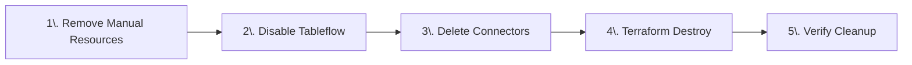
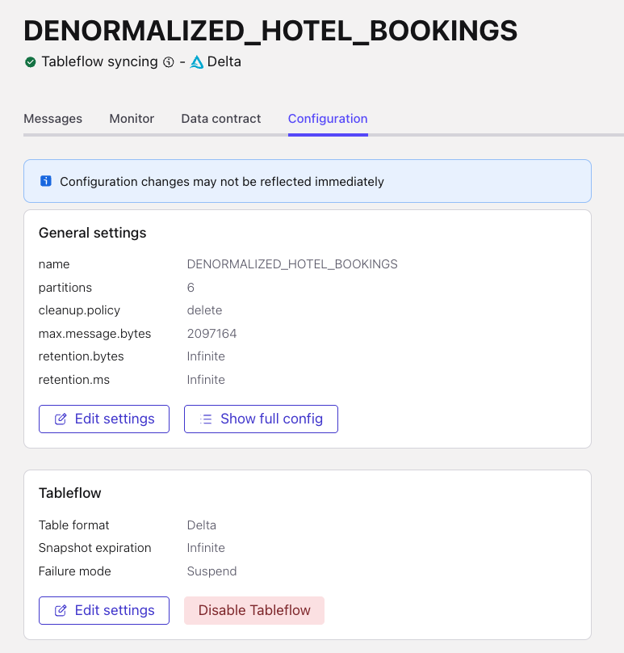

# LAB 7: Resource Cleanup

## 🗺️ Overview

Congratulations on completing your real-time AI-powered marketing pipeline! Now it's time to responsibly clean up your cloud resources to avoid unnecessary charges and maintain good cloud hygiene.

### What You'll Accomplish



By the end of this lab, you will have:

1. **Manual UI Cleanup**: Removed resources created through web interfaces (connectors, notebooks, integrations)
2. **Automated Terraform Cleanup**: Destroyed infrastructure provisioned through Infrastructure as Code
3. **Complete Resource Removal**: Verified all cloud resources are properly cleaned up to avoid ongoing charges

### Cleanup Strategy

The hybrid approach ensures complete resource removal while handling the different ways resources were created throughout the workshop. Manual steps address UI-created resources that Terraform doesn't track, while automated steps efficiently remove the bulk infrastructure.

> [!WARNING]
> **Complete Removal**
>
> Ensure you are done working with this workshop before you proceed, as everything you have set up will be removed once you complete these steps and there is no way to restore it.

## Part 1: Manual Cloud Resource Removal

These resources and connections were created through web interfaces and need to be manually removed first:

### Confluent

#### Remove PostgreSQL CDC Connector

1. Click on *Connectors* in the left sidebar
2. Find your PostgreSQL CDC Source connector
3. Click on the connector name
4. Click *Settings* → *Delete connector*
5. Type the connector name to confirm deletion

#### Disable Tableflow on Topics

<!-- TODO: Add more explicit directions here -->

1. Navigate to your topics
2. Click on the `DENORMALIZED_HOTEL_BOOKINGS` topic
3. Click on the **Configuration** tab
4. Click the **Disable Tableflow** link

   

5. Copy and paste the topic name into the field and click **Confirm**
6. Repeat steps 1-5 for the `clickstream` and `HOTEL_STATS` topics

#### Databricks

##### Remove Workspace Resources

1. Navigate to your Databricks workspace
2. Delete any notebooks you created or imported
3. In the *SQL Editor*, drop the external Delta tables:

```sql
DROP TABLE IF EXISTS hotel_stats;
DROP TABLE IF EXISTS clickstream;
DROP TABLE IF EXISTS denormalized_hotel_bookings;
```

## Part 2: Automatic Cloud Resource Removal

Now that manual resources are cleaned up, use Terraform to efficiently destroy the remaining cloud infrastructure:

1. Open your preferred command-line interface
2. Navigate to the workshop's *terraform* directory
3. Remove all remaining infrastructure using the Docker container:

   ```sh
   docker-compose run --rm terraform -c "terraform destroy -auto-approve"
   ```

4. Verify cleanup completion by checking that resources are removed from:
   - AWS Console (EC2 instances, S3 buckets, IAM roles)
   - Confluent Cloud (environments, clusters)
   - Databricks (workspaces, storage credentials)

## 🏁 Conclusion

🎉 **Excellent work!** You've successfully completed this entire workshop and have responsibly cleaned up all cloud resources - go ahead and give yourself a pat on the back, you deserve it!

### What You've Achieved

In this lab, you have:

✅ **Manual Resource Cleanup**: Removed PostgreSQL CDC connectors, disabled Tableflow on all topics, and cleaned up notebooks created through web interfaces

✅ **Automated Infrastructure Cleanup**: Used Terraform to efficiently destroy all cloud infrastructure across AWS, Confluent Cloud, and Databricks

✅ **Complete Resource Verification**: Ensured no ongoing charges by verifying all cloud resources are properly terminated

## ➡️ What's Next

Now that you've completed all of the labs that comprise this workshop, review [this recap](../recap.md) of what you've accomplished.

## 🔧 Troubleshooting

You can find potentially common issues and solutions or workarounds in the [Troubleshooting](../troubleshooting.md) guide.
