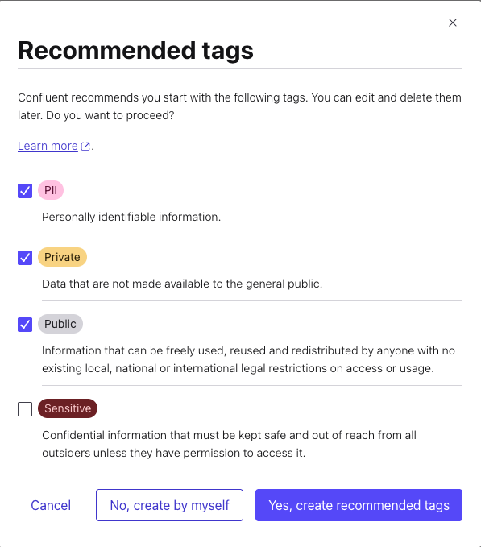
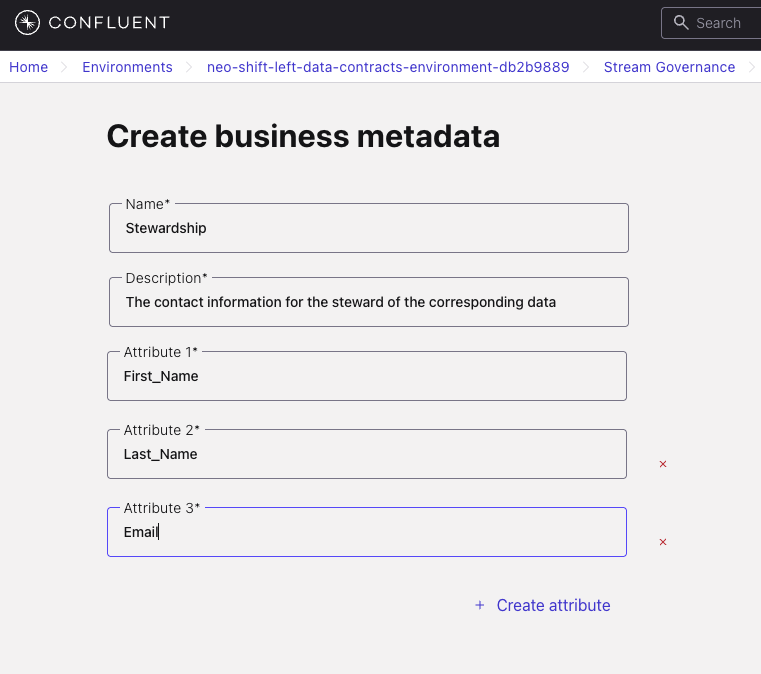
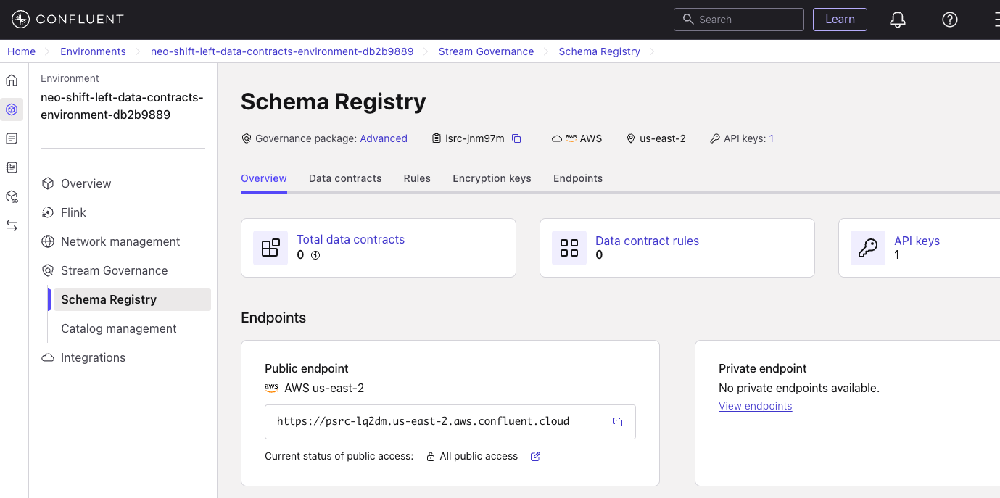
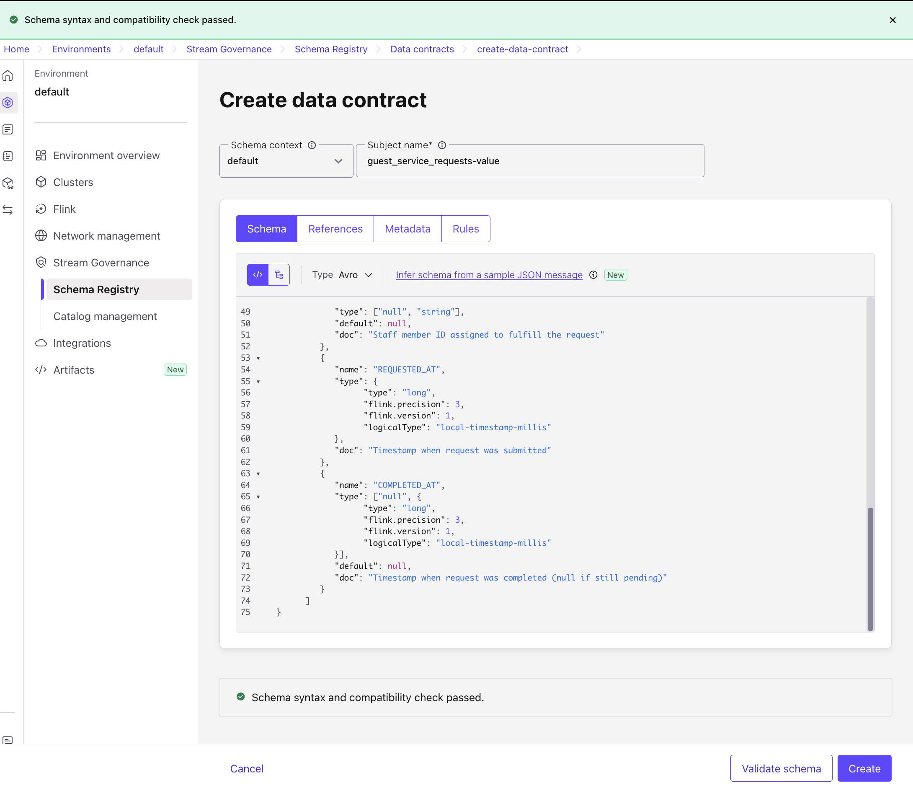
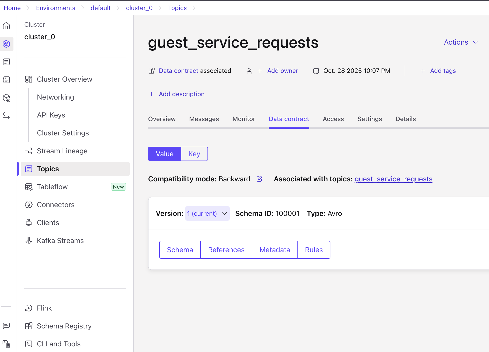

# Optional Lab: Data Governance

## 🗺️ Overview

In this lab, you'll explore how **data governance works in practice** using Confluent's catalog management and data contract framework. We'll walk through creating a schema, rules, and metadata together to see how organizations prevent data quality issues before they affect downstream systems.

### What You'll Explore

You'll work hands-on with Confluent's governance framework to understand how organizations maintain data quality at scale:

- **Schema Registry & Data Contracts**: Centralized schema management with version control and validation rules
- **Business Metadata**: Connecting technical schemas to real people and teams for accountability
- **Governance Tags**: Classification systems that enable automated policies and access controls

### Prerequisites

- Completed [LAB 2](../LAB2_cloud_deployment/LAB2.md) with all infrastructure deployed

## 👣 Steps

### Step 1: Exploring the Data Governance Framework

Let's start by discovering the foundational governance tools that organizations use to manage their data. We'll explore how tags, metadata templates, and catalog management work together.

#### Navigate to Catalog Management

1. Login to your Confluent Cloud account
2. Find and click on your workshop environment
3. Click on **Catalog Management** in the left menu

   


#### Understanding Governance Tags

Let's explore how tags work. Tags help classify data streams so that policies can be applied consistently.

Think of them like labels you might use to organize files on your computer, but for data streams.

1. Click on the **Tags** tab
2. Click on the **Create tags** button
3. Check the boxes for these recommended tags:
   - *PII* - Personally Identifiable Information
   - *Private* - Internal business data
   - *Public* - Data safe for external sharing

   

4. Click **Yes, create recommended tags**

5. **Create Custom Business Tag**:
   1. Click the **+ Add Tag** button
   2. Enter `KPI` in the *Tag Name* field
   3. Select any color you prefer
   4. Copy this description into the *Description* field:

   ```text
   A designation for fields that River Hotel leadership have identified as drivers for Key Performance Indicator metrics
   ```

   

   5. Click **Create**

6. Review your complete tag list:

   

**What You're Seeing:** These tags can now be applied to any data stream. Organizations use this tagging system to automate governance policies - for example, automatically encrypting anything tagged as "PII" or restricting access to "Private" data.

#### Learning About Business Metadata

Now let's see how business metadata works. This is how we connect technical schemas (which describe the structure of data) to business context like who owns it and who to contact when there's an issue.

1. Click on the **Business Metadata** tab
2. Click **Create business metadata**
3. Configure the stewardship template:
   - *Name:* `Stewardship`
   - *Description:* `Contact information for the steward of the corresponding data`
   - *Attribute 1:* `First_Name`
   - Click **Create attribute**
   - *Attribute 2:* `Last_Name`
   - Click **Create attribute**
   - *Attribute 3:* `Email`

   

4. Click **Create**

**What You've Created:** This reusable template can be attached to any schema. In real organizations, this ensures every data stream has someone responsible for it - no more "orphaned" data assets!

### Step 2: Creating Your First Data Contract

Let's explore how data contracts work by creating one. A data contract is like an agreement between the team producing data and the teams consuming it - it specifies exactly what the data should look like and what happens if it doesn't match.

#### Access Schema Registry

1. Click **Schema Registry** in the left menu
2. Notice there are currently **no Data Contracts or Rules** - you're starting with a clean slate

   

**What You're Seeing:** This is what an ungoverned data environment looks like - no schemas registered yet, no rules enforced. Let's change that!

#### Building the Data Contract

We'll create a data contract for guest service requests. As we build it, notice how the schema defines both the structure (what fields exist) and the rules (what values are valid).

1. Click the **Data contracts** tab
2. Click **Add data contract**
3. Enter the subject name: `guest_service_requests-value`

> [!IMPORTANT]
> **Subject Naming Strategy**
>
> Confluent uses *[TopicNameStrategy](https://developer.confluent.io/courses/schema-registry/schema-subjects/#topicnamestrategy)* by default, which means:
>
> - Topic: `guest_service_requests` → Subject: `guest_service_requests-value`
> - This naming convention links schemas to topics automatically

4. **Define the Schema Contract**:

   Copy and paste this schema into the editor:

```json
{
      "type": "record",
      "namespace": "com.riverhotel.poc",
      "name": "guestServiceRequest",
      "doc": "In-stay guest service requests across River Hotel properties",
      "fields": [
         {
            "name": "REQUEST_ID",
            "type": "string",
            "doc": "Unique identifier for the service request"
         },
         {
            "name": "GUEST_EMAIL",
            "type": "string",
            "doc": "Guest email address (PII - sensitive)"
         },
         {
            "name": "HOTEL_ID",
            "type": "string",
            "doc": "Identifier for the hotel property"
         },
         {
            "name": "ROOM_NUMBER",
            "type": "string",
            "doc": "Guest room number"
         },
         {
            "name": "REQUEST_TYPE",
            "type": "string",
            "doc": "Category of service request: housekeeping, maintenance, amenities, concierge, room_service"
         },
         {
            "name": "REQUEST_DETAILS",
            "type": "string",
            "doc": "Detailed description of the guest request"
         },
         {
            "name": "PRIORITY",
            "type": "string",
            "doc": "Request priority level: low, medium, high, urgent"
         },
         {
            "name": "STATUS",
            "type": "string",
            "doc": "Current status: pending, assigned, in_progress, completed, cancelled"
         },
         {
            "name": "ASSIGNED_TO",
            "type": ["null", "string"],
            "default": null,
            "doc": "Staff member ID assigned to fulfill the request"
         },
         {
            "name": "REQUESTED_AT",
            "type": {
                  "type": "long",
                  "flink.precision": 3,
                  "flink.version": 1,
                  "logicalType": "local-timestamp-millis"
            },
            "doc": "Timestamp when request was submitted"
         },
         {
            "name": "COMPLETED_AT",
            "type": ["null", {
                  "type": "long",
                  "flink.precision": 3,
                  "flink.version": 1,
                  "logicalType": "local-timestamp-millis"
            }],
            "default": null,
            "doc": "Timestamp when request was completed (null if still pending)"
         }
      ]
}
```

5. **Validate the Schema**:
   1. Click **Validate schema**
   2. Verify you see green checkmarks for syntax and compatibility

   

6. Click on the **Rules** tab
7. Click on the **Add rules** button
8. Now let's add a data quality rule. This is where the "contract" part really comes in - we're defining what happens when data doesn't meet our expectations. Fill in these fields:

   1. **Rule Name:** `validateRequestType`
   2. **Description:** Messages with invalid REQUEST_TYPE get sent to the Dead Letter Queue (DLQ)
   3. **Expression:** `message.REQUEST_TYPE.matches('^(housekeeping|maintenance|amenities|concierge|room_service)$')`
   4. **On failure:** `DLQ`
   5. **Value:** `invalid-messages`

   Your *Add Rule* form should look similar to this:

   

9.  Click the **Add** button
10. Click **Create** to establish the contract

**What This Rule Does:** Any message with a `REQUEST_TYPE` that isn't one of the five valid values will be automatically routed to the `invalid-messages` topic instead of being rejected. This is called a Dead Letter Queue (DLQ) pattern - it lets you investigate what went wrong without losing the data.

#### Adding Business Context

Now let's connect this technical schema to real people in your organization. This is how teams know who to contact when they have questions about the data.

1. Click **+ Add business metadata** in the right panel
2. Select `Stewardship` from the dropdown
3. Fill in ownership information:
   - *First_Name:* Your first name
   - *Last_Name:* Your last name
   - *Email:* Your email address

   

4. Click **Continue**
5. Take a moment to review your completed schema:

   

**What You've Built:** Notice how the schema now includes structure (field definitions), rules (validation logic), and context (who owns this). In real-world scenarios, when someone encounters issues with this data, they know exactly who to contact - no more hunting through documentation or Slack channels!

### Step 3: Connecting a Topic to Your Data Contract

Now let's see how topics and data contracts work together. When you create a topic with the same name as your contract's subject, they automatically link up. This means every message written to this topic will be validated against your schema and rules.

#### Create the Topic

1. Navigate to your workshop cluster
2. Click **Topics** in the left menu
3. Click **Create topic**
4. Configure the topic:
   - *Topic name:* `guest_service_requests`
   - Leave other settings as defaults

5. Click **Create with defaults**

#### Observing the Contract Link

Let's verify that the contract is connected to your topic:

1. Click the **Data contracts** tab
2. You should see **Version 1** of your schema listed here

   

**What This Means:** Your topic is now governed! From this point forward, any data written to this topic will be checked against your schema and validation rules. If the `REQUEST_TYPE` doesn't match one of the allowed values, the message will be routed to your DLQ instead of being accepted.

### Step 4: Creating the Dead Letter Queue (DLQ)

Remember the `invalid-messages` topic we specified in our validation rule? Let's create that now so there's somewhere for invalid data to go. This way, instead of silently dropping bad data, we can examine it later to understand what went wrong.

## 🏁 Reflection

You've just walked through the core components of a data governance system! Let's reflect on what these concepts mean in practice.

### Key Concepts You Explored

**Schema Governance**: You saw how centralized schema management works. Instead of every team defining their own data structures independently, schemas are registered in one place where everyone can reference them. This prevents the "I changed the field name and didn't realize it would break 10 downstream systems" problem.

**Data Ownership**: By adding business metadata, you connected technical artifacts (schemas) to real people. In large organizations, this is crucial - without clear ownership, data quality issues become "someone else's problem" and never get fixed.

**Quality Enforcement**: The validation rule you created demonstrates proactive quality control. Rather than discovering bad data after it's already processed incorrectly downstream, the system catches it immediately. The DLQ pattern means nothing is lost - you can investigate and fix the source.

**Business Context**: Tags and metadata aren't just documentation - they're machine-readable governance policies. Once you tag a field as "PII," automated systems can apply encryption, access controls, and compliance auditing.

### Thinking Bigger

In production environments, these concepts scale to hundreds or thousands of data streams. Without the governance framework you just explored, managing that complexity becomes impossible. With it, teams can work independently while still maintaining consistency and quality.

## What's Next

This is an optional lab, so you can return to wherever you came from in the main workshop flow, most likely one of these:

- [LAB 3: Tableflow and Oracle Connector](../LAB3_tableflow_and_connector/LAB3.md)
- [LAB 5: Stream Processing](../LAB5_stream_processing/LAB5.md)
- [LAB 6: Data Analysis in Databricks](../LAB6_databricks/LAB6.md)
