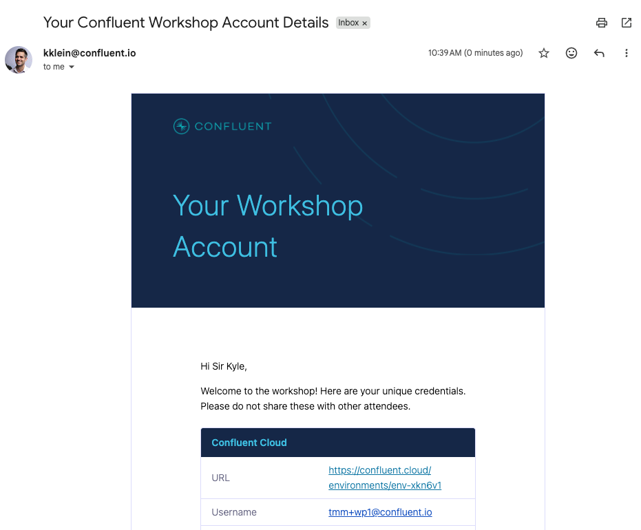
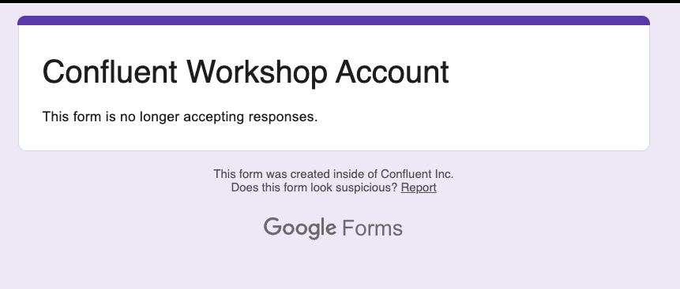

# LAB 1: Claim Your Account

## Overview

Welcome to the workshop! Your instructor has pre-provisioned cloud infrastructure for you across Confluent Cloud and Databricks. In this lab you will claim your dedicated environment and verify access.

### What You'll Accomplish

By the end of this lab, you will have:

1. **Claimed your workshop account** via the instructor-provided Google Form
2. **Received your credentials** via email
3. **Verified access** to Confluent Cloud and Databricks

### Prerequisites

- A web browser
- An email address

## Steps

### Step 1: Claim Your Account

Your instructor will share a **Google Form** link. Fill out the form to claim a workshop account:

1. Open the Google Form link provided by your instructor
2. Enter your **name** and **email address**
3. Submit the form

You should receive an email within a few minutes containing your workshop credentials.

> [!NOTE]
> **No Email**
>
> If you see this message then all the accounts have been claimed. You may follow along as a spectator, or you can reach out to your presenter about registering for our next workshop.
> 
>
> If you did not see the "form is closed" message above, but you do not receive the email, check your spam/junk folder. If it still has not arrived after 5 minutes, let your instructor know.

### Step 2: Review Your Credentials

Your credentials email will contain the following information:

| Credential | Description |
|---|---|
| **Confluent Cloud URL** | Link to your Confluent Cloud environment |
| **Confluent Cloud Email** | Your login email for Confluent Cloud |
| **Confluent Cloud Password** | Your login password |
| **Databricks Host** | URL to your Databricks workspace |
| **Databricks Email** | Your login email for Databricks |
| **Databricks Password** | Your login password |
| **SP Client ID** | Service principal application (client) ID |
| **SP Client Secret** | Service principal OAuth secret |
| **Unity Catalog Name** | Your Databricks Unity Catalog name |
| **S3 Bucket Name** | Your dedicated S3 bucket for Tableflow |
| **Schema Name** | Your Databricks Unity Catalog schema (Kafka cluster ID) |
| **SQL Warehouse ID** | Your Databricks SQL Warehouse ID |

Keep this email open — you will reference these credentials throughout the workshop.

### Step 3: Verify Confluent Cloud Access

1. Open the **Confluent Cloud URL** from your credentials email
2. Log in with the provided **email** and **password**
3. Verify that you can see your workshop **environment** and **Kafka cluster** in the dashboard

You should see an environment with a Kafka cluster already created, along with topics that are receiving data.

### Step 4: Verify Databricks Access

1. Open the **Databricks Host** URL from your credentials email
2. Log in with the provided **email** and **password**
3. Verify that you land on the Databricks workspace home page

> **Tip**: If you are prompted to select a compute resource, you can dismiss this for now — you will use it in a later lab.

## Conclusion

You have successfully claimed your workshop account and verified access to both Confluent Cloud and Databricks. Your infrastructure is already provisioned and data is flowing.

## What's Next

Continue to **[LAB 2: Explore Your Environment](../LAB2_explore_environment/LAB2.md)**.

## Troubleshooting

See the [Troubleshooting](../../shared/troubleshooting.md) guide for common issues and solutions.
