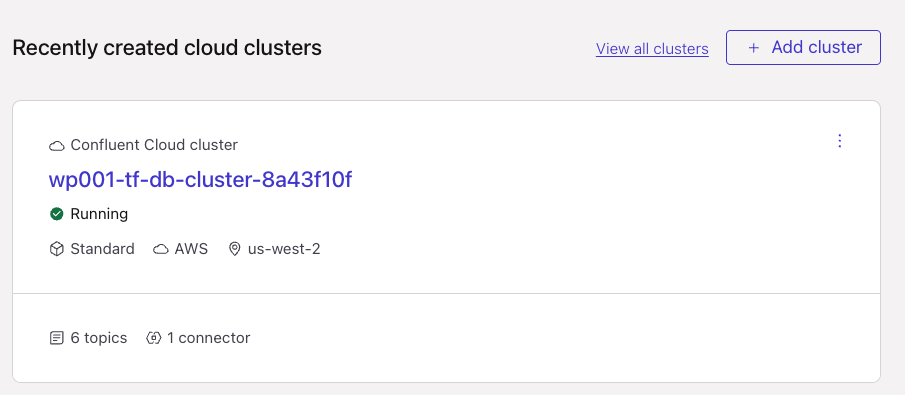
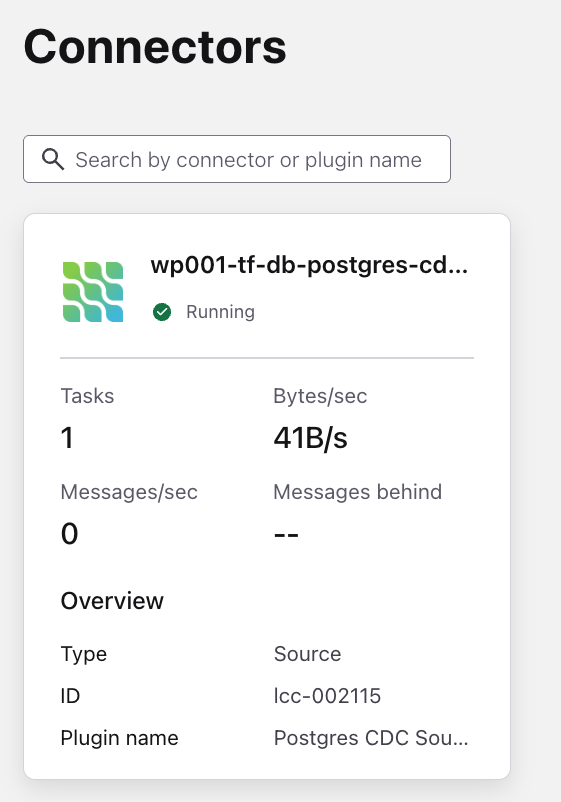
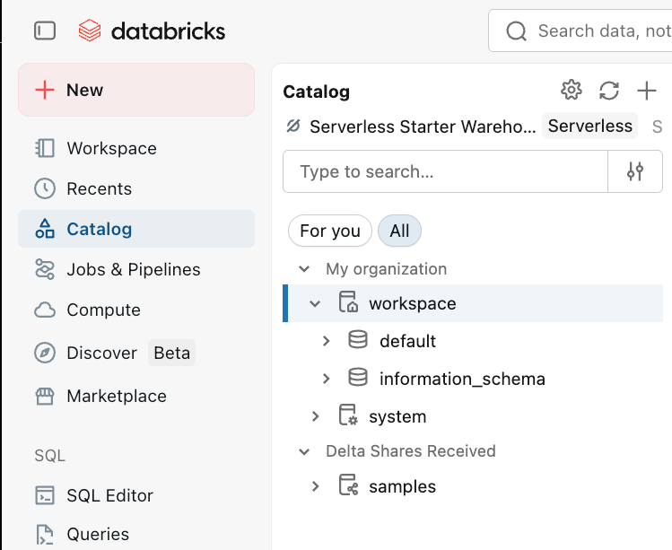

# LAB 2: Explore Your Environment

## Overview

Your instructor has already provisioned the full infrastructure stack for this workshop — including AWS resources, Confluent Cloud environments, Kafka clusters, CDC connectors, and Databricks workspaces. In this lab you will tour your pre-provisioned environment and understand what has been set up for you.

### What You'll Accomplish

By the end of this lab, you will have:

1. **Explored Confluent Cloud**: Reviewed your Kafka cluster, topics, and active CDC connectors
2. **Explored Databricks**: Located your workspace and Unity Catalog

### Prerequisites

- Completed **[LAB 1: Claim Your Account](../LAB1_claim_account/LAB1.md)**

## Steps

### Step 1: Explore Confluent Cloud

#### View Your Kafka Cluster

1. Navigate to [your Confluent Cloud cluster](https://confluent.cloud/go/cluster)
2. Select your workshop environment and cluster from the dropdowns
3. Take note of the cluster overview — you should see it is a **Standard** cluster in **AWS**

#### View Topics and Data

1. Click on **Topics** in the left menu
2. You should see several topics receiving data:

   | Topic | Source | Description |
   |---|---|---|
   | `bookings` | Java Data Generator | Booking transactions produced directly to Kafka |
   | `clickstream` | Java Data Generator | Website clickstream events produced directly to Kafka |
   | `riverhotel.cdc.customer` | PostgreSQL CDC | Customer profiles from PostgreSQL Change Data Capture |
   | `riverhotel.cdc.hotel` | PostgreSQL CDC | Hotel property data from PostgreSQL Change Data Capture |
   | `reviews` | Java Data Generator | Customer reviews produced directly to Kafka |

3. Click on the `clickstream` topic and select the **Messages** tab
4. Verify that messages are flowing — you should see new records appearing around every 10-20 seconds.

> [!NOTE]
> **Topic Naming**
>
> Topics with the `riverhotel.cdc.` prefix (`customer`, `hotel`) are populated via PostgreSQL CDC connectors configured with `after.state.only`, producing flat Avro records. The remaining topics (`bookings`, `clickstream`, `reviews`) are written directly to Kafka by the Java data generator.

#### View CDC Connectors

1. Click on **Connectors** in the left menu
2. You should see active PostgreSQL CDC connectors that are streaming data from the shared PostgreSQL database into your Kafka topics
3. Verify that the connectors show a **Running** status

#### View the Flink Compute Pool

1. Navigate to [your Flink compute pool](https://confluent.cloud/go/flink) in Confluent Cloud
2. Select your workshop environment
3. Click **Continue**
4. You should see a Flink compute pool already created for your environment

> [!TIP]
> **Compute Pool**
>
> You will use this compute pool in a later lab to run stream processing queries!

### Step 2: Explore Databricks

#### View Your Workspace

1. Open the **Databricks Host** URL from your credentials email
2. You should land on the workspace home page
3. Click on **Catalog** in the left menu to explore the Unity Catalog
4. Click on the **workspace** catalog under the *My organization* section

## Conclusion

You have toured your pre-provisioned workshop environment. You now know where to find your Kafka topics (with CDC data flowing), your connectors, your Flink compute pool, and your Databricks workspace.

## What's Next

Continue to **[LAB 3: Stream Processing](../LAB3_stream_processing/LAB3.md)**.

> **Optional**: Your environment includes pre-deployed data quality rules with a CEL validation on the clickstream topic. Explore this in the optional **[Data Governance Lab](../LAB_data_governance/LAB_data_governance.md)**.

## Troubleshooting

See the [Troubleshooting](../../shared/troubleshooting.md) guide for common issues and solutions.
