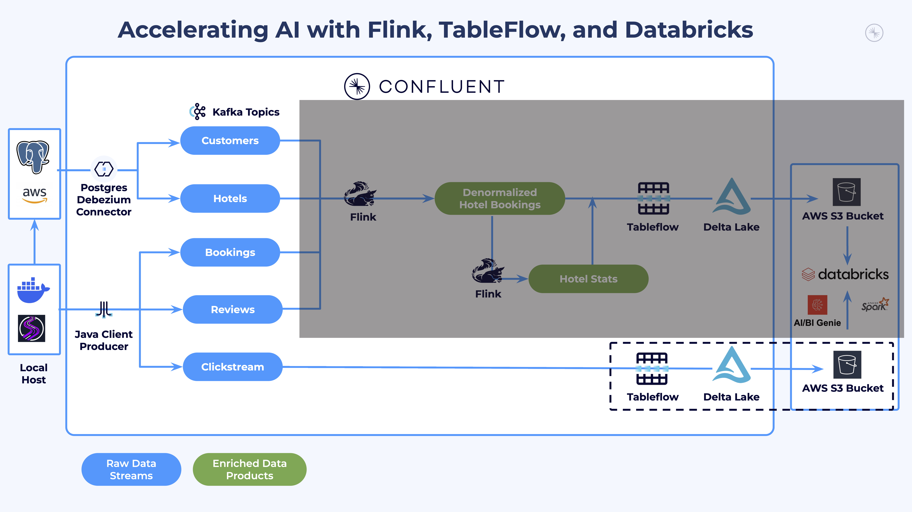
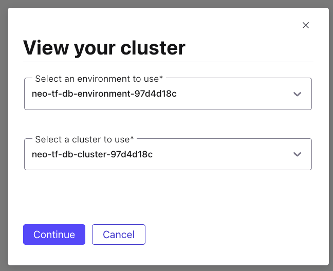
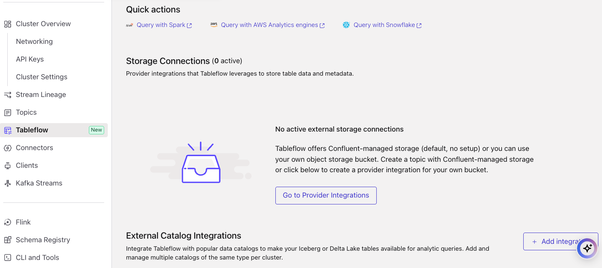
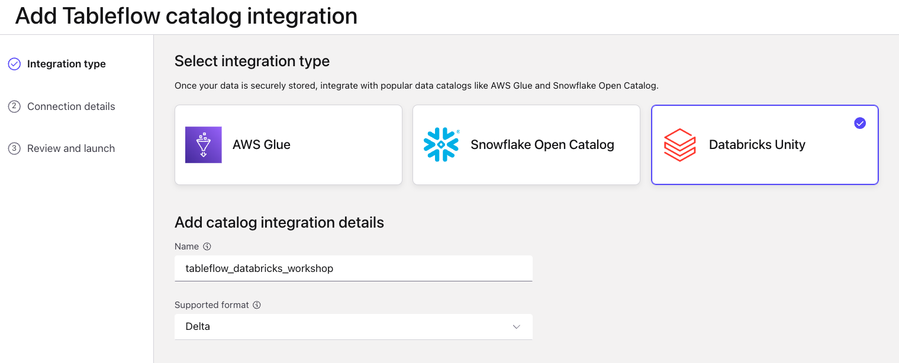
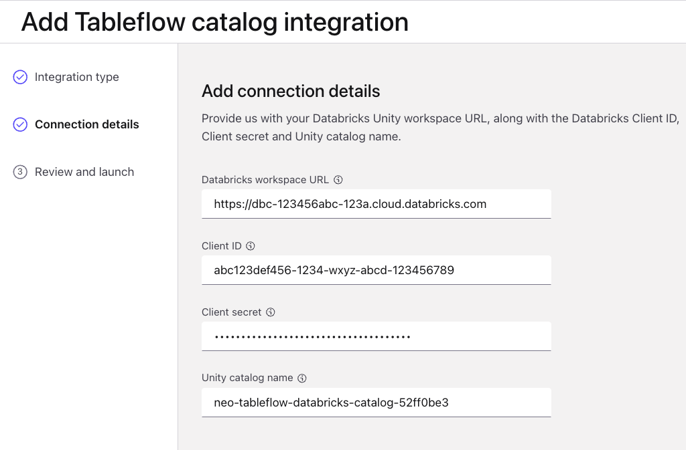
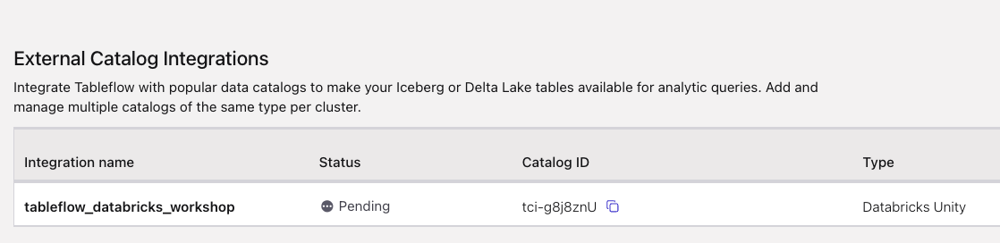

# LAB 3: Unity Catalog Integration

## Overview

Now that you have verified data flowing into your Kafka topics, it is time to integrate Confluent Cloud with Databricks Unity Catalog. This integration enables Tableflow to materialize Kafka topics as Delta Lake tables in later labs.

### What You'll Accomplish

By the end of this lab, you will have:

1. **Unity Catalog Integration**: Connected Confluent Cloud with Databricks Unity Catalog through Tableflow

### Prerequisites

- Completed **[LAB 2: Explore Your Environment](../LAB2_explore_environment/LAB2.md)** with data flowing to Kafka topics

## Steps

### Step 1: Set Up Tableflow Integration with Unity Catalog

#### Establish Unity Catalog Integration

Follow these steps to connect Tableflow to your Databricks Unity Catalog:

1. Navigate to your cluster in Confluent Cloud by clicking [this link](https://confluent.cloud/go/cluster)
2. Select your workshop environment and cluster in the dropdowns

   

3. Click on **Tableflow** in the left menu
4. Click on the **+ Add integration** button next to the *External Catalog Integrations* section

   

5. Select **Databricks Unity**
6. Enter a relevant name in the *Name* field, something like `tableflow-databricks-workshop`

   

7. Click **Continue**
8. Enter the connection details from your credentials email:

   | Field | Value Source |
   |---|---|
   | **Databricks workspace URL** | The Databricks `Workspace URL` from your credentials email |
   | **Client ID** | The Databricks `SP Client ID` from your credentials email |
   | **Client secret** | The Databricks `SP Client Secret` from your credentials email |
   | **Unity catalog name** | The Databricks `Unity Catalog Name` from your credentials email |

   

9. Click **Continue**
10. Launch your Unity Catalog integration

   

> **Important**: The status of your Tableflow integration with Unity Catalog will remain in *Pending* until you enable Tableflow for Delta Lake on your first topic, which you will do in LAB 5.

## Conclusion

You have successfully configured the integration between Confluent Cloud Tableflow and Databricks Unity Catalog. You will enable Tableflow on specific topics after building your stream processing pipelines.

## What's Next

Continue to **[LAB 4: Stream Processing](../LAB4_stream_processing/LAB4.md)**.

## Troubleshooting

See the [Troubleshooting](../../shared/troubleshooting.md) guide for common issues and solutions.
