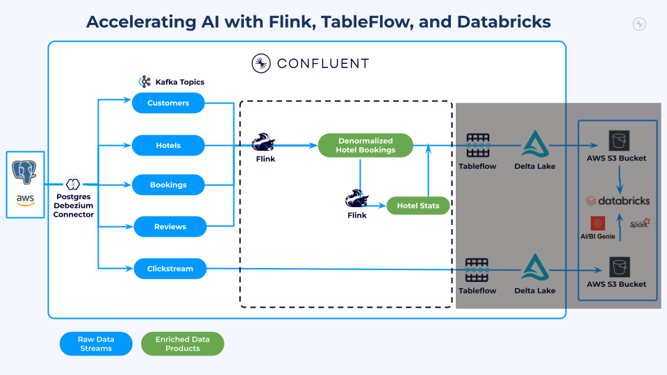
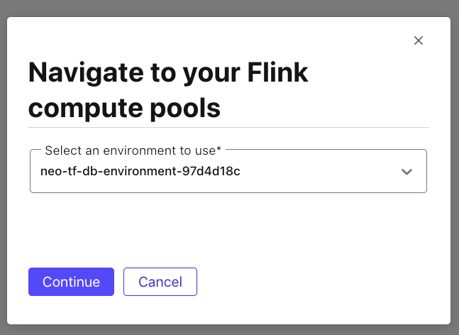
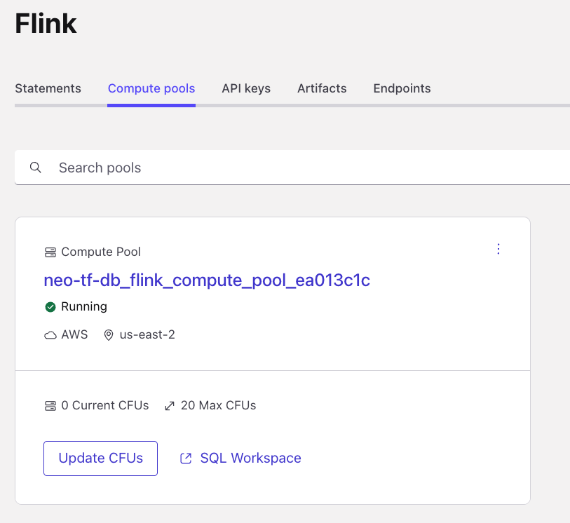
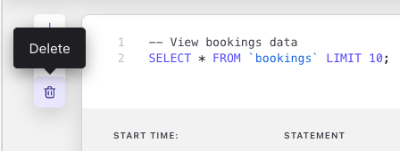
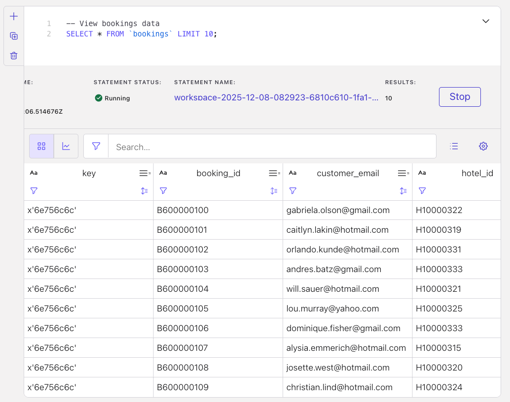
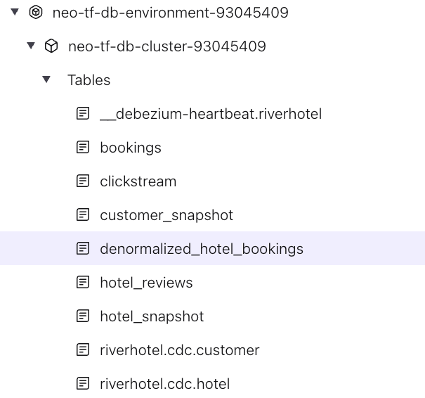
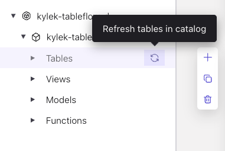
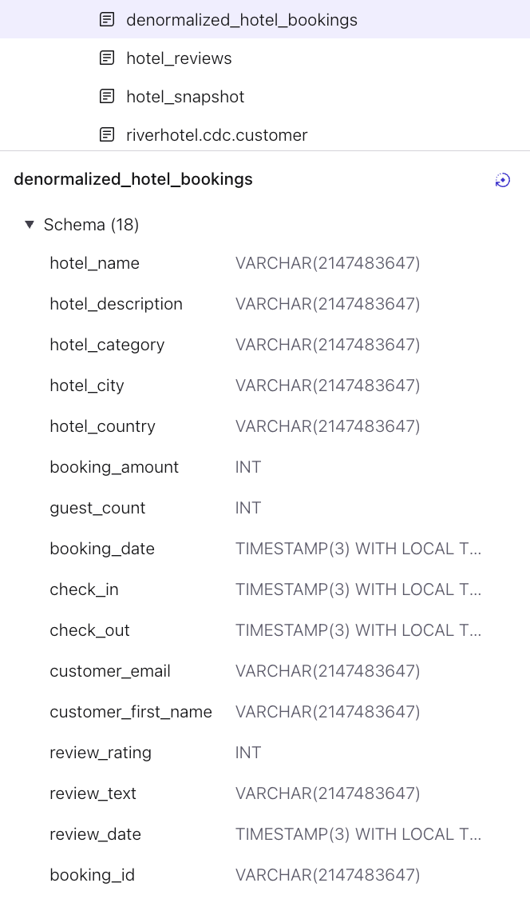

# LAB 3: Stream Processing

## Overview

This lab transforms your raw CDC data streams into enriched data products using Confluent Cloud's Flink SQL. You will build real-time processing pipelines that create denormalized datasets and analytical aggregations.

### What You'll Accomplish

By the end of this lab you will have:

1. **Explored Streaming CDC Data**: Queried real-time CDC topics with Flink SQL
2. **Created Enriched Data Products**: Built denormalized bookings combining customer, hotel, and review data using temporal joins
3. **Built Streaming Aggregations**: Created real-time hotel performance metrics



### Prerequisites

- Completed **[LAB 2: Explore Your Environment](../LAB2_explore_environment/LAB2.md)** with data flowing to Kafka topics

## Step 1: Explore Streaming Data with Flink SQL

### Navigate to Flink Compute Pool

1. Navigate to your [workshop Flink compute pool](https://confluent.cloud/go/flink)
2. Select your workshop environment
3. Click **Continue**

   

4. Click on the **Open SQL workspace** button in your workshop Flink compute pool

   
5. Ensure your workspace environment and cluster are both selected in the `Catalog` and `Database` dropdowns at the top of your compute pool screen

6. Drill down in the left navigation to see the tables in your environment and cluster

### Explore CDC Data

All of your data comes through PostgreSQL CDC connectors and uses the `riverhotel.cdc.` topic prefix. The connector is configured with `after.state.only = true`, which produces flat Avro records that you can query directly in Flink.

> **Tip**: Click the *+* button in the narrow side panel at the top left of the cell to create new cells. Create ~5 new cells as you will need them throughout this lab. Delete the current cell by clicking the trash icon below the *+*.
>
> 

Start by reviewing data from the CDC topics:

```sql
-- View customer data from CDC
SELECT * FROM `riverhotel.cdc.customer` LIMIT 10;
```

Click the *Run* button and review the results. You should see customer records with fields like `email`, `first_name`, `last_name`, `birth_date`, `created_at`, and `updated_at`.



Now explore booking data:

```sql
-- View bookings data from CDC
SELECT * FROM `riverhotel.cdc.bookings` LIMIT 10;
```

Some observations about this data:

- The `hotel_id` field references hotels but does not include hotel details like name or location
- There is no review information joined to the booking

### Run Streaming Data Queries

Execute this query to see the live count of booking data:

```sql
-- See streaming count of bookings data
SELECT COUNT(*) AS `TOTAL_BOOKINGS` FROM `riverhotel.cdc.bookings`;
```

Watch the count increase gradually as new booking data is produced.

## Step 2: Understand the Pre-configured CDC Topics

Your workshop infrastructure has already configured the CDC topics for use with Flink temporal joins and Tableflow. The connector uses `after.state.only = true` to produce flat Avro records (no Debezium envelope).

Primary keys are automatically derived from the Kafka message key (which maps to the source table's primary key).

Verify the customer table configuration:

```sql
SHOW CREATE TABLE `riverhotel.cdc.customer`;
```

You should see a primary key on `email` (from the Kafka key), a watermark on `updated_at`, and `changelog.mode = 'upsert'` in the `WITH` clause. This enables the CDC topic to serve directly as a dimension table for [temporal joins](https://docs.confluent.io/cloud/current/flink/concepts/joins.html#temporal-joins) without creating a separate snapshot table.

## Step 3: Enrich and Denormalize Hotel Bookings

Your CDC topics are already configured with primary keys, watermarks, and changelog modes. You will now process them into denormalized datasets useful for analytics.

### Create Denormalized Table

This query creates a denormalized table combining booking data with customer information, hotel details, and hotel reviews using [temporal joins](https://docs.confluent.io/cloud/current/flink/concepts/joins.html#temporal-joins). Because the CDC topics are pre-configured with primary keys and watermarks, you can join them directly without creating separate snapshot tables:

```sql
SET 'client.statement-name' = 'denormalized-hotel-bookings';

CREATE TABLE denormalized_hotel_bookings (
  PRIMARY KEY (`booking_id`) NOT ENFORCED,
  WATERMARK FOR `booking_date` AS `booking_date` - INTERVAL '30' SECOND
) WITH (
  'changelog.mode' = 'upsert',
  'kafka.cleanup-policy' = 'compact'
) AS
SELECT
  b.`booking_id`,
  h.`hotel_id`,
  h.`name` AS `hotel_name`,
  h.`description` AS `hotel_description`,
  h.`category` AS `hotel_category`,
  h.`city` AS `hotel_city`,
  h.`country` AS `hotel_country`,
  b.`price` AS `booking_amount`,
  b.`occupants` AS `guest_count`,
  b.`created_at` AS `booking_date`,
  b.`check_in`,
  b.`check_out`,
  c.`email` AS `customer_email`,
  c.`first_name` AS `customer_first_name`,
  hr.`review_rating` AS `review_rating`,
  hr.`review_text` AS `review_text`,
  hr.`created_at` AS `review_date`
FROM `riverhotel.cdc.bookings` b
  JOIN `riverhotel.cdc.customer` FOR SYSTEM_TIME AS OF b.`created_at` AS c
    ON c.`email` = b.`customer_email`
  JOIN `riverhotel.cdc.hotel` FOR SYSTEM_TIME AS OF b.`created_at` AS h
    ON h.`hotel_id` = b.`hotel_id`
  LEFT JOIN `riverhotel.cdc.hotel_reviews` hr
    ON hr.`booking_id` = b.`booking_id`;
```

<details>
<summary>Expand for details on this Flink statement</summary>

This **[CREATE TABLE AS SELECT (CTAS)](https://docs.confluent.io/cloud/current/flink/reference/statements/create-table-as.html)** statement creates a real-time **denormalized fact table** by joining streaming tables using [temporal joins](https://docs.confluent.io/cloud/current/flink/concepts/joins.html#temporal-joins).

**Understanding Temporal Joins**

Temporal joins allow you to join a streaming fact table (bookings) with dimension tables (customer, hotel) using point-in-time lookups. The `FOR SYSTEM_TIME AS OF` clause retrieves the dimension record as it existed at the time specified by the booking's event timestamp.

| Component | Purpose |
|-----------|---------|
| **CDC dimension tables** | `riverhotel.cdc.customer` and `riverhotel.cdc.hotel` with primary keys, upsert mode, and watermarks (pre-configured by Terraform) |
| **Watermarks** | Define event-time progression for temporal semantics |
| **`FOR SYSTEM_TIME AS OF`** | Looks up dimension state at the exact time of each booking event |

**Key Requirements for Temporal Joins**

1. **Primary Key**: The dimension table must have a declared primary key
2. **Watermark**: Both the probe side (bookings) and dimension side (customer, hotel) need watermarks
3. **Upsert Mode**: Dimension tables use `changelog.mode = 'upsert'` to maintain current state

</details>

### Verify Denormalization Results

Run this query to return 20 records from the denormalized table:

```sql
SELECT *
  FROM `denormalized_hotel_bookings`
LIMIT 20;
```

Some observations:

- Because of the **LEFT JOIN** on `riverhotel.cdc.hotel_reviews`, some bookings have no customer reviews yet

You can also verify the table in the left navigation panel:



> **Tip**: Hover over the *Tables* left menu item to reveal a sync icon. Click it to refresh any new tables into the UI.
>
> 

Click on `denormalized_hotel_bookings` to see its schema:



### Hotel Stats Data Product

Now that you have a denormalized bookings table with enriched customer and hotel details, you can build higher-level **analytical data products** on top of it.

This next statement creates a **continuous streaming aggregation** — a real-time summary of each hotel's performance metrics. Unlike the denormalized table which has one row per booking, this table maintains **one row per hotel** that updates automatically as new bookings and reviews arrive.

This is a common pattern in streaming architectures: raw events flow into enriched fact tables, which then feed aggregated summary tables. Each layer adds value, and because Flink runs continuously, the aggregations are always current — no batch jobs or scheduled refreshes needed.


```sql
SET 'sql.state-ttl' = '1 day';

SET 'client.statement-name' = 'hotel-stats';

CREATE TABLE hotel_stats AS (

SELECT
  COALESCE(hotel_id, 'UNKNOWN_HOTEL') AS hotel_id,
  COALESCE(hotel_name, 'UNKNOWN_HOTEL_NAME') AS hotel_name,
  COALESCE(hotel_city, 'UNKNOWN_HOTEL_CITY') AS hotel_city,
  COALESCE(hotel_country, 'UNKNOWN_HOTEL_COUNTRY') AS hotel_country,
  COALESCE(hotel_description, 'UNKNOWN_HOTEL_DESCRIPTION') AS hotel_description,
  COALESCE(hotel_category, 'UNKNOWN_HOTEL_CATEGORY') AS hotel_category,
  SUM(1) AS total_bookings_count,
  SUM(guest_count) AS total_guest_count,
  SUM(booking_amount) AS total_booking_amount,
  CAST(AVG(review_rating) AS DECIMAL(10, 2)) AS average_review_rating,
  SUM(CASE WHEN review_rating IS NOT NULL THEN 1 ELSE 0 END) AS review_count
FROM `denormalized_hotel_bookings`
WHERE hotel_id IS NOT NULL
GROUP BY
   COALESCE(hotel_id, 'UNKNOWN_HOTEL'),
   COALESCE(hotel_name, 'UNKNOWN_HOTEL_NAME'),
   COALESCE(hotel_city, 'UNKNOWN_HOTEL_CITY'),
   COALESCE(hotel_country, 'UNKNOWN_HOTEL_COUNTRY'),
   COALESCE(hotel_description, 'UNKNOWN_HOTEL_DESCRIPTION'),
   COALESCE(hotel_category, 'UNKNOWN_HOTEL_CATEGORY')
);
```

Query the hotel stats:

```sql
SELECT *
  FROM `hotel_stats`
LIMIT 30;
```

Observations:

- Each hotel has **one row** that continuously updates as new bookings arrive
- Fields like `average_review_rating` and `review_count` provide analytical insight
- `total_bookings_count` and `total_booking_amount` track overall hotel performance

## Conclusion

You have built a real-time streaming pipeline that transforms CDC data into enriched data products ready for Tableflow materialization and analytics. Your CDC topics were pre-configured by Terraform with primary keys, watermarks, and changelog modes, enabling direct temporal joins without intermediate snapshot tables.

You created two Flink tables: `denormalized_hotel_bookings` (enriched bookings with customer and hotel details) and `hotel_stats` (aggregated hotel performance metrics). The `riverhotel.cdc.clickstream` topic is also ready for Tableflow in append mode.

## What's Next

Continue to **[LAB 4: Tableflow](../LAB4_tableflow/LAB4.md)**.

## Troubleshooting

See the [Troubleshooting](../../shared/troubleshooting.md) guide for common issues and solutions.
