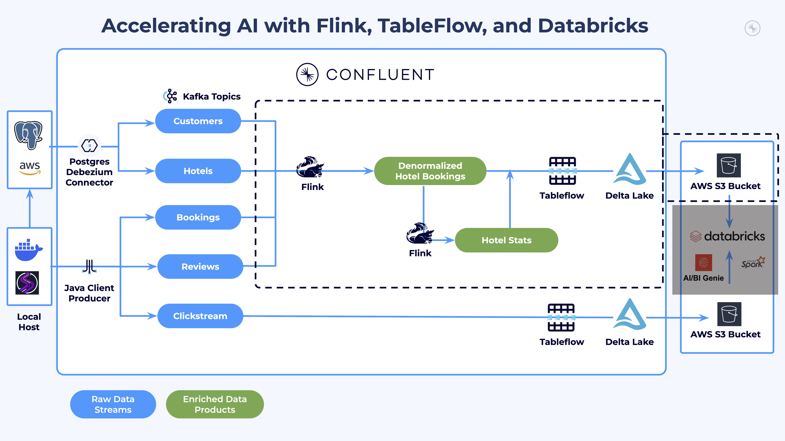

# LAB 4: Stream Processing

## Overview

This lab transforms your raw CDC data streams into enriched data products using Confluent Cloud's Flink SQL. You will build real-time processing pipelines that create denormalized datasets and analytical aggregations.

### What You'll Accomplish

By the end of this lab you will have:

1. **Prepared Clickstream for Analytics**: Created a Tableflow-compatible clickstream table from raw CDC data
2. **Established Intelligent Stream Processing**: Built Flink SQL queries that create snapshot dimension tables, denormalized bookings, and hotel performance metrics
3. **Created Enriched Data Products**: Combined customer, booking, and hotel data into analytical datasets



### Prerequisites

- Completed **[LAB 3: Unity Catalog Integration](../LAB3_catalog_integration/LAB3.md)** with Unity Catalog integration established

## Steps

### Step 1: Explore Streaming Data with Flink SQL

#### Navigate to Flink Compute Pool

1. Navigate to your [workshop Flink compute pool](https://confluent.cloud/go/flink)
2. Select your workshop environment
3. Click **Continue**

   

4. Click on the **Open SQL workspace** button in your workshop Flink compute pool

   
5. Ensure your workspace environment and cluster are both selected in the `Catalog` and `Database` dropdowns at the top of your compute pool screen
6. Drill down in the left navigation to see the tables in your environment and cluster

   

#### Explore CDC Data

All of your data comes through PostgreSQL CDC connectors and uses the `riverhotel.cdc.` topic prefix. Flink automatically unwraps the Debezium CDC envelope, so you can query the fields directly.

Start by reviewing data from the CDC topics:

```sql
-- View customer data from CDC
SELECT * FROM `riverhotel.cdc.customer` LIMIT 10;
```

Click the *Run* button and review the results. You should see customer records with fields like `email`, `first_name`, `last_name`, `birth_date`, `created_at`, and `updated_at`.


Now explore booking data:

```sql
-- View bookings data from CDC
SELECT * FROM `riverhotel.cdc.bookings` LIMIT 10;
```

Some observations about this data:

- The date fields `check_in`, `check_out`, and `created_at` have timestamp values that are not human-friendly
- The `hotel_id` field references hotels but does not include hotel details like name or location
- There is no review information joined to the booking

> **Tip**: Click the *+* button in the narrow side panel at the top left of the cell to create new cells. Create approximately 10 new cells as you will need them throughout this lab. Delete the current cell by clicking the trash icon below the *+*.
>
> 

#### Run Streaming Data Queries

Execute this query to see the live count of booking data:

```sql
-- See streaming count of bookings data
SELECT COUNT(*) AS `TOTAL_BOOKINGS` FROM `riverhotel.cdc.bookings`;
```

Watch the count increase gradually as new booking data is produced.

### Step 2: Create Clickstream Table for Tableflow

CDC topics use the Debezium envelope format (`avro-debezium-registry`) which Tableflow does not support directly. To materialize clickstream data as a Delta Lake table in a later lab, you need to create a derived table with a standard Avro format.

The source CDC table produces a full changelog (inserts, updates, and deletes), so the derived table uses `changelog.mode = 'upsert'` to maintain the latest state for each `activity_id`.

```sql
SET 'client.statement-name' = 'clickstream-materialized';

CREATE TABLE clickstream (
  PRIMARY KEY (`activity_id`) NOT ENFORCED
) WITH (
  'changelog.mode' = 'upsert'
) AS
SELECT
  `activity_id`,
  `customer_email`,
  `hotel_id`,
  `action`,
  `event_duration`,
  `url`,
  `created_at`
FROM `riverhotel.cdc.clickstream`;
```

Verify the table is populating:

```sql
SELECT * FROM `clickstream` LIMIT 10;
```

You should see flat clickstream records with fields like `activity_id`, `customer_email`, `hotel_id`, `action`, `event_duration`, `url`, and `created_at`.

### Step 3: Enrich and Denormalize Hotel Bookings

Your data has normalized CDC topics as tables in Flink. You will now process them into denormalized datasets useful for analytics.

#### Create Snapshot Dimension Tables

Create snapshot tables from the CDC sources with explicit primary keys and watermarks. These enable [temporal joins](https://docs.confluent.io/cloud/current/flink/concepts/joins.html#temporal-joins) that look up dimension data as it existed at the time of each booking event.

Run this statement to create the snapshot customer table:

```sql
SET 'client.statement-name' = 'customer-snapshot';

-- Create versioned customer table with watermark for temporal joins
CREATE TABLE customer_snapshot (
  PRIMARY KEY (`email`) NOT ENFORCED,
  WATERMARK FOR `updated_at` AS `updated_at` - INTERVAL '30' SECOND
) DISTRIBUTED BY HASH(`email`) INTO 1 BUCKETS
WITH (
  'changelog.mode' = 'upsert',
  'kafka.cleanup-policy' = 'compact'
) AS
SELECT
  `email`,
  `customer_id`,
  `first_name`,
  `last_name`,
  `birth_date`,
  `created_at`,
  `updated_at`
FROM `riverhotel.cdc.customer`;
```

Run this statement to create the snapshot hotel table:

```sql
SET 'client.statement-name' = 'hotel-snapshot';

-- Create snapshot hotel table with watermark for temporal joins
CREATE TABLE hotel_snapshot (
  PRIMARY KEY (`hotel_id`) NOT ENFORCED,
  WATERMARK FOR `updated_at` AS `updated_at` - INTERVAL '30' SECOND
) DISTRIBUTED BY HASH(`hotel_id`) INTO 1 BUCKETS
WITH (
  'changelog.mode' = 'upsert',
  'kafka.cleanup-policy' = 'compact'
) AS
SELECT
  `hotel_id`,
  `name`,
  `category`,
  `description`,
  `city`,
  `country`,
  `room_capacity`,
  `available_rooms`,
  `created_at`,
  `updated_at`
FROM `riverhotel.cdc.hotel`;
```

#### Update Watermark on Bookings Table

Temporal joins require an event-time watermark on the probe side (the bookings table). Modify the watermark to use the `created_at` column:

First, check the current watermark:

```sql
DESCRIBE EXTENDED `riverhotel.cdc.bookings`;
```

Now modify the watermark with a 30-second tolerance for late-arriving events:

```sql
-- Modify watermark on bookings table for temporal join probe side
ALTER TABLE `riverhotel.cdc.bookings` MODIFY WATERMARK FOR `created_at` AS `created_at` - INTERVAL '30' SECOND;
```

Verify the watermark was updated:

```sql
DESCRIBE EXTENDED `riverhotel.cdc.bookings`;
```

You should see the watermark defined as `created_at` - INTERVAL '30' SECOND.

#### Create Denormalized Table

This query creates a denormalized table combining booking data with customer information, hotel details, and hotel reviews using [temporal joins](https://docs.confluent.io/cloud/current/flink/concepts/joins.html#temporal-joins):

```sql
SET 'client.statement-name' = 'denormalized-hotel-bookings';

CREATE TABLE denormalized_hotel_bookings (
  PRIMARY KEY (`booking_id`) NOT ENFORCED,
  WATERMARK FOR `booking_date` AS `booking_date` - INTERVAL '30' SECOND
) WITH (
  'changelog.mode' = 'upsert',
  'kafka.cleanup-policy' = 'compact'
) AS
SELECT
  b.`booking_id`,
  h.`hotel_id`,
  h.`name` AS `hotel_name`,
  h.`description` AS `hotel_description`,
  h.`category` AS `hotel_category`,
  h.`city` AS `hotel_city`,
  h.`country` AS `hotel_country`,
  b.`price` AS `booking_amount`,
  b.`occupants` AS `guest_count`,
  b.`created_at` AS `booking_date`,
  b.`check_in`,
  b.`check_out`,
  c.`email` AS `customer_email`,
  c.`first_name` AS `customer_first_name`,
  hr.`review_rating` AS `review_rating`,
  hr.`review_text` AS `review_text`,
  hr.`created_at` AS `review_date`
FROM `riverhotel.cdc.bookings` b
  JOIN `customer_snapshot` FOR SYSTEM_TIME AS OF b.`created_at` AS c
    ON c.`email` = b.`customer_email`
  JOIN `hotel_snapshot` FOR SYSTEM_TIME AS OF b.`created_at` AS h
    ON h.`hotel_id` = b.`hotel_id`
  LEFT JOIN `riverhotel.cdc.hotel_reviews` hr
    ON hr.`booking_id` = b.`booking_id`;
```

<details>
<summary>Expand for details on this Flink statement</summary>

This **[CREATE TABLE AS SELECT (CTAS)](https://docs.confluent.io/cloud/current/flink/reference/statements/create-table-as.html)** statement creates a real-time **denormalized fact table** by joining streaming tables using [temporal joins](https://docs.confluent.io/cloud/current/flink/concepts/joins.html#temporal-joins).

**Understanding Temporal Joins**

Temporal joins allow you to join a streaming fact table (bookings) with snapshot dimension tables (customer, hotel) using point-in-time lookups. The `FOR SYSTEM_TIME AS OF` clause retrieves the dimension record as it existed at the time specified by the booking's event timestamp.

| Component | Purpose |
|-----------|---------|
| **Snapshot tables** | Store dimension data with primary keys and watermarks for point-in-time lookups |
| **Watermarks** | Define event-time progression for temporal semantics |
| **`FOR SYSTEM_TIME AS OF`** | Looks up dimension state at the exact time of each booking event |

**Key Requirements for Temporal Joins**

1. **Primary Key**: The snapshot table must have a declared primary key
2. **Watermark**: Both the probe side (bookings) and snapshot side (dimensions) need watermarks
3. **Upsert Mode**: Snapshot tables use `changelog.mode = 'upsert'` to maintain current state

</details>

#### Verify Denormalization Results

Run this query to return 20 records from the denormalized table:

```sql
SELECT *
  FROM `denormalized_hotel_bookings`
LIMIT 20;
```

Some observations:

- Because of the **LEFT JOIN** on `riverhotel.cdc.hotel_reviews`, some bookings have no customer reviews yet
- The `check_in`, `check_out`, `booking_date`, and `review_date` columns are now human readable

You can also verify the table in the left navigation panel:


> **Tip**: Hover over the *Tables* left menu item to reveal a sync icon. Click it to refresh any new tables into the UI.
>
> 

Click on `denormalized_hotel_bookings` to see its schema:


#### Hotel Stats Data Product

This Flink SQL statement creates a **continuous streaming aggregation table** that computes hotel-level performance metrics in real-time:

```sql
SET 'sql.state-ttl' = '1 day';

SET 'client.statement-name' = 'hotel-stats';

CREATE TABLE hotel_stats AS (

SELECT
  COALESCE(hotel_id, 'UNKNOWN_HOTEL') AS hotel_id,
  COALESCE(hotel_name, 'UNKNOWN_HOTEL_NAME') AS hotel_name,
  COALESCE(hotel_city, 'UNKNOWN_HOTEL_CITY') AS hotel_city,
  COALESCE(hotel_country, 'UNKNOWN_HOTEL_COUNTRY') AS hotel_country,
  COALESCE(hotel_description, 'UNKNOWN_HOTEL_DESCRIPTION') AS hotel_description,
  COALESCE(hotel_category, 'UNKNOWN_HOTEL_CATEGORY') AS hotel_category,
  SUM(1) AS total_bookings_count,
  SUM(guest_count) AS total_guest_count,
  SUM(booking_amount) AS total_booking_amount,
  CAST(AVG(review_rating) AS DECIMAL(10, 2)) AS average_review_rating,
  SUM(CASE WHEN review_rating IS NOT NULL THEN 1 ELSE 0 END) AS review_count
FROM `denormalized_hotel_bookings`
WHERE hotel_id IS NOT NULL
GROUP BY
   COALESCE(hotel_id, 'UNKNOWN_HOTEL'),
   COALESCE(hotel_name, 'UNKNOWN_HOTEL_NAME'),
   COALESCE(hotel_city, 'UNKNOWN_HOTEL_CITY'),
   COALESCE(hotel_country, 'UNKNOWN_HOTEL_COUNTRY'),
   COALESCE(hotel_description, 'UNKNOWN_HOTEL_DESCRIPTION'),
   COALESCE(hotel_category, 'UNKNOWN_HOTEL_CATEGORY')
);
```

Query the hotel stats:

```sql
SELECT *
  FROM `hotel_stats`
LIMIT 30;
```

Observations:

- Each hotel has **one row** that continuously updates as new bookings arrive
- Fields like `average_review_rating` and `review_count` provide analytical insight
- `total_bookings_count` and `total_booking_amount` track overall hotel performance

## Conclusion

You have built a real-time streaming pipeline that transforms raw CDC data into enriched data products ready for Tableflow materialization and analytics. You created three Tableflow-ready tables: `clickstream` (append-only page views), `denormalized_hotel_bookings` (enriched bookings with customer and hotel details), and `hotel_stats` (aggregated hotel performance metrics).

## What's Next

Continue to **[LAB 5: Tableflow](../LAB5_tableflow/LAB5.md)**.

## Troubleshooting

See the [Troubleshooting](../../shared/troubleshooting.md) guide for common issues and solutions.
