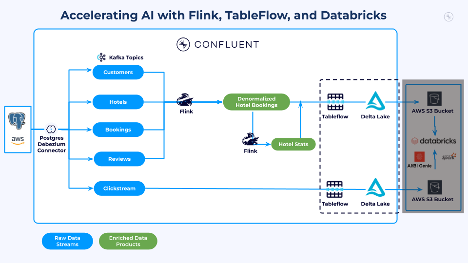
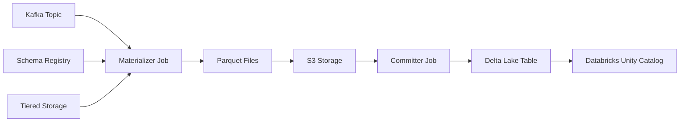
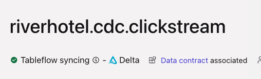

# LAB 4: Tableflow

## Overview

Now that you have built your stream processing pipelines and created enriched data products, it is time to connect Confluent Cloud with Databricks Unity Catalog and enable Tableflow to materialize your Kafka topics as Delta Lake tables.

### What You'll Accomplish

By the end of this lab, you will have:

1. **Unity Catalog Integration**: Connected Confluent Cloud with Databricks Unity Catalog through Tableflow
2. **Tableflow-enabled Topics**: Streamed your `riverhotel.cdc.clickstream`, `denormalized_hotel_bookings`, and `hotel_stats` topics as Delta Lake tables
3. **Verified Unity Catalog Sync**: Confirmed that Tableflow is syncing data to your Databricks Unity Catalog

### Prerequisites

- Completed **[LAB 3: Stream Processing](../LAB3_stream_processing/LAB3.md)** with enriched data products created

## Steps

### Step 1: Set Up Tableflow Integration with Unity Catalog

#### Establish Unity Catalog Integration

Follow these steps to connect Tableflow to your Databricks Unity Catalog:

1. Navigate to your cluster in Confluent Cloud by clicking [this link](https://confluent.cloud/go/cluster)
2. Select your workshop environment and cluster in the dropdowns

   

3. Click on **Tableflow** in the left menu
4. Click on the **+ Add integration** button next to the *External Catalog Integrations* section

   

5. Select **Databricks Unity**
6. Enter a relevant name in the *Name* field, something like `tableflow-databricks-workshop`

   

7. Click **Continue**
8. Enter the connection details from your credentials email:

   | Field | Value Source |
   |---|---|
   | **Databricks workspace URL** | The Databricks `Workspace URL` from your credentials email |
   | **Client ID** | The Databricks `SP Client ID` from your credentials email |
   | **Client secret** | The Databricks `SP Client Secret` from your credentials email |
   | **Unity catalog name** | The Databricks `Unity Catalog Name` from your credentials email |

   

9. Click **Continue**
10. Launch your Unity Catalog integration

   

> **Important**: The status of your Tableflow integration with Unity Catalog will remain in *Pending* until you enable Tableflow for Delta Lake on your first topic, which you will do next.

### How Tableflow Works (Optional)

Expand to learn more about how Tableflow works

When you enable Tableflow on a topic, Confluent starts two critical jobs:

**Materializer Job:**

- Connects to your Kafka topic and fetches table metadata
- Retrieves associated schema from Schema Registry to define table structure
- Fetches data segments directly from tiered object storage for optimal performance
- Converts streaming data to Parquet format
- Writes converted data to your specified S3 location

**Committer Job:**

- Commits snapshots to catalogs with exactly-once semantics guaranteed
- Propagates changes to external catalogs like Unity Catalog
- Maintains table metadata and ensures data consistency

### Step 2: Enable Tableflow on `riverhotel.cdc.clickstream`

1. Navigate to [your workshop topics](https://confluent.cloud/go/topics)
2. Select your workshop environment and cluster
3. Click on the `riverhotel.cdc.clickstream` topic
4. Click on the **Enable Tableflow** button in the top right of your screen
5. Deselect the **Iceberg** tile
6. Select the **Delta** tile

   

7. Click on the **Configure custom storage** button
8. Ensure the **Store in your own bucket** tile is selected
9. Select the *tableflow-databricks* provider integration from the dropdown
10. Copy and paste the `S3 Bucket Name` from your credentials email into the *AWS S3 Bucket name* textbox

    

11. Click on the **Continue** button
12. Review the configuration details and click the **Launch** button
13. Verify Tableflow is successfully syncing data by checking the status in the UI

    

### Step 3: Enable Tableflow on `denormalized_hotel_bookings` and `hotel_stats`

Repeat the steps you just completed for the `riverhotel.cdc.clickstream` topic above for the `hotel_stats` and `denormalized_hotel_booking` topics.

> **Important**: It may take a 3-4 minutes for Tableflow to begin syncing each topic. You can enable all three while waiting for the materialization to complete.

### Step 4: Review Unity Catalog Integration

1. Click on **Tableflow** in the left menu
2. Scroll down to the *External Catalog Integrations* section
3. Check for *Connected* status on the integration you set up in Step 1

   

### Configure Error Handling (Optional)

Expand to learn about configuring Dead Letter Queue (DLQ) error handling

Tableflow offers three modes for handling per-record materialization failures:

| Mode | Behavior |
|------|----------|
| **Suspend** (default) | Pauses Tableflow when a record cannot be materialized |
| **Skip** | Skips records that fail to materialize |
| **Log** | Sends failed records to a Dead Letter Queue (DLQ) topic |

The **Log** mode is useful for production environments where you want to capture problematic records without stopping the pipeline.

## Conclusion

You have configured the integration between Confluent Cloud Tableflow and Databricks Unity Catalog, enabled Tableflow on three topics — `riverhotel.cdc.clickstream`, `denormalized_hotel_bookings`, and `hotel_stats` — and verified that data is syncing as Delta Lake tables.

## What's Next

Continue to **[LAB 5: Analytics and AI-Powered Marketing](../LAB5_analytics_ai/LAB5.md)**.

## Troubleshooting

See the [Troubleshooting](../../shared/troubleshooting.md) guide for common issues and solutions.
