# LAB 6: Analytics and AI-Powered Marketing Automation

## Overview

Transform your streaming data products into actionable business insights and AI-generated marketing campaigns using Databricks' analytics and AI capabilities.

### What You'll Accomplish

By the end of this lab, you will have:

1. **AI-Powered Business Intelligence**: Used Databricks Genie to generate natural language insights about customer behavior, booking patterns, and hotel performance
2. **Intelligent Marketing Automation**: Deployed an AI agent that identifies underperforming hotels with good customer satisfaction, generates social media campaigns based on reviews, and creates targeted customer lists

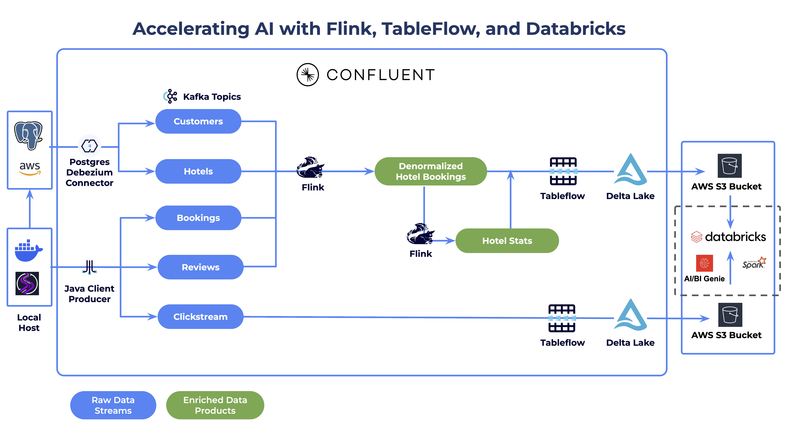

### Prerequisites

- Completed **[LAB 5: Tableflow](../LAB5_tableflow/LAB5.md)** with enriched data products flowing to Delta Lake tables

## Steps

### Step 1: Explore Streaming Data in Unity Catalog

Verify that data is flowing from Confluent via Tableflow into Databricks Unity Catalog:

1. Log in to your Databricks workspace using the credentials from your email
2. Click on **Catalog** in the left menu
3. Verify that you see your Tableflow catalog

   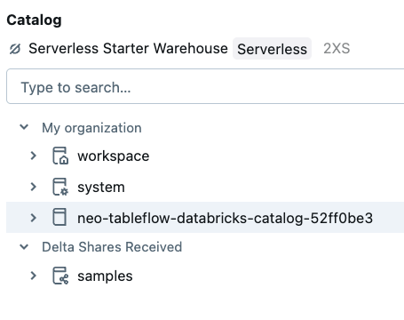

4. Expand your Tableflow catalog
5. Expand your Confluent cluster schema (its name should match the ID of your Confluent Cloud Kafka cluster)
6. Verify that you see three tables: *clickstream*, *denormalized_hotel_bookings*, and *hotel_stats*

   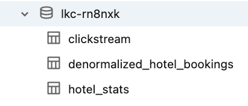

7. Select the `clickstream` table
8. Click the **Create** dropdown button in the top right
9. Select **Query**
10. Select your *catalog* and *schema* from the dropdowns

    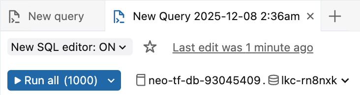

11. Run the query that appears in the cell:

```sql
select * from `<catalog>`.`<schema>`.`clickstream` limit 100;
```

> **Tip**: If you see a modal prompting you to start a compute resource, select **Automatically launch and attach without prompting** and click **Start, attach and run**.
>
> 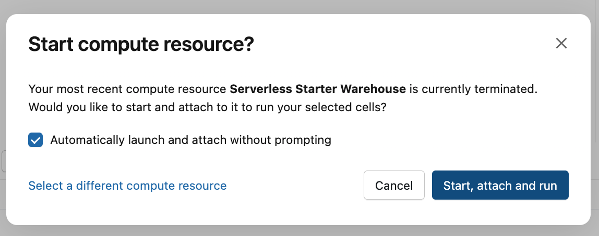

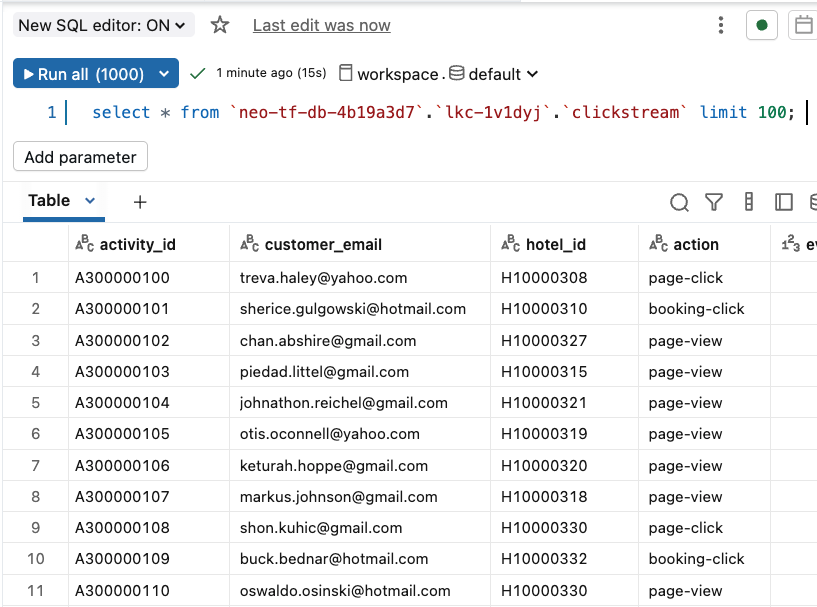

> **Important**: It may a few minutes for `SELECT` queries to return data for the `denormalized_hotel_bookings` and `hotel_stats` tables if you only recently enabled Tableflow on them.

### Step 2: Derive Data Product Insights with Genie

Databricks Genie provides a chat interface where you ask questions about your data in natural language and it generates SQL queries to answer them.

#### Set Up Genie Workspace

1. Click on the **Genie** link under the *SQL* section in the left sidebar
2. Click on the **+ New** button to create a new Genie space
3. Click on the **All** toggle
4. Navigate to your workshop *catalog* and *database*
5. Select the `clickstream`, `denormalized_hotel_bookings`, and `hotel_stats` tables

   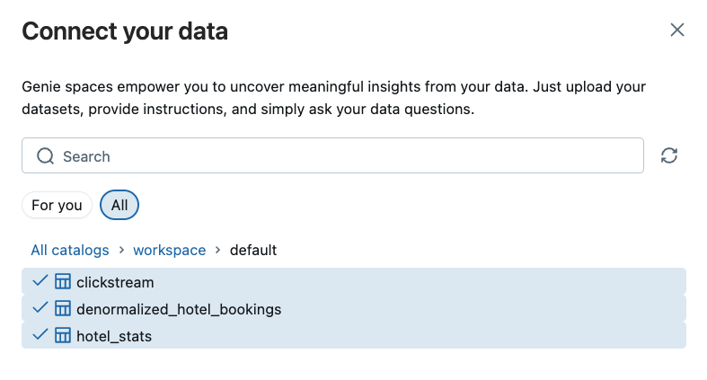

6. Click **Create**
7. Rename your space to something like *River Hotel BI*

   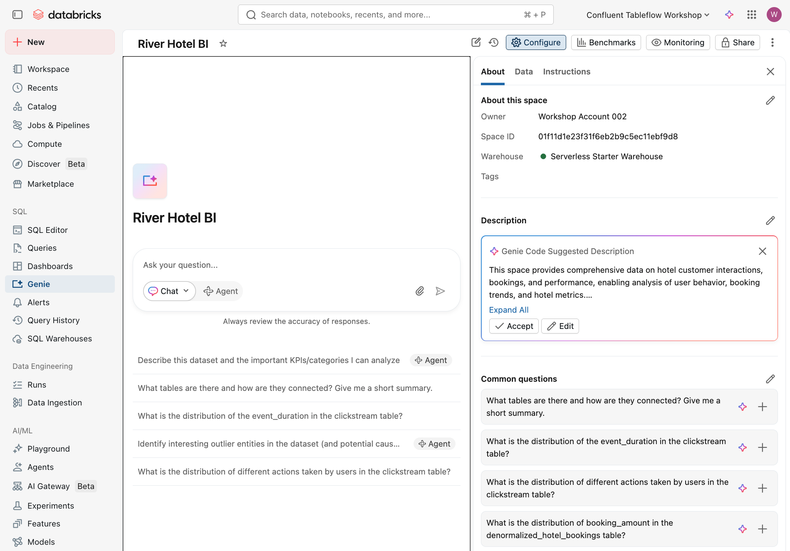

#### Generate Business Insights

Toggle the **Agent** mode and prompt Genie with natural language questions:

Click the **Explain the data set** button to get an overview.

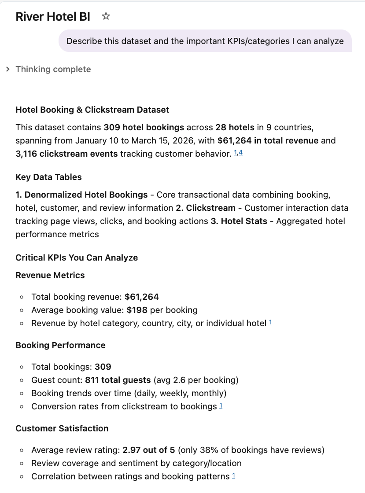

Try these prompts:

> Show me customer satisfaction metrics by country

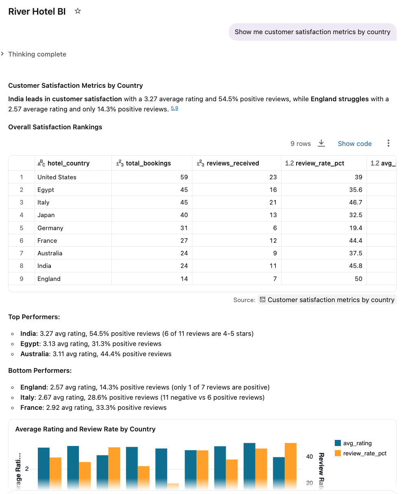

> Show me customers who viewed hotels in the most cities

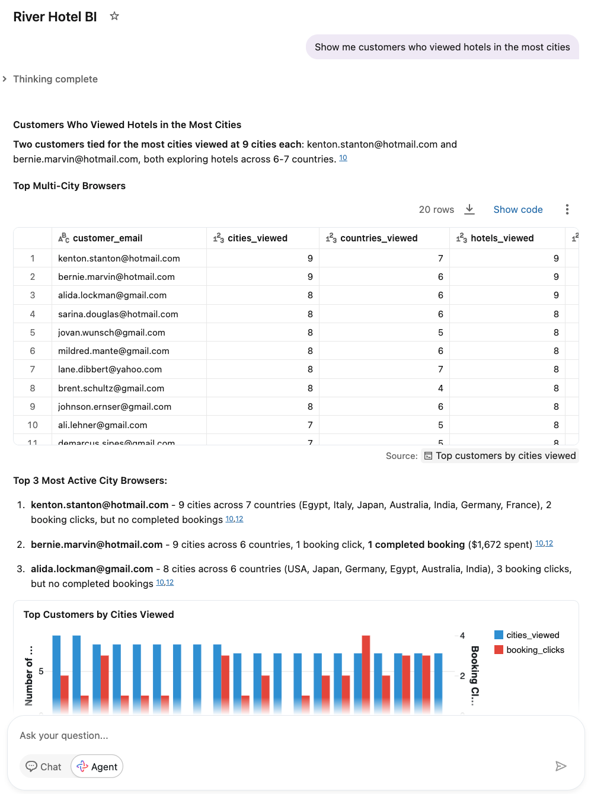

> Which cities had the most interest from customers?

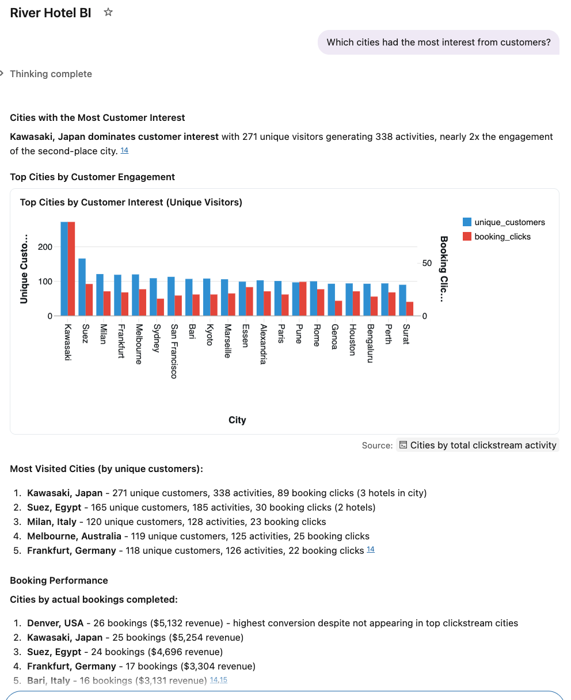

> Which category of hotel had the lowest interest from customers?

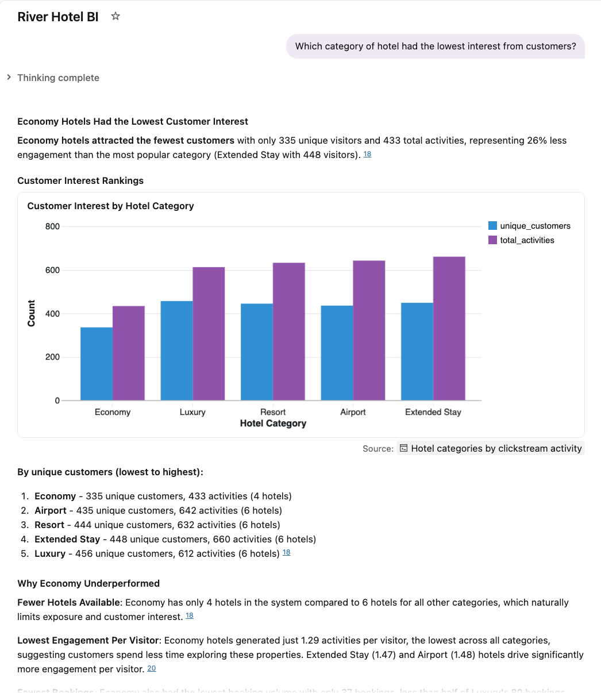

Identify the *Hotel Category* with the lowest customer interest — you will use this in the next section to create a marketing agent.

### Step 3: Create and Deploy Marketing Campaign Agent

Use a pre-built Jupyter Notebook to generate an AI agent that identifies hotels needing promotion and creates targeted marketing campaigns.

The AI agent combines three functions:

1. **Hotel Selection**: Identifies the lowest-performing hotel in a given category that has above-average customer satisfaction — perfect candidates for promotion
2. **Content Generation**: Analyzes customer reviews and creates positive social media posts
3. **Customer Targeting**: Finds customers with high browsing interest but few bookings — prime targets for conversion

#### Import and Configure Notebook

1. Click on the **+ New** button in the top left of the screen
2. Select **Notebook**
3. Click on **File** then **Import**

   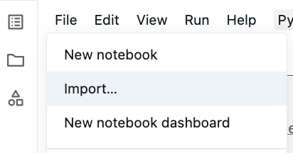

4. Select **URL**
5. Paste in this value:

```text
https://raw.githubusercontent.com/confluentinc/workshop-tableflow-databricks/refs/heads/main/labs/shared/river_hotel_marketing_agent.ipynb
```

6. Click **Import**

   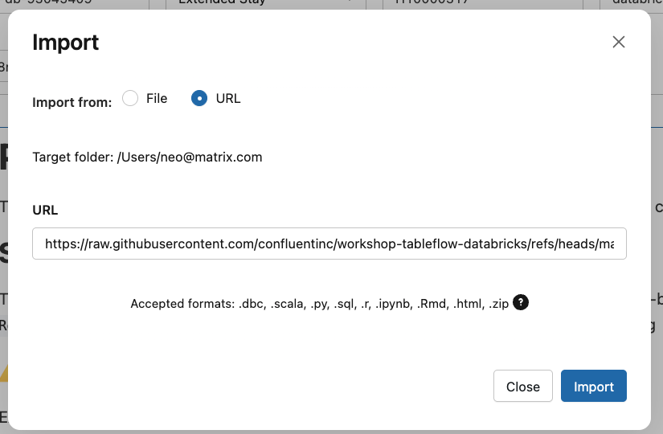

7. Follow the instructions in the Notebook to create and deploy the marketing campaign agent

## Conclusion

Your AI marketing agent is deployed and ready to help River Hotels create data-driven marketing campaigns in real-time.

## What's Next

Continue to **[LAB 7: Wrap Up](../LAB7_wrap_up/LAB7.md)**.

## Troubleshooting

See the [Troubleshooting](../../shared/troubleshooting.md) guide for common issues and solutions.
