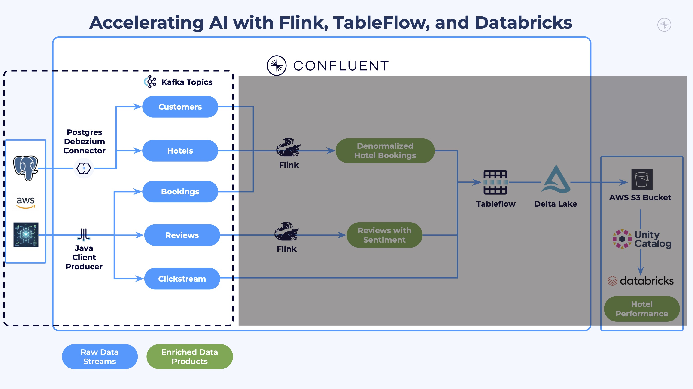
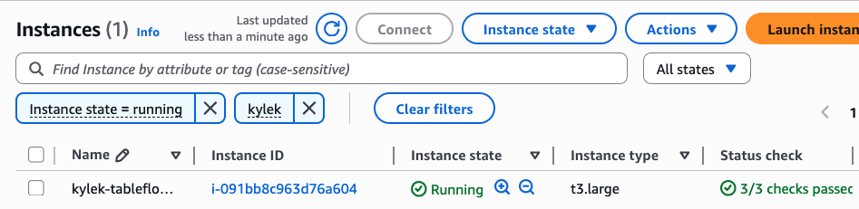
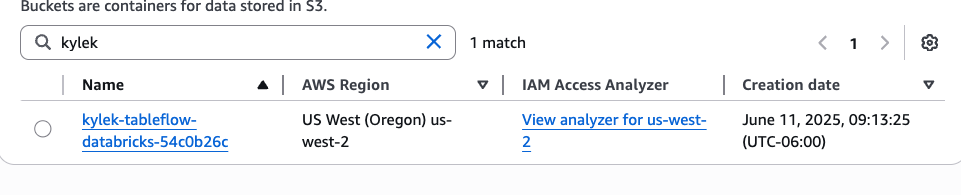
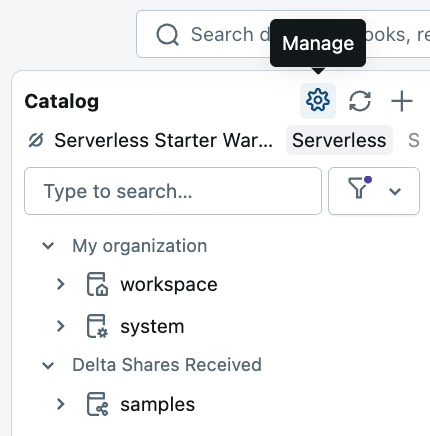
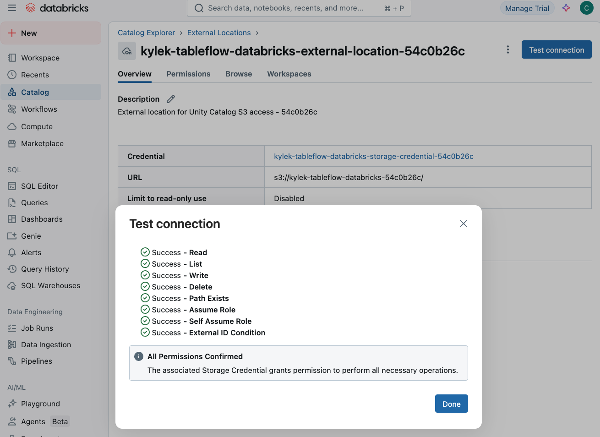
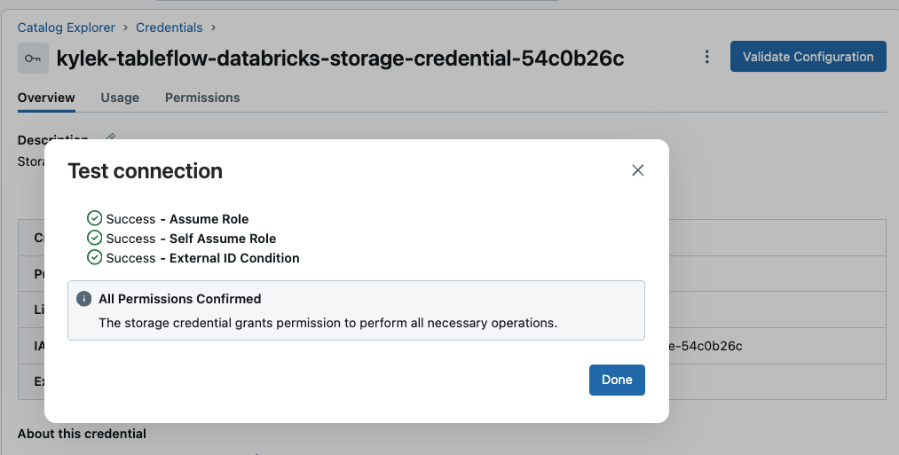
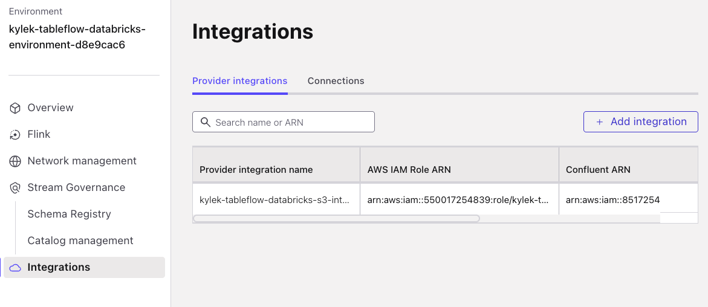

# LAB 2: Cloud Infrastructure Deployment

## 🗺️ Overview

Now that you've configured your cloud platform accounts, it's time to deploy the infrastructure foundation for River Hotels' real-time AI marketing pipeline! In this lab, you'll use Terraform to automatically provision and validate resources across multiple cloud platforms.

### What You'll Accomplish

By the end of this lab, you will have:

1. **Multi-Cloud Infrastructure Deployment**: Used Terraform to automatically provision 40+ cloud resources across AWS, Confluent Cloud, and Databricks with proper security, networking, and integration
2. **Verified Data Generation**: Confirmed that data is streaming to Kafka topics via Java Datagen and PostgreSQL CDC
3. **Platform Integration**: Confirmed that AWS, Confluent Cloud, and Databricks are properly connected and ready for data streaming



### Prerequisites

- Completed **[LAB 0: Prerequisites](../LAB0_prerequisites/LAB0.md)**
- Completed **[LAB 1: Account Setup](../LAB1_account_setup/LAB1.md)** with all cloud platform credentials configured in your `terraform.tfvars` file

## 👣 Steps

> [!NOTE]
> **Recommendation for Windows Users**
>
> We recommend that you run this workshop from a **WSL 2 terminal** (not PowerShell). See the [Windows setup instructions in LAB 0](../LAB0_prerequisites/LAB0.md#initial-setup-steps) if you haven't configured this yet.

### Step 1: Deploy Cloud Infrastructure with Terraform

Now it's time for you to perform some deployment magic! 🪄🎩

The following commands will initialize, validate, and apply the Terraform configuration to create your cloud resources.

#### Initialize Terraform

Run Terraform init inside the container:

```sh
docker-compose run --rm terraform -c "terraform init"
```

You should see this success message:

```sh
Terraform has been successfully initialized!
```

#### Validate Configuration

Verify that your Terraform configuration is valid:

```sh
docker-compose run --rm terraform -c "terraform validate"
```

You should see this success message:

```sh
Success! The configuration is valid.
```

#### Deploy Infrastructure

Initiate cloud resource creation:

```sh
docker-compose run --rm terraform -c "./terraform-apply-wrapper-with-retry.sh"
```

> [!NOTE]
> **Duration: 7-10 Minutes**
>
> It should take between 7-10 minutes for Terraform to completely generate all of the needed cloud resources.
>
> You may continue on with this lab while Terraform provisions. Alternatively, you may also spend *~10 minutes* going through this [optional data contracts and governance lab](../LAB_data_governance/LAB_data_governance.md) while you wait.
>
> You should see an extensive log output in your shell showing the progress of generating the cloud resources. When finished, you should see a message like this:
>
> *Apply complete! Resources: XX added, 0 changed, 0 destroyed.*

Expand the section below for a summary of the main cloud resources created through Terraform:

<details>
<summary>Cloud Resources Created</summary>

**AWS Resources:**

- VPC with proper networking components
- Security groups with minimal required access
- EC2 instance running PostgreSQL database with logical replication enabled
- S3 general-purpose bucket to store Delta table data
- IAM roles and policies for secure access

**Confluent Cloud Resources:**

- Environment for workshop isolation
- *Standard* Kafka cluster for data streaming
- Flink compute pool
- Provider Integration with AWS for Tableflow

**Databricks Resources:**

- External Location to access S3 bucket
- Storage Credential for secure access

</details>

#### Terraform Output

When the deployment completes, Terraform outputs helpful cloud resource values. You can view these values at any time by running:

```sh
docker-compose run --rm terraform -c "terraform output"
```

> [!IMPORTANT]
> **Troubleshoot Terraform Issues**
>
> If your terraform execution fails, you can [review these common issues](../../shared/troubleshooting.md#terraform).
>
> If you encounter a `500 Internal Server Error` when creating the Databricks external location, this is a transient error due to IAM propagation delays. The `terraform-apply-wrapper-with-retry.sh` script will automatically retry until successful.
>
> See [this section](../../shared/troubleshooting.md#transient-500-error-during-external-location-creation) of the Troubleshooting Guide for more details.

### Step 2: Verify Data Generation

With your infrastructure deployed, data generation is already running. During Terraform deployment, Java Datagen was automatically started on the PostgreSQL EC2 instance. It generates realistic customer behavior data that flows through your entire pipeline — writing customer and hotel data to PostgreSQL (captured by the CDC connector) and streaming clickstream, booking, and review events directly to Kafka.

#### Review Topics

Follow these steps to see data streaming into Confluent Cloud:

1. Navigate to the [topics UI](https://confluent.cloud/go/topics) in Confluent Cloud
2. Select your environment and cluster
3. Verify that you see topics including `bookings`, `clickstream`, `reviews`, `riverhotel.cdc.customer`, and `riverhotel.cdc.hotel`

#### Review PostgreSQL CDC Connector

Verify that the PostgreSQL CDC connector is capturing real-time changes from your PostgreSQL database:

1. Click on *Connectors* in the left sidebar menu
2. You should see a PostgreSQL CDC Source connector tile
3. Click the tile
4. Verify that the connector is running successfully

> [!TIP]
> **CDC Events**
>
> This change data capture connector will automatically record all *INSERT*, *UPDATE*, and *DELETE* events on the `customer` and `hotel` database tables to the corresponding Kafka topics `riverhotel.cdc.customer` and `riverhotel.cdc.hotel`.

<details>
<summary>More details about your data pipeline</summary>

You now have a live, streaming data pipeline consisting of:

**Generated Data Streams:**

- **1,000 customer profiles** with realistic contact information and preferences
- **30 hotel properties** across 9 countries with detailed amenities and descriptions
- **3,000+ historical clickstream events** showing authentic customer browsing behavior
- **400+ booking transactions** with realistic customer-hotel relationships
- **200+ hotel reviews** with ratings and feedback that reflect actual guest experiences
- **Continuous streaming data** with realistic throttling patterns that simulate real-world usage

</details>

### Step 3: Verify Infrastructure Deployment (Optional)

You can verify that the cloud resources we created via Terraform are accessible and working as expected by expanding the section below and following the steps:

<details>
<summary>Review Cloud Resources</summary>

#### Verify AWS Resources

1. If logged out, log into the AWS console with the same account you used in Terraform
2. Select the same *cloud region* as you have in Terraform
3. **Ensure EC2 Instance is running**
   1. Navigate to the EC2 home page
   2. Click on *Instances* in the left navigation
   3. Search for the name of your instance (it should contain your call sign)
   4. Click on the link for it
   5. Check that it is running

   

4. **Ensure S3 Bucket is available**
   1. Navigate to the S3 home page
   2. Search for your bucket under the *General purpose buckets* section
   3. Verify that the bucket exists and is empty

   

#### Verify Databricks Resources

Follow these steps in a separate browser tab to verify that your Databricks cloud resources work:

##### Test External Location

1. Click on the *Catalog* link in the left navigation panel
2. Click on the gear icon in the top right of the Catalog panel

   

3. Click on *External Locations*
4. Click on the *Name* link of the External Location created by Terraform
5. Click on the *Test connection* button in the top right of the screen
6. You should see a message like this

   

##### Validate Storage Credential

1. Click on the *Credential* link
2. Click on the *Validate Configuration* button
3. You should see a success message like this:

   

> [!NOTE]
> **Databricks Browser Tab**
>
> Keep this browser tab open as you will be returning to Databricks towards the end of this workshop.

#### Verify Confluent Resources

1. Navigate to your Confluent Cloud account
2. Find and Click on your workshop environment
3. Click on the *Integrations* link in the left menu
4. Notice there is a row under the *Provider* tab that contains the name **tableflow-databricks**. This is the AWS integration that will enable Tableflow to push streams as Delta Lake tables to S3

   

5. Click on *Overview* in the left sidebar menu
6. Click on your workshop Cluster
7. Click on the *Topics* link in the left sidebar menu
8. Verify that topics are being produced — you should see `bookings`, `clickstream`, `reviews`, `riverhotel.cdc.customer`, and `riverhotel.cdc.hotel`

</details>

## 🏁 Conclusion

🎉 **Congratulations!** You've successfully deployed the complete infrastructure foundation for River Hotels' AI-powered marketing pipeline and verified that data is streaming!

## ➡️ What's Next

Resume your journey in **[LAB 3: Tableflow and Unity Catalog](../LAB3_tableflow/LAB3.md)**.

> **Optional**: Your infrastructure was deployed with data quality rules that enforce a CEL validation on the clickstream topic. Explore this in the optional **[Data Governance Lab](../LAB_data_governance/LAB_data_governance.md)**.

## 🔧 Troubleshooting

You can find potentially common issues and solutions or workarounds in the [Troubleshooting](../../shared/troubleshooting.md) guide.
