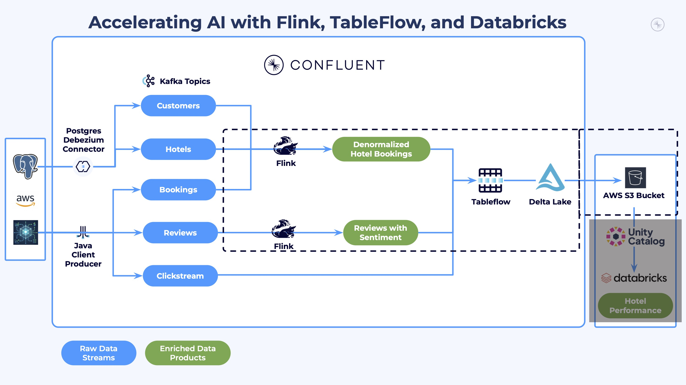
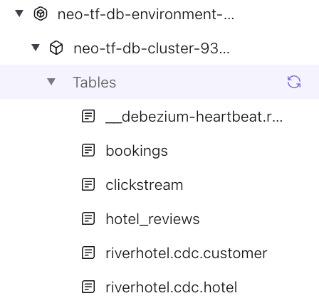
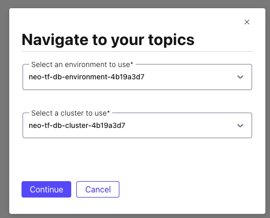
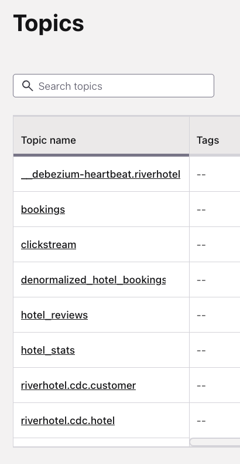

# LAB 4: Stream Processing

## 🗺️ Overview

This lab transforms your raw data streams into enriched data products using Confluent Cloud's Flink SQL. You will build real-time processing pipelines that create denormalized datasets and analytical aggregations.

### What You'll Accomplish



By the end of this lab you will have:

1. **Explored Streaming Data**: Queried real-time topics with Flink SQL
2. **Created Enriched Data Products**: Built denormalized bookings combining customer and hotel data using temporal joins
3. **Created AI-Enriched Reviews**: Used `AI_SENTIMENT` to analyze hotel reviews by cleanliness, amenities, and service
4. **Integrated with Delta Lake**: Used Confluent Tableflow to sync processed data streams as Delta tables in S3

### Prerequisites

- Completed **[LAB 3: Tableflow and Unity Catalog](../LAB3_tableflow/LAB3.md)** by establishing the integration with Unity Catalog and enabling Tableflow on the `clickstream` topic.

## 👣 Steps

### Step 1: Explore Streaming Data with Flink SQL

The next step in your journey is to enrich your *data streams* with serverless
Apache Flink on Confluent.

#### Navigate to Flink Compute Pool

Follow these steps to navigate to the *Flink Compute Pool* that you spun up
earlier with Terraform:

1. Navigate to your [workshop flink compute pool](https://confluent.cloud/go/flink)
2. Select your workshop environment
3. Click **Continue**

   

4. Click on the **SQL Workspace** button in your workshop Flink compute pool

   

5. Ensure your workspace environment and cluster are both selected in the
   `Use catalog` and `Use database` dropdowns at the top of your compute pool screen
6. Drill down in the left navigation to see the tables in your environment and
   cluster

   

#### Explore Bookings Data

Now that you are in the Flink SQL workspace, you can start executing queries and
statements to enhance your River Hotels data streams.

Start by reviewing the `booking` topic data with these steps:

1. Copy and paste this query into the cell:

```sql
-- View bookings data
SELECT * FROM `bookings` LIMIT 10;
```

2. Click the *Run* button

3. Look for the cell to expand at the bottom to show you the result set, which
   should look similar to this:

   

   Some observations about this data stream:

   - The `check_in` and `check_out` fields have timestamp values that are not human friendly
   - While you can see the values of `hotel_id`, it would be more informative to have identifiable fields displayed as well, like its name and location

4. Click the *Stop* button
5. Click the *+* button in the in the narrow side panel at the top left of the
   cell to create a new one. Create ~6 new cells as you will need them
   throughout the remainder of this workshop
6. Delete the current cell by clicking the trash icon located below the *+*

   

#### Run Streaming Data Queries

Execute these steps to see how the `bookings` data continues to stream in from
the data generator:

1. Copy and paste this query into the next empty cell

```sql
-- See streaming count of bookings data
SELECT COUNT(*) AS `TOTAL_BOOKINGS` FROM `bookings`;
```

2. Click the *Run* button

3. Pay attention to the count - over the next few minutes it should increase
   gradually as new booking data is produced to the `bookings` topic and
   surfaced in this table

### Step 2: Understand the Pre-configured Topics

Your workshop infrastructure has already configured the source topics for use with Flink temporal joins and Tableflow. The CDC connector uses `after.state.only = true` to produce flat Avro records (no Debezium envelope).

Your data comes from two sources:

- **CDC topics** (`riverhotel.cdc.customer`, `riverhotel.cdc.hotel`): Data written to PostgreSQL and captured by the CDC connector. These are configured with `changelog.mode = 'upsert'`, compaction, and watermarks — ready to serve as dimension tables for temporal joins.
- **Direct-to-Kafka topics** (`bookings`, `clickstream`, `reviews`): Data produced directly to Kafka by Java Datagen. These are configured with watermarks and retention by Terraform.

Primary keys are automatically derived from the Kafka message key (which maps to the source table's primary key for CDC topics).

Verify the customer table configuration:

```sql
SHOW CREATE TABLE `riverhotel.cdc.customer`;
```

You should see a primary key on `email` (from the Kafka key), a watermark on `updated_at`, and `changelog.mode = 'upsert'` in the `WITH` clause. This enables the CDC topic to serve directly as a dimension table for [temporal joins](https://docs.confluent.io/cloud/current/flink/concepts/joins.html#temporal-joins) without creating a separate snapshot table.

### Step 3: Enrich and Denormalize Hotel Bookings

Your source topics are already configured with primary keys, watermarks, and changelog modes. You will now process them into denormalized datasets useful for analytics.

#### Create Denormalized Table

This query creates a denormalized table combining booking data with customer information and hotel details using [temporal joins](https://docs.confluent.io/cloud/current/flink/concepts/joins.html#temporal-joins). Because the CDC topics are pre-configured with primary keys and watermarks, you can join them directly without creating separate snapshot tables:

```sql
SET 'client.statement-name' = 'denormalized-hotel-bookings';

CREATE TABLE denormalized_hotel_bookings (
  PRIMARY KEY (`booking_id`) NOT ENFORCED,
  WATERMARK FOR `booking_date` AS `booking_date` - INTERVAL '30' SECOND
) WITH (
  'changelog.mode' = 'upsert',
  'kafka.cleanup-policy' = 'compact'
) AS
SELECT
  b.`booking_id`,
  h.`hotel_id`,
  h.`name` AS `hotel_name`,
  h.`description` AS `hotel_description`,
  h.`category` AS `hotel_category`,
  h.`city` AS `hotel_city`,
  h.`country` AS `hotel_country`,
  b.`price` AS `booking_amount`,
  b.`occupants` AS `guest_count`,
  b.`created_at` AS `booking_date`,
  CAST(TO_TIMESTAMP_LTZ(b.`check_in`, 3) AS DATE) AS `check_in`,
  CAST(TO_TIMESTAMP_LTZ(b.`check_out`, 3) AS DATE) AS `check_out`,
  c.`email` AS `customer_email`,
  c.`first_name` AS `customer_first_name`,
  c.`rewards_points` AS `customer_rewards_points`
FROM `bookings` b
  JOIN `riverhotel.cdc.customer` FOR SYSTEM_TIME AS OF b.`created_at` AS c
    ON c.`email` = b.`customer_email`
  JOIN `riverhotel.cdc.hotel` FOR SYSTEM_TIME AS OF b.`created_at` AS h
    ON h.`hotel_id` = b.`hotel_id`;
```

<details>
<summary>Expand for details on this Flink statement</summary>

This **[CREATE TABLE AS SELECT (CTAS)](https://docs.confluent.io/cloud/current/flink/reference/statements/create-table-as.html)** statement creates a real-time **denormalized fact table** by joining streaming tables using [temporal joins](https://docs.confluent.io/cloud/current/flink/concepts/joins.html#temporal-joins).

**Understanding Temporal Joins**

Temporal joins allow you to join a streaming fact table (bookings) with dimension tables (customer, hotel) using point-in-time lookups. The `FOR SYSTEM_TIME AS OF` clause retrieves the dimension record as it existed at the time specified by the booking's event timestamp.

| Component | Purpose |
|-----------|---------|
| **CDC dimension tables** | `riverhotel.cdc.customer` and `riverhotel.cdc.hotel` with primary keys, upsert mode, and watermarks (pre-configured by Terraform) |
| **Watermarks** | Define event-time progression for temporal semantics |
| **`FOR SYSTEM_TIME AS OF`** | Looks up dimension state at the exact time of each booking event |

**Key Requirements for Temporal Joins**

1. **Primary Key**: The dimension table must have a declared primary key
2. **Watermark**: Both the probe side (bookings) and dimension side (customer, hotel) need watermarks
3. **Upsert Mode**: Dimension tables use `changelog.mode = 'upsert'` to maintain current state
4. **Historical Versions**: The dimension topic must retain historical record versions — compaction cannot remove them before the temporal join reads them. This workshop uses `min.compaction.lag.ms = 7 days` to preserve versions during the workshop window.

</details>

#### Verify Denormalization Results

Run this query to return 20 records from the denormalized table:

```sql
SELECT *
  FROM `denormalized_hotel_bookings`
LIMIT 20;
```

Some observations:

- Each booking is enriched with **customer** and **hotel** details via temporal joins
- The `booking_date` watermark enables downstream analytics and time-based filtering
- The `check_in` and `check_out` dates are now human readable

You can also verify the table in the left navigation panel:


> **Tip**: Hover over the *Tables* left menu item to reveal a sync icon. Click it to refresh any new tables into the UI.
>
> 

Click on `denormalized_hotel_bookings` to see its schema:


#### Enrich Hotel Reviews with AI Sentiment Analysis

Now create a table that enriches hotel reviews with AI-powered sentiment analysis. This uses the [`AI_SENTIMENT`](https://docs.confluent.io/cloud/current/ai/builtin-functions/sentiment.html) function to analyze each review across three aspects: cleanliness, amenities, and service. The sentiment scores are flattened into individual columns for clean downstream analytics.

```sql
SET 'client.statement-name' = 'hotel-reviews-with-sentiment';

CREATE TABLE reviews_with_sentiment (
  PRIMARY KEY (`review_id`) NOT ENFORCED,
  WATERMARK FOR `created_at` AS `created_at` - INTERVAL '30' SECOND
) WITH (
  'changelog.mode' = 'upsert',
  'kafka.cleanup-policy' = 'compact'
) AS
SELECT
  review_id,
  hotel_id,
  review_rating,
  review_text,
  created_at,
  sentiment_result.sentiment[1].label AS cleanliness_label,
  sentiment_result.sentiment[1].score AS cleanliness_score,
  sentiment_result.sentiment[2].label AS amenities_label,
  sentiment_result.sentiment[2].score AS amenities_score,
  sentiment_result.sentiment[3].label AS service_label,
  sentiment_result.sentiment[3].score AS service_score
FROM (
  SELECT
    `review_id`,
    `hotel_id`,
    `review_rating`,
    `review_text`,
    `created_at`,
    AI_SENTIMENT(
      `review_text`,
      ARRAY['cleanliness', 'amenities', 'service']
    ) AS sentiment_result
  FROM `reviews`
);
```

<details>
<summary>Expand for details on AI_SENTIMENT</summary>

**[`AI_SENTIMENT`](https://docs.confluent.io/cloud/current/ai/builtin-functions/sentiment.html)** is a *Confluent Cloud for Apache Flink* built-in function that performs **aspect-based sentiment analysis** using a fine-tuned DeBERTa model. Unlike general sentiment analysis, it evaluates sentiment for each specified aspect independently.

**How it works:**

- Takes a text input and an array of aspects to evaluate
- Returns a structured result with `sentiment` and `confidence` for each aspect
- Each aspect gets a `label` (`positive`, `negative`, or `neutral`) and a `score` (0.0 to 1.0)

**Why flatten?** `AI_SENTIMENT` returns a nested `ROW` type with an array of aspect results. The subquery calls `AI_SENTIMENT` once, and the outer query extracts the individual aspect labels and scores into flat columns (`cleanliness_label`, `amenities_label`, `service_label`, etc.). This produces a clean, flat schema in the Kafka topic that maps directly to simple Delta Lake columns via Tableflow — no nested struct navigation needed in Databricks.

**No join needed**: This is a pure enrichment — each review is independently scored by `AI_SENTIMENT` without requiring any lookup against other tables. The `hotel_id` is carried through from the source topic so that reviews can be joined to hotel data later in Databricks.

</details>

Verify the sentiment-enriched reviews:

```sql
SELECT
  `review_id`,
  `hotel_id`,
  `review_rating`,
  SUBSTRING(`review_text`, 1, 50) AS `review_preview`,
  `cleanliness_label`,
  `amenities_label`,
  `service_label`,
  `service_score`
FROM `reviews_with_sentiment`
LIMIT 10;
```

**Time for Analytics:**

Now that you have created enriched datasets, you can now more easily derive insights from them with powerful analytical platforms like Databricks!

In this next section you will stream your topics as *Delta Lake* tables with *TableFlow*.

### Step 4: Enable Tableflow on Topics

These steps guide you through enabling Tableflow for the `denormalized_hotel_bookings` and `reviews_with_sentiment` topics:

1. Navigate to [your workshop topics](https://confluent.cloud/go/topics)
2. Select your workshop environment and cluster
3. Click **Continue**

   

4. Verify that it looks something like this:

   

5. Click on the newly-created `denormalized_hotel_bookings` topic
6. Click on the **Enable Tableflow** button in the top right of the screen
7. Select the **Delta** tile
8. Deselect the **Iceberg** tile

   

9.  Click on the **Configure custom storage** button
10. Select the **Store in your own bucket** option
11. Select the *tableflow-databricks* provider integration from the dropdown
12. In your *terraform* directory shell window, run

    ```sh
    docker-compose run --rm terraform -c "terraform output databricks_integration"
    ```

13. Copy the value from the `s3_bucket_name` property and paste it into the *AWS S3 Bucket
    name* textbox

    Your selections should look like this:
    

14. Click on the **Continue** button
15. Review the configuration details and click the **Launch** button
16. Verify Tableflow is successfully syncing data by checking the status in the UI

    

<details>
<summary>Optional: Configure storage retention</summary>

When enabling Tableflow, configure the **storage retention** for each topic to control how long historical data is kept in Delta Lake:

| Topic | Storage Retention |
|---|---|
| `denormalized_hotel_bookings` | 2 weeks |
| `reviews_with_sentiment` | 2 weeks |

</details>

17. Repeat steps 4-16 for the `reviews_with_sentiment` topic

> [!IMPORTANT]
> **Tableflow Sync Startup Time**
>
> It should take only a few minutes for Tableflow to connect to S3 and begin streaming your topics as tables.
>
> However, in some cases it may take longer, and you will see a *Tableflow sync pending* message.
>
> While this sync is pending, you can move on to the next lab but you will not be able to pull in data until the sync is successful.

#### Review Unity Catalog Integration

Follow these steps to verify that the integration between Tableflow and Unity Catalog is working as expected:

1. Click on **Tableflow** in the left menu
2. Scroll down to the *External Catalog Integrations* section
3. Check for *Connected* status on the integration you set up previously - It should look similar to this:

   

## 🏁 Conclusion

You have built a real-time streaming pipeline that transforms raw data into enriched data products ready for analytics. Your source topics were pre-configured by Terraform with primary keys, watermarks, and changelog modes, enabling direct temporal joins without intermediate snapshot tables.

You created two Flink tables: `denormalized_hotel_bookings` (enriched bookings with customer and hotel details) and `reviews_with_sentiment` (AI-enriched reviews with aspect-based sentiment analysis). The `clickstream` topic is also ready for Tableflow in append mode.

## ➡️ What's Next

Press forward on your journey with [LAB 5: Stream Lineage](../LAB5_stream_lineage/LAB5.md).

## 🔧 Troubleshooting

You can find potentially common issues and solutions or workarounds in the [Troubleshooting](../../shared/troubleshooting.md) guide.
