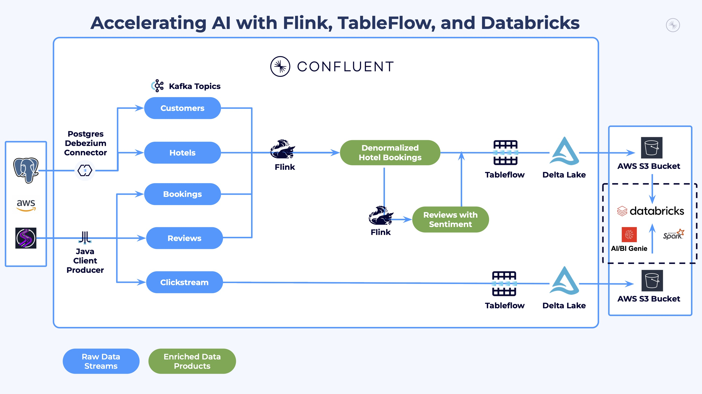

# LAB 5: Analytics and AI-Powered Marketing Automation

## 🗺️ Overview

Welcome to the analytics powerhouse of your real-time AI marketing pipeline! Transform your streaming data products into actionable business insights and AI-generated marketing campaigns using Databricks' advanced analytics and AI capabilities.

### What You'll Accomplish



By the end of this lab, you will have:

1. **Created Hotel Analytics View**: Built a `hotel_stats` SQL VIEW that aggregates booking metrics, review ratings, and sentiment analysis from Tableflow tables
2. **AI-Powered Business Intelligence**: Used Databricks Genie to generate natural language insights about customer behavior, booking patterns, and hotel performance metrics
3. **Intelligent Marketing Automation**: Deployed an AI agent that automatically identifies underperforming hotels with good customer satisfaction, generates personalized social media campaigns based on customer reviews, and creates targeted customer lists for marketing outreach

### Prerequisites

Completed [LAB 4: Stream Processing](../LAB4_stream_processing/LAB4.md) with enriched data products flowing to Delta Lake tables

## 👣 Steps

### Step 1: Explore Streaming Data in Unity Catalog

Now that both raw and enriched data is flowing from Confluent via Tableflow to Databricks Unity Catalog, you can do some deep analysis and capture insights from it.

First, follow these steps to verify that the data is flowing in as expected:

1. Login and navigate to your Databricks account in your web browser
2. Click on **Catalog** in the left menu
3. Verify that you see your Tableflow catalog, it will look something like this:

   

4. Click to expand your Tableflow catalog
5. Click to expand your Confluent cluster schema - its name should match the ID of your Confluent Cloud kafka cluster
6. Verify that you see three Tableflow tables: *clickstream*, *denormalized_hotel_bookings*, and *hotel_reviews_with_sentiment*

   

7. Select the `clickstream` table
8. Click the **Create** dropdown button in the top right of the screen
9. Select **Query** from the dropdown list
10. Select your *catalog* and *schema* from the dropdowns

   

11. Run the query that appears in the cell - it should look like this:

   ```sql
   select * from `<catalog>`.`<schema>`.`clickstream` limit 100;
   ```

> [!TIP]
> **Compute Resource**
>
> You may see this modal pop up, especially if you are using a free edition or free trial Databricks account:
>
> 
>
> If you do, select the **Automatically launch and attach without prompting** and click the **Start, attach and run** button

12. You should see a result like this:

   

> [!IMPORTANT]
> **10-15 Minute Data Sync**
>
> It may take 5-10 minutes for the `SELECT` queries to return data for the `denormalized_hotel_bookings` and `hotel_reviews_with_sentiment` tables, as you may have only recently enabled them with TableFlow.

### Step 2: Create Hotel Stats View

Now that the raw and enriched data is available as Delta Lake tables, create an analytics view that aggregates hotel performance metrics from the past 7 days. This view joins `denormalized_hotel_bookings` with `hotel_reviews_with_sentiment` to produce a single row per hotel with booking totals, review ratings, sentiment counts, and concatenated review text.

1. Open a new SQL query in your Databricks workspace
2. Ensure your *catalog* and *schema* are selected in the dropdowns
3. Run this statement:

```sql
CREATE OR REPLACE VIEW hotel_stats AS
SELECT
  dhb.hotel_id,
  MAX(dhb.hotel_name) AS hotel_name,
  MAX(dhb.hotel_city) AS hotel_city,
  MAX(dhb.hotel_country) AS hotel_country,
  MAX(dhb.hotel_category) AS hotel_category,
  MAX(dhb.hotel_description) AS hotel_description,
  COUNT(*) AS total_bookings_count,
  SUM(dhb.guest_count) AS total_guest_count,
  SUM(dhb.booking_amount) AS total_booking_amount,
  CAST(AVG(hrs.review_rating) AS DECIMAL(10, 2)) AS average_review_rating,
  COUNT(hrs.review_id) AS review_count,
  SUM(CASE WHEN hrs.cleanliness_label = 'Positive' THEN 1 ELSE 0 END) AS positive_cleanliness_count,
  SUM(CASE WHEN hrs.amenities_label = 'Positive' THEN 1 ELSE 0 END) AS positive_amenities_count,
  SUM(CASE WHEN hrs.service_label = 'Positive' THEN 1 ELSE 0 END) AS positive_service_count,
  CONCAT_WS(' --- ', COLLECT_LIST(
    CASE WHEN hrs.review_rating >= 4 THEN hrs.review_text END
  )) AS positive_review_texts
FROM denormalized_hotel_bookings dhb
LEFT JOIN hotel_reviews_with_sentiment hrs
  ON hrs.booking_id = dhb.booking_id
WHERE dhb.booking_date >= current_timestamp() - INTERVAL 7 DAYS
GROUP BY dhb.hotel_id;
```

4. Verify the view by querying it:

```sql
SELECT * FROM hotel_stats LIMIT 10;
```

You should see one row per hotel with aggregated metrics. The `positive_review_texts` column contains concatenated review text that the AI agent will use downstream to generate marketing content.

### Step 3: Derive Data Product Insights with Genie

Databricks Genie makes it more accessible and easier to obtain data insights.  It provides a chat interface where you ask questions about your data in natural language, and it leverages generative AI to parse your questions and answer them through SQL queries it generates.

#### Set Up Genie Workspace

Follow these steps to set Genie up:

1. Click on the **Genie** link under the *SQL* section in the left sidebar
2. Click on the **+ New** button in the top right of the screen to create a new Genie space
3. Click on the **All** toggle
4. Navigate to your workshop *catalog* and *database*
5. Select the `clickstream`, `denormalized_hotel_bookings`, `hotel_reviews_with_sentiment`, and `hotel_stats` tables

   

6. Click on the **Create** button
7. Rename your space to something like *River Hotel BI*
8. Your space should look similar to this:

   


#### Generate Business Insights

Toggle the **Agent** mode and prompt Genie with natural language questions.

Here are some other prompts you can try:

> Show me customer satisfaction metrics by country


---

> Which category of hotel had the lowest interest from customers?


Identify the *Hotel Category* with the lowest customer interest — you will use this in the next section to create a marketing agent.

---

<details>
<summary>Expand this section for more sample prompts</summary>

> Show me customers who viewed hotels in the most cities


---

> Which cities had the most interest from customers?


</details>

### Step 4: Create and Deploy Marketing Campaign Agent

In this section you will use a provided Jupyter Notebook to generate an AI agent that will identify hotels that need promotion and create targeted marketing campaigns for them!

The AI agent combines three intelligent functions:

1. **Hotel Selection**: Identifies the lowest-performing hotel in a given category that has above-average customer satisfaction (3+ reviews) - perfect candidates for promotion
2. **Content Generation**: Leverages AI to analyze customer reviews and extract the top 3 reasons guests enjoyed their stay, then creates positive social media posts highlighting these strengths
3. **Customer Targeting**: Uncovers customers who showed high interest (many page views/clicks) but made few bookings in that hotel category - prime targets for conversion

See the [**optional** Notebook deep dive](notebook_details.md) for more information.

#### Import and Configure Notebook

Follow these steps to import and use a pre-built Notebook to generate your AI Agent:

1. Click on the light-red **+ New** button in the top left of the screen
2. Select **Notebook**
3. Click on **File**
4. Select **Import**

   

5. Select **URL**
6. Paste in this value

   ```link
   https://raw.githubusercontent.com/confluentinc/workshop-tableflow-databricks/refs/heads/main/labs/shared/river_hotel_marketing_agent.ipynb
   ```

7. Click **Import**

   

8. The Notebook should load in a new tab

9. Follow the instructions in the Notebook to create and deploy the marketing campaign agent.

## 🏁 Conclusion

**Congratulations!** Your AI marketing agent is now deployed and accessible through multiple interfaces, and is ready to help River Hotels create data-driven marketing campaigns in real-time!

## ➡️ What's Next

Your journey concludes by cleaning up the resources you created in **[LAB 6: Resource Cleanup](../LAB6_clean_up/LAB6.md)**!

## 🔧 Troubleshooting

You can find potentially common issues and solutions or workarounds in the [Troubleshooting](../../shared/troubleshooting.md) guide.
