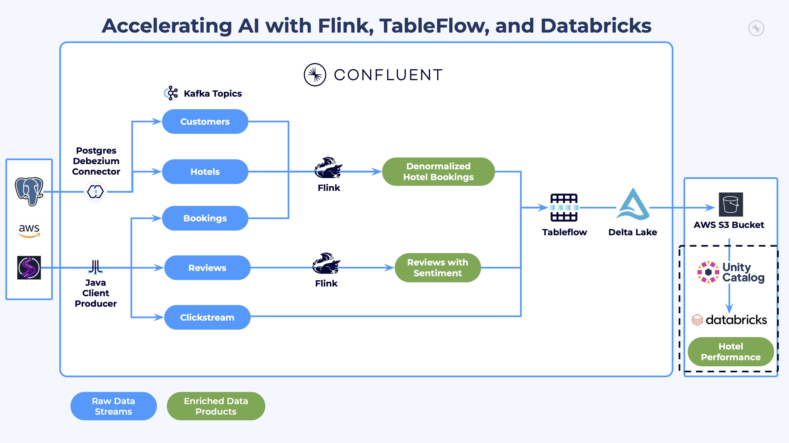

# LAB 6: Analytics and AI-Powered Marketing Automation

## 🗺️ Overview

Welcome to the analytics powerhouse of your real-time AI marketing pipeline! Transform your streaming data products into actionable business insights and AI-generated marketing campaigns using Databricks' advanced analytics and AI capabilities.

### What You'll Accomplish



By the end of this lab, you will have:

1. **AI-Powered Business Intelligence**: Use Databricks Genie to generate natural language insights about customer behavior, booking patterns, and hotel performance metrics
2. **Intelligent Marketing Automation**: Deploy an AI agent that automatically identifies underperforming hotels with good customer satisfaction, generates personalized social media campaigns based on customer reviews, and creates targeted customer lists for marketing outreach

### Prerequisites

Completed **[LAB 5: Stream Lineage](../LAB5_stream_lineage/LAB5.md)** with the workshop pipeline explored in Stream Lineage

## 👣 Steps

### Step 1: Create Hotel Performance View and Explore Analytics

Now that both raw and enriched data is flowing from Confluent via Tableflow to Databricks Unity Catalog, you can do some deep analysis and capture insights from it.

First, follow these steps to verify that the data is flowing in as expected:

1. Login and navigate to your Databricks account in your web browser
2. Click on **Catalog** in the left menu
3. Verify that you see your Tableflow catalog, it will look something like this:

   

4. Click to expand your Tableflow catalog
5. Click to expand your Confluent cluster schema - its name should match the ID of your Confluent Cloud kafka cluster
6. Verify that you see three tables: *clickstream*, *denormalized_hotel_bookings*, and *reviews_with_sentiment*

   

> [!TIP]
> **Compute Resource**
>
> You may see this modal pop up, especially if you are using a free edition or free trial Databricks account:
>
> 
>
> If you do, select the **Automatically launch and attach without prompting** and click the **Start, attach and run** button

> [!IMPORTANT]
> **10-15 Minute Data Sync**
>
> It may take 5-10 minutes for the `SELECT` queries to return data for the `denormalized_hotel_bookings` and `reviews_with_sentiment` tables, as you may have only recently enabled them with TableFlow.

#### Create the Hotel Performance View

7. Click the **Create** dropdown and select **Query**
8. Select your *catalog* and *schema* from the dropdowns

   

9. Run this statement to create an analytics view that aggregates booking metrics and sentiment scores:

```sql
CREATE OR REPLACE VIEW hotel_performance AS
WITH booking_metrics AS (
  SELECT
    hotel_id,
    MAX(hotel_name) AS hotel_name,
    MAX(hotel_city) AS hotel_city,
    MAX(hotel_country) AS hotel_country,
    MAX(hotel_category) AS hotel_category,
    MAX(hotel_description) AS hotel_description,
    COUNT(*) AS total_bookings_count,
    SUM(guest_count) AS total_guest_count,
    SUM(booking_amount) AS total_booking_amount
  FROM denormalized_hotel_bookings
  WHERE booking_date >= current_timestamp() - INTERVAL 7 DAYS
  GROUP BY hotel_id
),
review_metrics AS (
  SELECT
    hotel_id,
    CAST(AVG(review_rating) AS DECIMAL(10, 2)) AS average_review_rating,
    COUNT(*) AS review_count,
    SUM(CASE WHEN cleanliness_label = 'Positive' THEN 1 ELSE 0 END) AS positive_cleanliness_count,
    SUM(CASE WHEN amenities_label = 'Positive' THEN 1 ELSE 0 END) AS positive_amenities_count,
    SUM(CASE WHEN service_label = 'Positive' THEN 1 ELSE 0 END) AS positive_service_count
  FROM reviews_with_sentiment
  GROUP BY hotel_id
)
SELECT
  bm.*,
  rm.average_review_rating,
  rm.review_count,
  rm.positive_cleanliness_count,
  rm.positive_amenities_count,
  rm.positive_service_count
FROM booking_metrics bm
LEFT JOIN review_metrics rm ON rm.hotel_id = bm.hotel_id;
```

10. Query the top hotels by positive amenities sentiment:

```sql
SELECT
  hotel_name,
  hotel_city,
  hotel_category,
  positive_amenities_count,
  positive_cleanliness_count,
  positive_service_count,
  average_review_rating,
  review_count
FROM hotel_performance
ORDER BY positive_amenities_count DESC
LIMIT 5;
```

The top 5 hotels ranked by positive amenities sentiment, with their cleanliness and service scores for comparison. These sentiment counts come from Flink's `AI_SENTIMENT` function, which analyzed each review for cleanliness, amenities, and service aspects.

### Step 2: Derive Data Product Insights with Genie

Databricks Genie makes it more accessible and easier to obtain data insights.  It provides a chat interface where you ask questions about your data in natural language, and it leverages generative AI to parse your questions and answer them through SQL queries it generates.

#### Set Up Genie Workspace

Follow these steps to set Genie up:

1. Click on the **Genie** link under the *SQL* section in the left sidebar
2. Click on the **+ New** button in the top right of the screen to create a new Genie space
3. Click on the **All** toggle
4. Navigate to your workshop *catalog* and *database*
5. Select the `clickstream`, `denormalized_hotel_bookings`, `reviews_with_sentiment`, and `hotel_performance` tables

   

6. Click on the **Create** button
7. Rename your space to something like *River Hotel BI*
8. Your space should look similar to this:

   


#### Generate Business Insights

Toggle the **Agent** mode and prompt Genie with natural language questions.

Here are some other prompts you can try:

> Show me customer satisfaction metrics by country


---

> Which hotels have the highest positive sentiment across cleanliness, amenities, and service?

---

> Which category of hotel had the lowest interest from customers?


Identify the *Hotel Category* with the lowest customer interest — you will use this in the next section to create a marketing agent.

---

<details>
<summary>Expand this section for more sample prompts</summary>

> Show me customers who viewed hotels in the most cities


---

> Which cities had the most interest from customers?


</details>

### Step 3: Create and Deploy Marketing Campaign Agent

In this section you will use a provided Jupyter Notebook to generate an AI agent that will identify hotels that need promotion and create targeted marketing campaigns for them!

The AI agent combines three intelligent functions:

1. **Hotel Selection**: Identifies the lowest-performing hotel in a given category that has above-average customer satisfaction (3+ reviews) - perfect candidates for promotion
2. **Content Generation**: Leverages AI to analyze customer reviews and extract the top 3 reasons guests enjoyed their stay, then creates positive social media posts highlighting these strengths
3. **Customer Targeting**: Uncovers customers who showed high interest (many page views/clicks) but made few bookings in that hotel category - prime targets for conversion

See the [**optional** Notebook deep dive](notebook_details.md) for more information.

#### Import and Configure Notebook

Follow these steps to import and use a pre-built Notebook to generate your AI Agent:

1. Click on the light-red **+ New** button in the top left of the screen
2. Select **Notebook**
3. Click on **File**
4. Select **Import**

   

5. Select **URL**
6. Paste in this value

   ```link
   https://raw.githubusercontent.com/confluentinc/workshop-tableflow-databricks/refs/heads/main/labs/shared/river_hotel_marketing_agent.ipynb
   ```

7. Click **Import**

   

8. The Notebook should load in a new tab

9. Follow the instructions in the Notebook to create and deploy the marketing campaign agent.

## 🏁 Conclusion

**Congratulations!** Your AI marketing agent is now deployed and accessible through multiple interfaces, and is ready to help River Hotels create data-driven marketing campaigns in real-time!

## ➡️ What's Next

Your journey concludes by cleaning up the resources you created in **[LAB 7: Resource Cleanup](../LAB7_clean_up/LAB7.md)**!

## 🔧 Troubleshooting

You can find potentially common issues and solutions or workarounds in the [Troubleshooting](../../shared/troubleshooting.md) guide.
