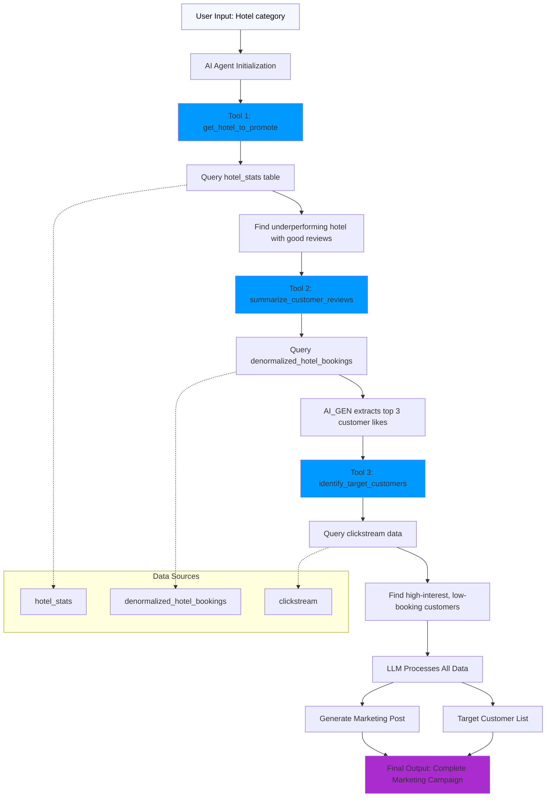

# Notebook Deep Dive

## Flowchart

```mermaid
flowchart TD
    A[User Input: Hotel category] --> B[AI Agent Initialization]
    B --> C[Tool 1: get_hotel_to_promote]
    C --> D[Query hotel_stats table]
    D --> E[Find underperforming hotel with good reviews]

    E --> F[Tool 2: summarize_customer_reviews]
    F --> G[Query denormalized_hotel_bookings]
    G --> H[AI_GEN extracts top 3 customer likes]

    H --> I[Tool 3: identify_target_customers]
    I --> J[Query clickstream data]
    J --> K[Find high-interest, low-booking customers]

    K --> L[LLM Processes All Data]
    L --> M[Generate Marketing Post]
    L --> N[Target Customer List]

    M --> O[Final Output: Complete Marketing Campaign]
    N --> O

    subgraph "Data Sources"
        P[hotel_stats]
        Q[denormalized_hotel_bookings]
        R[clickstream]
    end

    D -.-> P
    G -.-> Q
    J -.-> R

    style A fill:#f5f7ff,color:#000000
    style C fill:#0099ff
    style F fill:#0099ff
    style I fill:#0099ff
    style O fill:#aa2bce
```
