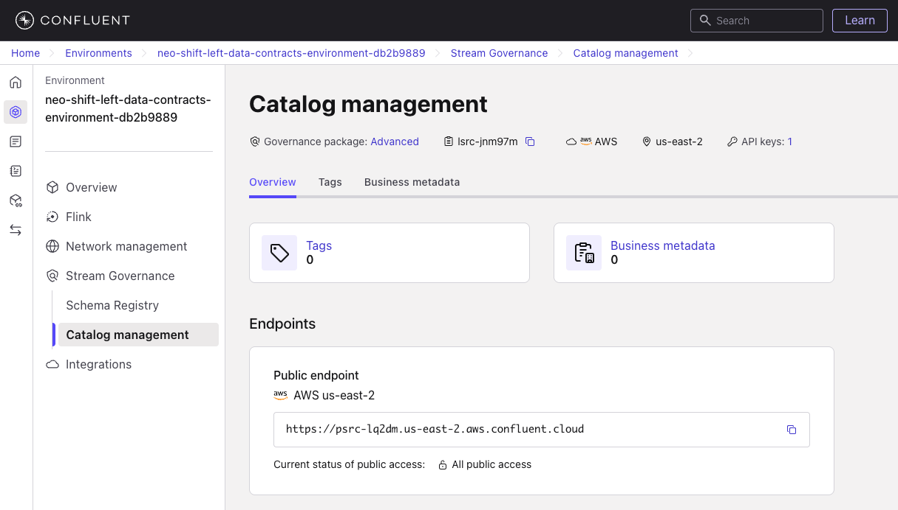
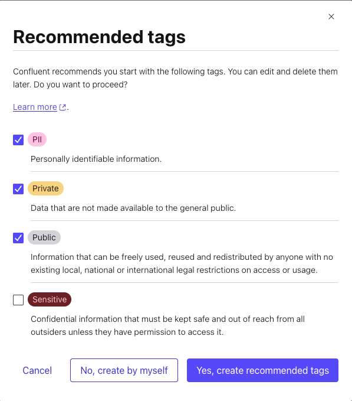
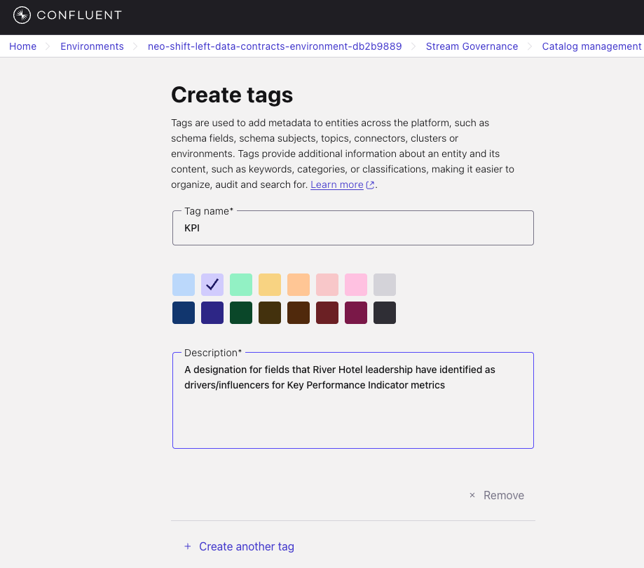
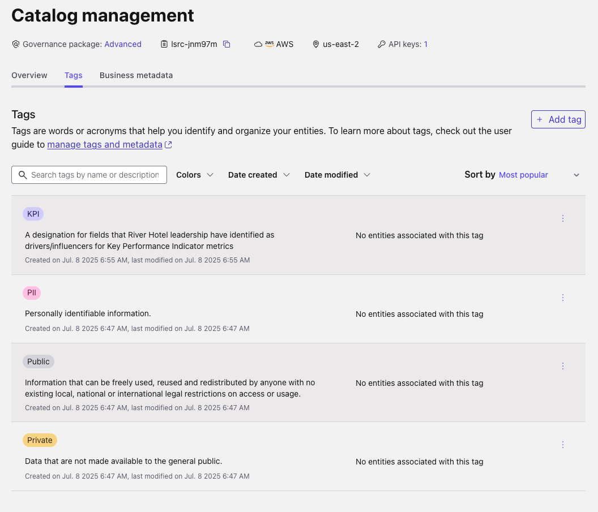
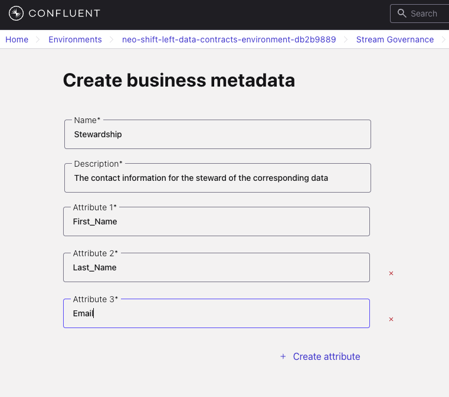

# Optional Lab: Data Governance

## Overview

In this lab, you'll explore how **data governance works in practice** using Confluent's catalog management and data contract framework. Your workshop infrastructure was deployed with pre-configured data quality rules that actively enforce data contracts on live streaming data.

### What You'll Explore

- **Data Quality Rules (DQR)**: Observe a CEL-based validation rule that's actively routing invalid clickstream events to a Dead Letter Queue
- **Schema Registry & Data Contracts**: See how schemas with embedded rules enforce data quality at produce time
- **Business Metadata**: Connect technical schemas to real people and teams for accountability
- **Governance Tags**: Classification systems that enable automated policies and access controls

### Prerequisites

- Completed [LAB 2](../LAB2_cloud_deployment/LAB2.md) with all infrastructure deployed

## Steps

### Step 1: Observe Pre-deployed Data Quality Rules

Your infrastructure was provisioned with a data contract on the `clickstream` topic. Let's examine it.

#### Navigate to Schema Registry

1. Login to your Confluent Cloud account
2. Find and click on your workshop environment
3. Click **Schema Registry** in the left menu
4. Find the `clickstream-value` subject and click on it

You should see the Avro schema for clickstream events. This schema was registered by Terraform with a CEL data quality rule attached.

#### Examine the Data Quality Rule

1. Click on the **Rules** tab within the `clickstream-value` subject
2. You'll see a rule named **`validateClickstreamAction`**

   This rule enforces that the `action` field must be one of the valid values:

   ```
   message.action.matches('^(page-view|page-click|booking-click)$')
   ```

3. Note the **On failure** action is set to `DLQ`, routing invalid events to the `invalid_clickstream_events` topic

**What This Means:** Every message produced to the `clickstream` topic is validated against this rule at produce time. The `KafkaAvroSerializer` (with `kafka-schema-rules` on the classpath) evaluates the CEL expression before the message reaches the broker. If the `action` field contains an invalid value, the message is automatically redirected to the DLQ topic.

### Step 2: Observe DLQ Routing in Action

The data generator intentionally produces ~5% of clickstream events with invalid `action` values (`admin-access`, `page-scroll`). These are caught by the CEL rule and routed to the DLQ.

#### Check the DLQ Topic

1. Navigate to your workshop cluster
2. Click **Topics** in the left menu
3. Find and click on the `invalid_clickstream_events` topic
4. Click on the **Messages** tab

You should see invalid clickstream events appearing here. Each message contains the original event data with the invalid `action` value that triggered the rule.

#### Compare with the Main Topic

1. Go back to **Topics** and click on the `clickstream` topic
2. Click on the **Messages** tab
3. Inspect a few messages — you'll notice every event here has a valid `action` value (`page-view`, `page-click`, or `booking-click`)

**Key Insight:** The DLQ pattern lets you catch bad data at the source without losing it. In production, teams can monitor the DLQ topic to identify data quality issues, fix the upstream producer, and optionally replay corrected events.

### Step 3: Explore Governance Tags and Business Metadata

Now let's explore additional governance features that complement data quality rules.

#### Navigate to Catalog Management

1. Click on **Catalog Management** in the left menu

   

#### Understanding Governance Tags

Tags help classify data streams so that policies can be applied consistently.

1. Click on the **Tags** tab
2. Click on the **Create tags** button
3. Check the boxes for these recommended tags:
   - *PII* - Personally Identifiable Information
   - *Private* - Internal business data
   - *Public* - Data safe for external sharing

   

4. Click **Yes, create recommended tags**

5. **Create Custom Business Tag**:
   1. Click the **+ Add Tag** button
   2. Enter `KPI` in the *Tag Name* field
   3. Select any color you prefer
   4. Copy this description into the *Description* field:

   ```text
   A designation for fields that River Hotel leadership have identified as drivers for Key Performance Indicator metrics
   ```

   

   5. Click **Create**

6. Review your complete tag list:

   

**What You're Seeing:** These tags can now be applied to any data stream. Organizations use this tagging system to automate governance policies — for example, automatically encrypting anything tagged as "PII" or restricting access to "Private" data.

#### Learning About Business Metadata

Now let's connect technical schemas to business context.

1. Click on the **Business Metadata** tab
2. Click **Create business metadata**
3. Configure the stewardship template:
   - *Name:* `Stewardship`
   - *Description:* `Contact information for the steward of the corresponding data`
   - *Attribute 1:* `First_Name`
   - Click **Create attribute**
   - *Attribute 2:* `Last_Name`
   - Click **Create attribute**
   - *Attribute 3:* `Email`

   

4. Click **Create**

**What You've Created:** This reusable template can be attached to any schema. In real organizations, this ensures every data stream has someone responsible for it — no more "orphaned" data assets!

### Step 4: Create Your Own Rule (Optional)

Now that you've seen a pre-deployed data quality rule in action, try adding a second rule to the `clickstream-value` schema:

1. Navigate to **Schema Registry** > `clickstream-value` > **Rules**
2. Click **Add rule**
3. Try creating a rule that validates another field. For example:
   - **Rule Name:** `validateEventDuration`
   - **Expression:** `message.event_duration > 0 && message.event_duration < 3600`
   - **On failure:** `DLQ`
   - **Value:** `invalid_clickstream_events`

4. Click **Add**, then **Save**

This rule ensures `event_duration` is between 1 second and 1 hour. Any event outside this range will be DLQ-routed alongside the invalid action events.

## Reflection

### Key Concepts You Explored

**Live Data Quality Enforcement**: Unlike traditional data validation that happens after data is stored, the CEL rules you observed enforce quality at produce time. The `kafka-schema-rules` library evaluates rules inside the serializer — bad data never reaches the main topic.

**DLQ Pattern**: The Dead Letter Queue captures invalid events without data loss. Teams can monitor, investigate, and fix quality issues at the source rather than discovering them in downstream analytics.

**Data Ownership**: By adding business metadata, you connected technical artifacts (schemas) to real people. In large organizations, this is crucial — without clear ownership, data quality issues become "someone else's problem."

**Proactive vs. Reactive Governance**: Tags and rules together enable proactive governance. Instead of discovering bad data after it's processed incorrectly downstream, the system catches it immediately.

### Thinking Bigger

In production environments, these concepts scale to hundreds or thousands of data streams. Data contracts ensure that producers and consumers agree on data shape and quality, while governance tags automate compliance and access control policies.

## What's Next

This is an optional lab, so you can return to wherever you came from in the main workshop flow:

- [LAB 2: Cloud Resource Deployment](../LAB2_cloud_deployment/LAB2.md)
- [LAB 4: Stream Processing](../LAB4_stream_processing/LAB4.md)
- [LAB 6: Analytics & AI](../LAB6_databricks/LAB6.md)
