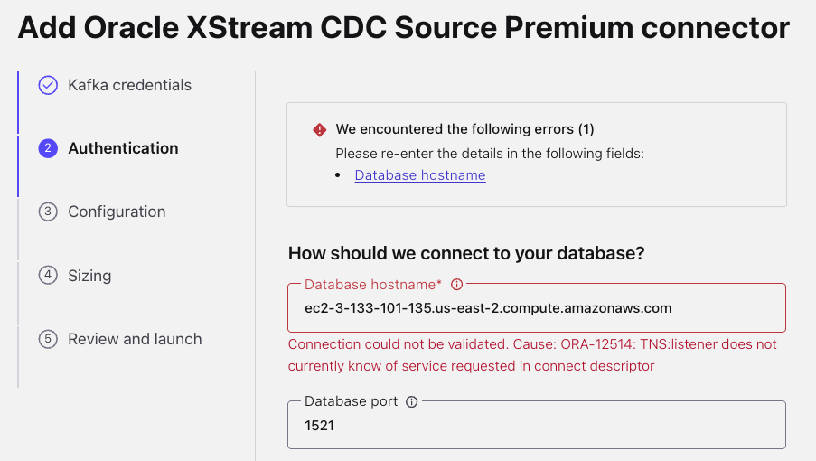
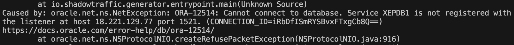
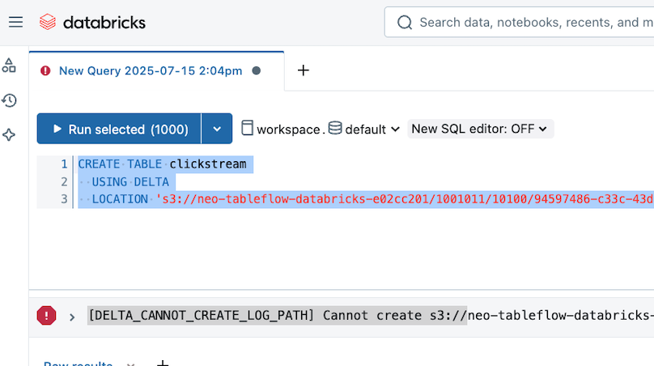

# Troubleshooting

Review the resources below if you run into issues while going through instructions in this workshop.

## 🏗️ Terraform

### Provider Integration Deletion Conflicts

**Issue:**

When running `terraform destroy -auto-approve` to destroy workshop resources, you encounter a `409 Conflict` error:

```
Error: error deleting Provider Integration (pixxxxxxx): 409 Conflict: Provider integration pixxxxxxx cannot be deleted as it is being used by active TableFlow instances
```

**Why This Happens:**

Confluent Cloud prevents deletion of provider integrations that are actively being used by TableFlow instances. This dependency conflict occurs when:

1. **TableFlow sync is still active** - Data is still flowing from topics to Delta Lake
2. **Resource deletion order** - Terraform tries to delete the integration before stopping TableFlow
3. **API timing issues** - Brief delays in resource cleanup can cause conflicts

**Resolution:**

1. **Remove the problematic resource from Terraform state:**

   ```sh
   docker-compose run --rm terraform -c "terraform state rm confluent_provider_integration.s3_tableflow_integration"
   ```

   > [!NOTE]
   > **Terraform State Removal**
   >
   > This command removes the resource from Terraform's state file but does **not** delete the actual resource from Confluent Cloud. The resource will be force-removed when the Confluent Environment gets deleted in the next step.

2. **Rerun the terraform destroy command:**

   ```sh
   docker-compose run --rm terraform -c "terraform destroy -auto-approve"
   ```

3. **If issues persist**, manually stop TableFlow in Confluent Console before running destroy

### PostgreSQL Readiness Check Timeout

**Issue:**

When running `terraform apply` with `create_postgres_cdc_connector = true`, you encounter a timeout error:

```
Error: PostgreSQL did not become ready after 12 minutes
```

**Why This Happens:**

The EC2 `user_data` script takes time to complete (Docker install, PostgreSQL container startup, schema initialization). If Terraform's readiness check times out before PostgreSQL is fully ready, the connector creation fails.

**Resolution:**

1. **Option A: Disable automated connector creation** (recommended):

   ```hcl
   # terraform.tfvars
   create_postgres_cdc_connector = false
   ```

   Then create the connector manually in LAB3 (~5 minutes).

2. **Option B: Increase timeout and retry**:

   Run `docker-compose run --rm terraform -c "terraform apply -auto-approve"` again - the EC2 instance is already running, so PostgreSQL should be ready.

3. **Option C: Verify PostgreSQL manually**:

   ```bash
   # SSH to the instance
   ssh -i sshkey-*.pem ec2-user@<instance-dns>

   # Check if PostgreSQL container is running
   sudo docker ps

   # Test database connection
   sudo docker exec postgres-workshop pg_isready -U postgres
   ```

---

## 🗄️ Oracle Database

### Database Connection Failures

**Issue:**

When attempting to connect to the Oracle database, you encounter this type of error:

**ORA-12514 Error in Confluent Cloud:**



**ORA-12514 Error in Shadow Traffic:**



```sh
Caused by: oracle.net.ns.NetException: ORA-12514: Cannot connect to database. Service XEPDB1 is not registered with the listener at host 18.221.129.77 port 1521. (CONNECTION_ID=iRbDfISmRYSBvxFTxgCb8Q==)
https://docs.oracle.com/error-help/db/ora-12514/
        at oracle.net.ns.NSProtocolNIO.createRefusePacketException(NSProtocolNIO.java:916)
        at oracle.net.ns.NSProtocolNIO.handleConnectPacketResponse(NSProtocolNIO.java:462)
```

**Why This Happens:**

This error occurs when the Oracle database service has not yet fully initialized. Common causes include:

1. **Database still starting up** - Oracle XE container is still initializing after EC2 launch
2. **Network connectivity issues** - Security groups or VPC routing problems
3. **Service registration delays** - XEPDB1 pluggable database hasn't registered with the listener yet

**Resolution:**

1. **Wait for initialization** - Oracle XE can take 10-15 minutes to fully start after EC2 instance launch
2. **Verify connectivity** - Ensure EC2 instance is running and accessible
3. **Check service status** - Connect to the instance and verify Oracle services are running

### Oracle Database Diagnostics

**Issue:**

You need to troubleshoot Oracle database issues, verify XStream configuration, or check service status.

**Why This Happens:**

Oracle database issues can stem from:

1. **XStream configuration problems** - Xstream Outbound server not properly configured
2. **Container issues** - Docker container may have stopped or crashed
3. **Service dependencies** - Database services may not have started in correct order

**Resolution:**

1. **Get connection details** from Terraform output (run from the `terraform/` directory):

```sh
docker-compose run --rm terraform -c "terraform output oracle_vm"
```

2. **Connect to the Oracle EC2 instance** using SSH:

Copy and paste the `ssh_command` output from the above command and execute it your shell:

```sh
ssh -i sshkey-[YOUR_KEY_NAME].pem ec2-user@[YOUR_INSTANCE_DNS]
```

   > [!NOTE]
   > **Key Fingerprint**
   >
   > If prompted to add the key fingerprint to your known hosts, enter `yes`.

3. **Access the Oracle XE container**:

```sh
sudo docker exec -it oracle-xe sqlplus system/Welcome1@localhost:1521/XE
```

4. **Verify XStream outbound server** exists in SQL*Plus:

```sql
SELECT SERVER_NAME, CAPTURE_NAME, SOURCE_DATABASE, QUEUE_OWNER, QUEUE_NAME FROM ALL_XSTREAM_OUTBOUND;
```

   **Expected result:** You should see an entry for the "xout" server with source database `XEPDB1`

5. **Alter Session to XEPDB1**

```sql
ALTER SESSION SET CONTAINER = XEPDB1;
```

```sql
DESCRIBE CDC.customer;
```

```sql
SELECT COLUMN_NAME
FROM ALL_CONS_COLUMNS
WHERE CONSTRAINT_NAME = (
    SELECT CONSTRAINT_NAME
    FROM ALL_CONSTRAINTS
    WHERE TABLE_NAME = 'CUSTOMER'
    AND OWNER = 'CDC'
    AND CONSTRAINT_TYPE = 'P'
);
```

6. **Check container status** if connection fails:

```sh
sudo docker ps
sudo docker logs oracle-xe
```

## ⚡ Flink

### Streaming Join Issues with CDC Sources

**Issue:**

When working with Oracle CDC sources in Flink SQL, you may encounter various join-related errors such as:

```
Temporal Table Join requires primary key in versioned table, but no primary key can be found.
StreamPhysicalIntervalJoin doesn't support consuming update and delete changes
```

**Comprehensive Solution:**

For a complete analysis of streaming join challenges with CDC sources and proven working solutions, see:

**[Flink Streaming Joins with CDC Sources: A Journey of Discovery](flink-joins.md)**

This comprehensive guide documents our complete journey from initial temporal join failures through to reliable production solutions, including:

- ✅ **Experiment results** from all attempted approaches
- ✅ **Root cause analysis** of CDC stream compatibility issues
- ✅ **Working solutions** using snapshot tables + interval joins
- ✅ **Hybrid timestamp strategies** for optimal results
- ✅ **Production recommendations** for different use cases

**Quick Resolution for Workshop:**

If you need an immediate working solution, use the **snapshot + interval joins approach**:

1. **Create snapshot tables** from CDC sources:

   ```sql
   CREATE TABLE CUSTOMER_SNAPSHOT AS (
   SELECT customer_id, email, first_name, last_name, birth_date, created_at
   FROM `riverhotel.CDC.customer`
   );
   ALTER TABLE CUSTOMER_SNAPSHOT SET ('changelog.mode' = 'append');

   CREATE TABLE HOTEL_SNAPSHOT AS (
   SELECT hotel_id, name, category, description, city, country, room_capacity, created_at
   FROM `riverhotel.CDC.hotel`
   );
   ALTER TABLE HOTEL_SNAPSHOT SET ('changelog.mode' = 'append');
   ```

2. **Use interval joins with snapshots**:

   ```sql
   FROM `bookings` b
      JOIN `CUSTOMER_SNAPSHOT` c
        ON c.`email` = b.`customer_email`
        AND c.`$rowtime` BETWEEN b.`$rowtime` - INTERVAL '7' DAY AND b.`$rowtime` + INTERVAL '7' DAY
      JOIN `HOTEL_SNAPSHOT` h
        ON h.`hotel_id` = b.`hotel_id`
        AND h.`$rowtime` BETWEEN b.`$rowtime` - INTERVAL '7' DAY AND b.`$rowtime` + INTERVAL '7' DAY
   ```

> **Note**: Direct interval joins with CDC sources will fail with "StreamPhysicalIntervalJoin doesn't support consuming update and delete changes"

### Streaming Join State Management

**Issue:**

Regular inner joins in streaming queries generate warnings about requiring both sides of the table to be kept in state indefinitely.

**Why This Happens:**

Regular streaming joins maintain infinite state on both sides, leading to potential memory issues and performance degradation over time.

**Resolution:**

Use streaming-optimized join patterns:

1. **Temporal joins** for dimension table lookups (when primary keys are available)
2. **Interval joins** with time bounds to limit state retention
3. **TTL configuration** to automatically expire old state:

   ```sql
   SET 'table.exec.state.ttl' = '7d';
   ```

## 🔐 Databricks Authentication

### Service Principal Authentication Issues

**Issue:**

When running `terraform apply`, you encounter authentication errors related to Databricks:

```
Error: cannot authenticate with Databricks: invalid client credentials
```

or

```
Error: cannot create storage credential: permission denied
```

**Why This Happens:**

This workshop uses **Service Principal with OAuth** for Databricks authentication. Common causes include:

1. **Invalid credentials** - Client ID or Secret is incorrect
2. **Missing permissions** - Service Principal is not in the **admins** group
3. **OAuth secret expired** - Secrets have a limited lifetime

**Resolution:**

1. **Verify Service Principal credentials**:
   - Go to Databricks → Settings → Identity and access → Service principals
   - Confirm the Client ID matches your `terraform.tfvars`
   - If needed, generate a new OAuth secret

2. **Check Service Principal permissions**:
   - Go to Settings → Identity and access → Groups → **admins**
   - Verify your Service Principal is a member
   - If not, add it to the admins group

3. **Regenerate OAuth secret**:
   - Click on your Service Principal → OAuth secrets tab
   - Generate a new secret
   - Update `databricks_service_principal_client_secret` in `terraform.tfvars`

### External Data Access Not Enabled

**Issue:**

Terraform fails to create external location or storage credential.

**Resolution:**

1. Go to Databricks → Catalog → Select your metastore
2. Click **Edit** → Enable **External data access**
3. Save changes and retry `docker-compose run --rm terraform -c "terraform apply -auto-approve"`

### Transient 500 Error During External Location Creation

**Issue:**

When running `terraform apply`, the `databricks_external_location` resource fails with a 500 Internal Server Error:

```
Error: cannot create external location:

  with databricks_external_location.main,
  on main.tf line 362, in resource "databricks_external_location" "main":
 362: resource "databricks_external_location" "main" {
```

The Terraform debug log shows:

```
POST /api/2.1/unity-catalog/external-locations
< HTTP/2.0 500 Internal Server Error
< {
<   "error_code": "INTERNAL_ERROR",
<   "message": ""
< }
```

**Why This Happens:**

This is a **transient error** that occurs due to IAM trust policy propagation delays. When Terraform updates the IAM role trust policy with the Databricks external ID and then immediately tries to create the external location, Databricks may not yet be able to assume the role because:

1. **AWS IAM eventual consistency** - IAM policy changes can take 30-60+ seconds to propagate globally
2. **Databricks internal validation** - Databricks validates it can assume the role before creating the external location
3. **Race condition** - The wait period in Terraform may not be sufficient for all AWS regions

**Resolution:**

Since this is a transient error, the IAM configuration is correct - it just needs more time to propagate.

1. **Option A: Simply re-run terraform apply** (recommended):

   ```bash
   docker-compose run --rm terraform -c "terraform apply -auto-approve"
   ```

   Since the IAM trust policy has already been updated and time has passed, the second run typically succeeds. Terraform will only attempt to create the resources that failed.

2. **Option B: Use the retry wrapper script**:

   A wrapper script is provided that automatically retries `terraform apply` with delays:

   ```bash
   cd terraform
   chmod +x terraform-apply-wrapper-with-retry.sh
   ./terraform-apply-wrapper-with-retry.sh
   ```

   This script will:
   - Attempt `terraform apply` up to 6 times
   - Wait 30 seconds between attempts
   - Provide clear status output for each attempt

3. **Option C: Increase wait times in Terraform** (for persistent issues):

   If you consistently encounter this error, you can increase the wait time in `main.tf` by modifying the `null_resource.wait_for_trust_policy_phase2` resource:

   ```terraform
   # Change sleep 60 to sleep 120 or higher
   command = <<-EOT
     echo "⏳ Waiting 120 seconds for Phase 2 IAM propagation..."
     sleep 120
     echo "✅ Phase 2 propagation wait complete!"
   EOT
   ```

---

## 🧱 Databricks

### External Delta Lake Table Creation Failures

**Issue:**

When running this statement to create an external table from S3 data:

```sql
CREATE TABLE <<table_name>>
  USING DELTA
LOCATION '<<S3 URI>>';
```

You encounter this error:

```sh
[DELTA_CANNOT_CREATE_LOG_PATH] Cannot create s3://<full_path>
```



**Why This Happens:**

This Delta Lake table creation failure can occur due to several factors:

1. **Account type limitations** - (Most likely) Databricks free trial accounts have more restrictive permissions, as this error seems to be occurring only in free trial accounts
2. **Service Principal permissions** - Insufficient IAM or Databricks permissions for the service principal
3. **S3 bucket access issues** - External location or storage credential configuration problems
4. **Unity Catalog restrictions** - Workspace may not have proper Unity Catalog setup

**Resolution:**

Try these solutions in order:

1. **Verify external location configuration** - Ensure your external location is properly configured in Databricks
2. **Check service principal permissions** - Verify IAM and Databricks permissions are correctly set
3. **Use alternative account type**:
   - Clean up current workshop resources: `docker-compose run --rm terraform -c "terraform destroy -auto-approve"`
   - Restart workshop with a Databricks paid account or different free edition account
4. **Create new service principal**:
   - Clean up current workshop resources
   - Generate a new Databricks Service Principal during redeployment

> [!TIP]
> **Manual External Location Setup**
>
> For additional context on manual external location configuration, see the [Confluent TableFlow Delta Lake documentation](https://docs.confluent.io/cloud/current/topics/tableflow/get-started/quick-start-delta-lake.html#create-and-query-an-external-delta-lake-table).
